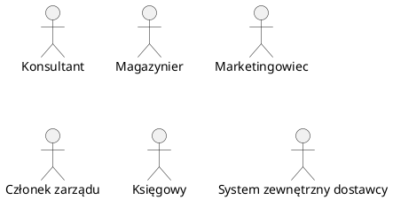
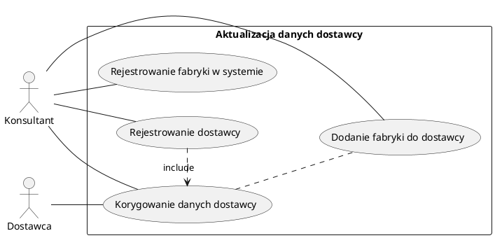
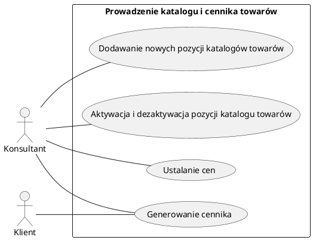
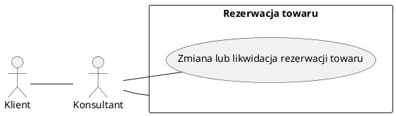
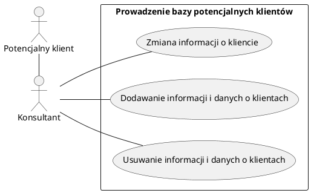
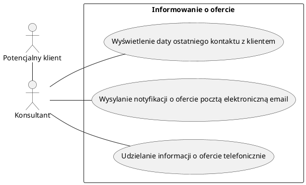

Zespół: Mateusz Popielarz, Adam Samsonowicz, Kamil Gliński, Kacper Kwapisz

Lead: Mateusz Popielarz

# System wspomagania sprzedaży/marketingu urządzeń z sektora automatyki przemysłowej
## Żródło danych: firma rodzinna

# 0 Spis Treści

<!-- vscode-markdown-toc -->
* [1.1  Przedmiot modelowania](#Przedmiotmodelowania)
	* [1.1.1 Nazwa firmy](#Nazwafirmy)
	* [1.1.2 Typ firmy](#Typfirmy)
	* [1.1.2 Cel produktu](#Celproduktu)
	* [1.1.3 Opis dziedziny działalności](#Opisdziedzinydziaalnoci)
	* [1.1.4 Cele firmy](#Celefirmy)
	* [1.1.5 Schemat struktury organizacyjnej](#Schematstrukturyorganizacyjnej)
* [1.2 Opis obszaru modelowania OM](#OpisobszarumodelowaniaOM)
	* [1.2.1 Wywiad z zarządem w celu ustalenia przeznaczenia systemu](#Wywiadzzarzdemwceluustaleniaprzeznaczeniasystemu)
	* [1.2.2 Definicja celu systemu](#Definicjacelusystemu)
	* [1.2.3 Składniki organizacyjne dla Obszaru Modelowania](#SkadnikiorganizacyjnedlaObszaruModelowania)
* [1.3 Zakres odpowiedzialności systemu (ZOS)](#ZakresodpowiedzialnocisystemuZOS)
	* [1.3.1 Obszary aktywności (OA)](#ObszaryaktywnociOA)
		* [1.3.1.1 Obsługa zamówień](#Obsugazamwie)
		* [1.3.1.2 Obsługa zleceń zakupu](#Obsugazlecezakupu)
		* [1.3.1.3 Obsługa reklamacji](#Obsugareklamacji)
		* [1.3.1.4 Obsługa magazynu](#Obsugamagazynu)
		* [1.3.1.5 Kontrola stanów magazynowych](#Kontrolastanwmagazynowych)
		* [1.3.1.6 Integracja z systemami marketingu](#Integracjazsystemamimarketingu)
		* [1.3.1.7 Rejestr potencjalnych klientów i stanu kontaktu z nimi](#Rejestrpotencjalnychklientwistanukontaktuznimi)
		* [1.3.1.8 Zarzadzanie](#Zarzadzanie)
* [1.4 Problem](#Problem)
	* [1.4.1 Nazwa problemu](#Nazwaproblemu)
	* [1.4.2 Nazwa kodowa](#Nazwakodowa)
* [1.5 Cele do osiągnięcia](#Celedoosignicia)
	* [1.5.1 Cele produktu](#Celeproduktu)
	* [1.5.2 Cele przedsięwzięcia projektowego](#Celeprzedsiwziciaprojektowego)
* [2.1 Funkcje systemu ze strony widzenia użytkownika](#Funkcjesystemuzestronywidzeniauytkownika)
	* [2.1.1 Aktorzy w systemie](#Aktorzywsystemie)
	* [2.1.2 Historie użytkowników (Use Cases)](#HistorieuytkownikwUseCases)
		* [2.1.2.1 Obsługa zamówień](#Obsugazamwie-1)
		* [2.1.2.3 Obsługa reklamacji](#ObsugareklamacjiUC)
		* [2.1.2.8 Zarządanie](#ZarzadzanieUC)
* [2.2 Dane przechowywane w systemie ## Zmergować definicjw danych i nie używać słowa encja ni atruybu](#DaneprzechowywanewsystemieZmergowadefinicjwdanychinieuywasowaencjaniatruybu)
	* [2.2.1 Dane ogólne](#Daneoglne)
	* [2.2.2 Opis klienta i powiązanych encji](#Opisklientaipowizanychencji)
	* [2.2.3 Opis Dostawcy](#OpisDostawcy)
	* [2.2.4 Opis Magazynu](#OpisMagazynu)
* [2.3 Dokumenty wprowadzane i wyprowadzane z systemu – wzory ## Trzeba wygenerować wzory w jakiejś apce](#DokumentywprowadzaneiwyprowadzanezsystemuwzoryTrzebawygenerowawzorywjakiejapce)
	* [2.3.1 Zapytanie ofertowe od klienta](#Zapytanieofertoweodklienta)
	* [2.3.2 Oferta](#Oferta)
	* [2.3.3 Zamówienie towaru u dostawcy](#Zamwienietowaruudostawcy)
		* [2.3.4 Potwierdzenie zamówienia od dostawcy](#Potwierdzeniezamwieniaoddostawcy)
		* [2.3.5. Faktura zakupu od dostawcy](#Fakturazakupuoddostawcy)
		* [2.3.6. Rejestracja towaru na magazynie](#Rejestracjatowarunamagazynie)
		* [2.3.7. Wyrejestrowanie towaru z magazynu](#Wyrejestrowanietowaruzmagazynu)
		* [2.3.8. Faktura zakupu dla klienta](#Fakturazakupudlaklienta)
		* [2.3.9. Raport sprzedażowe do analiz wewnętrznych](#Raportsprzedaowedoanalizwewntrznych)
		* [2.3.10. Raport statystyczny wspierający cele marketingowe](#Raportstatystycznywspierajcycelemarketingowe)
		* [2.3.11. Raport statystyczny wspierający prognozy popytu wspierający cele magazynowe](#Raportstatystycznywspierajcyprognozypopytuwspierajcycelemagazynowe)

<!-- vscode-markdown-toc-config
	numbering=false
	autoSave=false
	/vscode-markdown-toc-config -->
<!-- /vscode-markdown-toc -->

# 1 Charakterystyka firmy

## 1.1  Przedmiot modelowania
### 1.1.1 Nazwa firmy
Instom

### 1.1.2 Typ firmy  
Firma handlowa - `FH`, firma jest spółką z ograniczoną odpowiedzialnością

### 1.1.2 Cel produktu
System służy do wspomagania zarządzania `FH`.

Firma jako działający na rynku pretendent do lidera w sprzedaży urządzeń z automatyki przemysłowej na codzień ma przed sobą wiele wyzwań. Jednym z nich jest świadczenie usług najwyższej jakości. W tym celu kadra specjalistów z zakresu marketingu, sprzedaży i obsługi magazynowej codziennie dokłada wszelkich starań, by utrzymać wysoki poziom zadowolenia klientów, co przekłada się na wysoką liczbę zrealizowanych zamówień przy zmniejszającym się czasie ich realizacji.
Dla zmniejszenia czasu dostawy najpopularniejszych towarów są one magazynowane na miejscu i dostarczane z lokalnego miejsca przechowywania.

Jako że nie każdy klient ma odpowiednio przeszkoloną kadrę do montażu sprzętu, firma pośredniczy w implementacji rozwiązania u klienta komunikując się z integratorami.
Jednym z problemów z którym firma musi się zmierzyć jest rosnąca ilość zamówień, co sprawia, że kontrola nad procesami oraz zleceniami i zamówieniami jest coraz trudniejsza.

Wysoko wykwalifikowana kadra do spraw sprzedaży służy klientowi wiedzą przy wyborze sprzętu.

### 1.1.3 Opis dziedziny działalności

Klientami są: przemysł, hurtowanie, integratorzy.
Klienci w większości są inżynierami.

Komunikacja odbywa się przez email. Wysyłają zapytania z listą interesujących ich produktów.

Niektórzy kliencie  potrzebują pomocy w dobraniu produktów,  konfiguracji zestawu produktów.

Integratorzy kupują produkty od firmy, lub zajmują się samym montażem, gdy fabryka dokona zakupu. Są to firmy zewnętrzne niepowiązane.

Firma współpracuje z dostawcami, którymi są międzynarodowe fabryki.

Dostawcy zajmują się wysyłką.

Jeżeli produkt jest wysłany do dostawcy na podstawie reklamacji, i jest to bezpodstawne wg. dostawcy to koszty ponosi firma nie dostawcy. Z tego powodu ważne są procedury decydujące o  oględziny produktów wysyłanych do reklamacji przez wewnętrzny zespół.

### 1.1.4 Cele firmy

Celem firmy jest doskonalenie usług, zgodnie z potrzebami klientów i ich oczekiwaniami. Firma chce kontynuować ekspansję na Polskim rynku, a w tym celu jest potrzeba:

- Pozyskania nowych klientów

- Zmniejszenia średniego czasu do zamknięcia zamówienia
- Zwiększenie liczby opinii odebranych od klientów i bardziej przekrojowej ich analizie
- Optymalizacji procesów w firmie
- Optymalizacji ilości i typu magazynowanych produktów

### 1.1.5 Schemat struktury organizacyjnej

W tym punkcie opiszemy strukturę organizacyjną ( Do każdego punktu krótki opis)

###### *Rysunek 1. Diagram struktura zarządu*

W obecnym okresie jest około 60 pracowników.
W sprzedzaży pracuje około 20, w zarządzie 5, W dziale marketingu 5, natomiast w księgowości 10, w dziale usług 20

- Zarząd: Pracownicy tego poziomu zajmują się koordynowaniem działania firmy na najwyższym poziomie, planują długofalową strategię ekspansji, zatwierdzają budżet, wyznaczają cele na kolejne kwartały
- Marketing : Pracownicy działu marketingu zajmują się przygotowaniem materiałów reklamowych, zakupem reklam oraz wyszukiwaniem potencjalnie zainteresowanych firm
- Dział R&D : Pracownicy działu marketingu zajmują się tworzeniem nowych rozwiązań z zakresu automatyki- nie będziemy w tym systemie zajmować się obsługą tego działu.
- Dzial handlowy: Pracownicy handlowi zajmują się finalizowaniem zamówień, tworzeniem zleceń zakupu, reagowaniem na niski stan magazynowy i uzupełnianiem braków.
- Księgowość: Pracownicy księgowości zajmują się finansami - przetwarzane są tam faktury, część tego działu jest działem kadrowym

## 1.2 Opis obszaru modelowania OM

### 1.2.1 Wywiad z zarządem w celu ustalenia przeznaczenia systemu

Został przeprowadzony wywiad z zarządem. Transkrypcje odpowiedzi umieścimy w *Załączniku Transkrypcja*.

### 1.2.2 Definicja celu systemu

Celem systemu PSSK jest kompleksowe wspomaganie procesu zamówienia od złożenia go przez klienta, przez pomoc i kontrolowanie procesu zlecenia zakupu komponentów po obsługę gwarancyjną.
Dodatkowym celem będzie stworzenie przejrzystej struktury dokumentów przepływających przez firmę niezbędnych do sprawnego działania organizacji.

### 1.2.3 Składniki organizacyjne dla Obszaru Modelowania

- Dział handlu (Obsługa klienta, pośredniczenie w składaniu zamówień)

  System będzie pomagał sprzedawcy przy odbieraniu zamówienia od klienta.

  Konsultant będzie wprowadzał dane klienta do systemu

  System będzie mógł powiadomić konsultanta o zmianie lub zdarzeniach

  System będzie asystował przy składaniu zleceniu zakupu

  System będzie przechowywał informacje na temat reklamacji i ich stanu

- Dział księgowości (Wewnętrzne rozliczenia, rozliczenia faktur z dostawcami)

  System będzie generować faktury sprzedażowe

  System będzie generował faktury dla współpracowników

  System będzie rejestrował stan wypłaconych pensji

  System będzie generował listę płac

- Dział usług (Rozwijanie systemów bezpieczeństwa) -
  Integracja systemu w tym obszarze będzie polegać tylko na obsłudze kadrowej

- Dział marketingu (Śledzenie rezultatów akcji marketingowych)

  System będzie generował raporty
  System będzie miał możliwość porównywania okresów akcji promocyjnej z wynikami sprzedaży

## 1.3 Zakres odpowiedzialności systemu (ZOS)
### 1.3.1 Obszary aktywności (OA)

###### *Rysunek 2. Przegląd obszarów aktywności*

#### 1.3.1.1 Obsługa zamówień

Obszar aktywności obsługi zamówień zawiera w sobie 

1. Prowadzenie rejestru dostawcy

    1. Rejestrowanie dostawców
    
       Jako `Konsultant` potrzebuję `dodać dostawcę do systemu`.
       
    1. Korygowanie danych dostawcy
      
       Jako `Konsultant` potrzebuję `zmodyfikować dane dostawcy`, ponieważ zmiana dany dostawcy, lub dane były wprowadzone z błędem.
      
    1. Rejestrowanie fabryki w systemie
      
       Jako `Konsultant` potrzebuję `dodać fabrykę`, ponieważ istniejąca nie była wcześniej wprowadzona do systemu.

    1. Dodanie fabryki do dostawcy 

      Jako `Konsultant` potrzebuję `dodać fabrykę`, ponieważ dostawca wszedł w posiadanie kolejnej `fabryki`.
    
1. Prowadzenie katalogu i cennika towarów
    1. Dodawanie nowych pozycji katalogów towarów
    
       Jako `Konsultant` przy odbiorze nowych broszur z towarami od dostawców mogę `dodać nową pozycję towaru` w katalogu.
      
    1. Aktywacja i dezaktywacja pozycji katalogu towarów
      
       Jako `Konsultant` przy odbiorze nowych broszur z towarami od dostawców mogę `zaktualizować pozycję towaru` w katalogu.
      
    1. Ustalanie cen
      
       Jako `Konsultant` mogę dodać do towaru cenę.
      
    1. Generowanie cennika
      
       Jako Konsultant chcę pokazać klientowi dostępne dla niego `towary` w przystępnej postaci
   
1. Rezerwacja towaru
    1. Rezerwacja towaru
    Jako `Konsultatnt` gdy istnieje prawdopodobieństwo `Zlecenia zakupu` obejmującego dany towar mogę go `zarezerwować`

    1. Zmiana lub likwidacja rezerwacji towaru
      
   
   Jako `Konsultant` gdy `Zlecenia Zakupu` przestanie obejmować dany towar mogę zlikwidować całkowicie `rezerwację towaru` u danego dostawcy .

#### 1.3.1.2 Obsługa zleceń zakupu

1. Prowadzenie bazy klientów

   1. Rejestrowanie klienta

      `Konsultant` w sytuacji gdy nawiązuję się współpraca z nowym `klientem` powinien mieć możliwość dodania  go do system poprzez interface udostępniany przez system.

   2. Korygowanie danych klienta

      `Konsultant` powiadomiony przez `klienta` o zmianie danych `klienta` powinien mieć możliwość wprowadzenia poprawnych danych do systemu.

2. Przyjęcie zapytania ofertowego od klienta

   `Klient` wysyła zapytanie ofertowe do `konsultanta`, `konsultant` powinien być powiadomiony o takim zapytaniu w celu dalszego procesowania danego zapytania.

3. Przygotowanie oferty dla klienta

   1. Utworzenie oferty w systemie

      `Konsultant` po otrzymaniu zapytania ofertowego od klienta powinien mieć możliwośc utworzenia oferty w systemie.

   2. Dodanie produktów do oferty

      1. Znalezienie w systemie oraz dodanie produktów do oferty

      `Konsultant` po stworzeniu oferty powinien mieć możliwość dodania produktów do oferty.

      Produkty są zdefiniowane przez samego `klienta` lub wyszukane w systemie przez `konsultanta`.

      2. Sprawdzenie dostępności produktu

         1. Sprawdzenie aktualnego stanu magazynu

            `Konsultant` podczas tworzenia oferty dla klienta musi znać czas realizacji danej oferty, w tym celu powinien mieć możliwość sprawdzenia czy produkty, których potrzebuje klient znajdują się na magazynie.

         2. Sprawdzenie najszybszego możliwego czasu dostawy

            W przypadku braku towarów na magazynie `konsultant` powinien mieć możliwość sprawdzenia czasu oczekiwania na dostawe produktów. 

   3. Wygenerowanie dokumentu ofertowego

      `Konsultant` po stworzeniu oferty oraz dodaniu odpowiednio skonfigurowanych produktów powinien mieć możliwość wygenerować dokument ofertowy w czytelnej dla `klienta` formie.

   4. Zatwierdzenie oferty przez przełożonego

      Jeżeli wymaga tego sytuacja, na którą wpływa doświadczenie oraz pozycja `konsultanta`, to system powinien umożliwiać `konsultantowi` przedstawienie oferty do przełożonego w celu jej akceptacji.

4. Kontakt z klientem w celu potwierdzenia oferty

   1. Przedstawienie oferty klientowi

      `Konsultant` po stworzeniu oferty i wygenerowaniu dokumentu ofertowego, przedstawia ten dokument `klientowi`. 

   2. Potwierdzenie oferty przez klienta

      `Klient` jest zgodny co do oferty, `konsultant` wtedy powinien mieć możliwość sprawdzenia w systemie jaka forma potwierdzenia jest możliwa dla danego `klienta`. Może być to przedpłata dla nowych klientów, lub też zwykły email potwierdzający od zaufanych klientów. `Konsultant` powinien mieć możliwość sprawdzenia wszystkich danych wpływających na dalszy proces zamówienia, mogą być to kredyty kupieckie lub historia spóźnień w zapłatach przez danego `klienta`. W razie braku informacji lub doświadczenia posiadanych przez `konsultanta`, `konsultant` powinien mieć możliwość uzyskania takiej informacji przez system od przełożonego.

5. Wystawienie faktury 

   `Konsultant` powinien mieć możliwość przesłania potwierdzonej oferty do działu księgowości w celu wystawienia faktury dla `klienta`.

6. Zatwierdzenie faktury - Klient zapłacił za faktury 

#### 1.3.1.3 Obsługa reklamacji
1. Przyjęcie zgłoszenia reklamacji od klienta

Jako `klient` chciałbym mieć możliwość złożenia reklamacji aby otrzymać działający produkt lub zwrot pieniędzy.

2. Analiza zasadności reklamacji

    1. Sprawdzenie zasadności reklamacji przez zespół

    Jako `właściciel` chciałbym, aby `zespół techniczny` przeanalizował zasadność oddania produktu do reklamacji przez `klienta`, aby nie angażować `dostawcy` we wszystkie zgłoszenia reklamacji.

3. Zgłoszenie reklamacji dostawcy

    1. Przygotowanie produktów do odesłania do dostawcy

    Jako `właściciel` chciałbym, aby `zespół techniczny` przygotował reklamowane produkty do odesłania `dostawcy`.

    2. Realizacja reklamacji do dostawcy
    
    Jako `właściciel` chciałbym móc wysłać przygotowane, reklamowane produkty do `dostawcy`, aby otrzymać od niego wymienione, działające produkty.

4. Prowadzenie rejestru reklamacji

    Jako `właściciel` chciałbym mieć rejestr reklamowanych produktów, aby móc analizować awaryjność produktów.

#### 1.3.1.4 Obsługa magazynu

1. Rozładunek oraz załadunek

    1. Weryfikacja dokumentacji
    
        Jako `magazynier` chce mieć możliwość `weryfikacji dokumentacji` aby `procesować towar zgodnie z procedurami i przepisami`.
    
    1. Rozładunek za pomocą dostępnej infrastruktury przeładunkowej
    
        Jako `magazynier` chce mieć możliwość `rozładunku` przesyłki aby `zapełnić magazyn produktami`.
    
    1. Przyjęcie towaru i kontrola stanu fizycznego przesyłki
    
        Jako `magazynier` chce mieć możliwość `przyjęcia towaru i kontroli stanu przesyłki` magazynu aby `przekazać go do dalszego procesowania - rozładunku`.
    
    1. Przygotowanie towaru do składowania
    
        Jako `magazynier` chce mieć możliwość `przygotowania towaru do składowania`  aby `umożliwić szybką wysyłkę w przypadku zamówienia`.

1. Czynności monitorujące

    1. Zarejestrowanie towaru w magazynie
    
    Jako `magazynier` chce mieć możliwość `zarejestrowania towaru` aby `udostępnić oraz uaktualnić informacje o dostępności towaru`.
    
    1. Tworzenie zamówienia dostaw na podstawie zarejestrowanych rezerwacji wystawienie dokumentów magazynowych
    
    Jako `magazynier` chce mieć możliwość `tworzyć zamówienia dostaw` aby `zapewnić wymagane dokumenty dotyczące dostaw`.
    
    Jako `magazynier` chce mieć możliwość `wystawiania dokumentów` aby `zapenić wymagane dokumenty w prcedurze`.
    
    1. Powiązanie towaru z dostawcą i nabywcą
    
    Jako `magazynier` chce mieć możliwość `powiązania towaru z dostawcą i nabywcą` aby `dostarczyć przesyłkę pod odpowiednią lokalizację`.
    
    1. Wyrejstrowanie towaru z magazynu
    
    Jako `magazynier` chce mieć możliwość `wyrejestrowania towaru` z magazynu aby `uaktualnić informacje o dostępności towaru`.

#### 1.3.1.5 Kontrola stanów magazynowych

1. Kontrolowanie

    1. Sprawdzenie stanu magazynu
    
    Jako `magazynier` chce mieć możliwość `sprawdzenia stanu` magazynu aby `okreslić jego aktualny stan`.
    
    1. Informowanie o danych poziomach stanu magazynu
    
    Jako `magazynier` chce mieć możliwość `informowania o danych poziomach stanu` magazynu aby `uzupełniać go na bieżąco produktami`
    
    1. Zaawansowana kontrola towarów aktualnych na magazynie jak i towarów sprzedanych
    
    Jako `magazynier` chce mieć możliwość `kontroli towaru` aby `zapewnić jakość produktów`
    
    1. Kontrolowanie sprzedaży online (w tym kontrola ilości i wartości towaru znajdującego się na magazynie)
    
    Jako `magazynier` chce mieć możliwość `kontrolowania sprzedaży online i wartosci towaru` aby `wysyłany towar byl zawsze zgodny z umową i adekwatny do ceny`

1. Kategoryzowanie

    1. Grupowanie towarów pod jedną nazwą oraz przypisanie do kategorii i nadanie ceny
    
    Jako `magazynier` chce mieć możliwość `grupowania towaru` aby `zminimalizować czas wyszukiwania towaru`
    
    1. Przypisywanie numeru seryjnego dla każdego egzemplarza
    
    Jako `magazynier` chce mieć możliwość `przypisywania unikalnego numeru seryjnego produktom` aby `umożliwić rozróznienie produktu oraz ułatwić wyszukiwanie`
    
    1. Przypisywanie numeru partii
    
    Jako `magazynier` chce mieć możliwość `przypisywania numeru partii` aby `umożliwić rozróznienie produktu oraz ułatwić wyszukiwanie`
    
    1. Przypisywania kodów EAN
    
    Jako `magazynier` chce mieć możliwość `przypisywania kodów EAN` aby `umożliwić wysyłkę produktu po całej Europie`

1. Prognozowanie popytu
    1. Tworzenie prognoz popytu
    
    Jako `magazynier` chce mieć możliwość `tworzenia prognoz popytu` aby `utrzymać kluczowe produkty na stanie`

#### 1.3.1.6 Integracja z systemami marketingu
1. Marketing w internecie
    1. Pozycjonowanie strony
    
       Strona firmy powinna mieć zapewnioną dobrą wyszukiwalność w popularnych przeglądarkach.
    
    1. Reklama na portalach biznesowych powiązanych z branżą
    
       Reklamy na portalach biznesowych przedstawiają produkty oferowane przez firme. System powinien dostarczyć informacji o najlepiej sprzedających się produktach oraz innych statystykach zdefiniowanych na potrzeby marketingu.
    
    1. Statystyki powiązane z katalogiem produktowym
    
       Katalog produktowy jest udostępniony na stronie głównej firmy, strona znajduje się w sieci www. Opisywany w dokumencie system powinien mieć możliwość wglądu do statystyk związanych z ruchem w katalogu produktowym w celu udoskonalenia przedstawianych przez system statystyk marketingowych.
    
2. Wystawienie danych na strategiczne potrzeby marketingowe

    1. Podejmowanie decyzji przez dział marketingu na podstawie danych

       Dział marketingu podejmuje decyzje bazujące na danych sprzedażowych. System takie dane powinien generować oraz dostarczać do pracowników powiązanych z planowaniem strategicznym czynności marketingowych.

#### 1.3.1.7 Rejestr potencjalnych klientów i stanu kontaktu z nimi
1. Prowadzenie bazy potencjalnych klientów
    1. Dodawanie informacji i danych o klientach
        Jako `Konsultant` gdy chce wprowadzić nowego `klienta` do systemu mogę wpisać jego podstawowe dane do formularza.

    1. Zmiana informacji o kliencie
        Jako `Konsultant`, gdy dostanę informacje o klienta o zmianie w jego danych mam możliwość zmienić istniejaćy wpis w rejestrze.

    1. Usuwanie informacji i danych o klientach
        Jako `Konsultant` gdy klient wycoda zgodę na rodo muszę mieć możliwość zanonymizowania danych

1. Informowanie o ofercie
    1. Wyświetlenie daty ostatniego kontaktu z klientem
        Jako `Konsultatnt` mam możliwość sprawdzenia, kiedy ostatni raz prezentowałem mu daną ofertę.

    1. Wysylanie notyfikacji o ofercie pocztą elektroniczną email
        Jako `Konsultant` mam możliwość wysłania wygenerowanej oferty na adres e-mail

    1. Udzielanie informacji o ofercie telefonicznie
        Jako `Konsultant` mam możliwość za pomocą systemu ustanowić połączenie telefoniczne z klientem - system pokazuje wygenerowaną, spersonalizowaną ofertę którą `konsultant` może zaprezentować. W systemie powinna być załączona kopia oferty, rozmowy i potwierdzenie zgody klienta na nagrywanie.

#### 1.3.1.8 Zarządzanie

1. Organizacja (obieg dokumentacji, system informacji, obszary zadaniowe)

    Jako `właściciel` chciałbym mieć możliwość łatwego obiegu dokumentacji między działami.

2. Szacowanie czasowego i ilościowego zapotrzebowania na produkty dla 1 dostawy

    Jako `właściciel` chciałbym znać zapotrzebowanie czasowe (prognozę zamówień) na produkty do zamówienia od `dostawcy`.

    Jako `właściciel` chciałbym znać zapotrzebowanie ilościowe na produkty do zamówienia od `dostawcy`.

3. Przydział pracowników do określonych zadań

    Jako `właściciel` chciałbym mieć możliwość przydzielania pracowników do określonych zadań za pomocą systemu zarządzania

## 1.4 Problem
### 1.4.1 Nazwa problemu
System do przekrojowego zarządzania firmą wspomagający sprzedaż, marketing i kontakt z integratorami

### 1.4.2 Nazwa kodowa
Przekrojowy system sprzedażowo-konsultingowy - PSSK

## 1.5 Cele do osiągnięcia

### 1.5.1 Cele produktu
Produkt ma na celu wsparcie firmy poprzez:
- Redukcję narzutu komunikacyjnego między ludźmi i formalizacji komunikacji
- Krystalizację procedur istniejących w firmie
- Umożliwieniem dostępu do statystyk działalności
- Uproszczenie kontaktu sprzedawca klient, uproszczenie obsługi zamówienia przez kilku sprzedawców
- Śledzeniem stanu magazynowego i wprowadzeniem mechanizmu notyfikacji przy niedostatecznym poziomie materiałów
- Zwiększenie jakości obsługi przez ujednoliconą mechanizm informacji o kliencie

### 1.5.2 Cele przedsięwzięcia projektowego
Przedsięwzięcie docelowo miałoby na celu
- Zmniejszenie średniego czasu obsługi pojedyńczego klienta o więcej niż 10%
- Ograniczyć czas brak stanów magazynowych najpopularniejszych produktów o 15%
- Ograniczyć reklamacje odrzucone przez dostawców o 5%
- Zmniejszyć czas realizacji następnego zamówienia o tych samych parametrach jak jedno z poprzednich o 40%
- Ograniczyć czas spędzany na wypełnianiu dokumentów przez wprowadzanie ustandaryzowanych elektroniczych formularzy o 20%

Dodatkową korzyścią z tego przedsięwzięcia byłoby przećwiczenie zbierania wymagań oraz przeprowadzenia ich analizy biznesowej.

# 2. Opis Wymagań Systemu

## 2.1 Funkcje systemu ze strony widzenia użytkownika

### 2.1.1 Aktorzy w systemie

###### *Rysunek 3. Aktorzy w systemie*

W systemie możemy wyróżnić następujących aktorów

- Konsultant - wprowadza zamówienia do systemu, aktualizuje je, dezaktywuje, zgłasza zlecenia zakupu, sprawdza stan zamówień, zgłasza reklamację w system, sprawdza notyfikacje, może przejąć opiekę nad klientem innego konsultanta
- Magazynier - aktualizuje stan magazynowy, zgłasza ewentualne nieprawidłowości w stanie faktycznym, zatwierdza wysyłkę towaru
- Marketingowiec - wprowadzą informacje do systemu na temat kampanii promocyjnych, aktualizuje ich stan, ma dostęp do statystyk
- Członek zarządu - Ma dostęp do większości informacji, jego zakresem zainteresowań będzie wpływ przeprowadzanych akcji na wyniki finansowe i efektywność działań ,widoki dla tego aktora powinny ukrywać dane użytkownika RODO
- Księgowy - ma dostęp do zamówień i zleceń zakupu, synchronizuje dane między zewnętrznym
- System zewnętrzny dostawcy - może aktualizować stan zlecenia zakupu (np. na wysłane), lub stan reklamacji

### 2.1.2 Historie użytkowników (Use Cases)

W tym punkcie określimy przypadki użycia do określonych wcześniej historyjek użytkownika.

#### 2.1.2.1 Obsługa zamówień

###### *Rysunek 4. Diagram przypadków użycia aktualizacji danych dostawcy*

**Numer i Nazwa przypadku użycia:** 1.1.1.1 - Rejestrowanie dostawcy

**Autor:** Mateusz Popielarz

**Cel przypadku użycia:** Dodanie dostawcy do systemu

**Kontekst użycia:** ​Gdy system będzie wprowadzany będziemy potrzebować możliwości wprowadzenia istniejących dostawców do systemu. Innym przypadkiem jest sytuacja, gdy firma pozyska nowego dostawcę - w tym wypadku także będziemy musieli go wpisać do systemu.

**Zakres:** System do obsługi dostawców

**Poziom:** Przetwarzanie danych dostawców 

**Aktor główny:** Konsultant

**Uczestnicy i interesy:**

*Konsultant* - Jest to w jego zakresu obowiązków
*Dostawca* - Chce być w naszym systemie, żeby móc dostawać od nas zamówienia, będzie powiadomiony o zdarzeniu zmianiy danych w celu ich weryfikacji

***

**Numer i Nazwa przypadku użycia:** 1.1.1.2 - Modyfikowanie danych dostawcy

**Autor:** Mateusz Popielarz

**Cel przypadku użycia:** Aktualizacja lub poprawienie danych dsotawcy

**Kontekst użycia:** ​Gdy system będzie wprowadzany będziemy potrzebować możliwości wprowadzenia istniejących dostawców do systemu. Innym przypadkiem jest sytuacja, gdy firma pozyska nowego dostawcę - w tym wypadku także będziemy musieli go wpisać do systemu.

**Zakres:** Gdy dane dostawcy, jak siedziba, nazwa, adres kontaktowy lub numer, ulegną zmianie system musi być w stanie bezproblemowo poradzić sobie ze zmianą tych danych. Dokumenty wystawione przed datą zmiany NIE MOGĄ zostać zmienione. Historia zmian musi być zapisana razem z datą, powodem i osobą jej dokonującą do wglądu zarządu.

**Poziom:** Przetwarzanie danych dostawców 

**Aktor główny:** Konsultant

**Uczestnicy i interesy:**

*Konsultant* - Jest to w jego zakresu obowiązków
*Dostawca* - Jego dane muszą być aktualne, żeby system mógł poprawnie zaklasyfikować paczki, będzie powiadomiony o zdarzeniu zmianiy danych w celu ich weryfikacji

***

**Numer i Nazwa przypadku użycia:** 1.1.1.3 - Rejestrowanie fabryki w systemie

**Autor:** Mateusz Popielarz

**Cel przypadku użycia:** Dodanie fabryki do systemu i podłączenie jej do dostawcy

**Kontekst użycia:** ​Gdy system będzie wdrażany `Konsultant` musi mieć możliwość dodania `Fabryki` do systemu, która już istnieje w obecnych dokumentach firmy. Każda fabryka jest przypisana do jednego z dostawców, ale może być przypisana do wielu w przypadku, gdy jest podwykonawcą każdego z nich. (Przykład `GlobalFoundries` produkujący chipy dla `AMD` i dla `Samsung`)

**Zakres:**  Gdy dane fabryki, jak nazwa, adres kontaktowy lub numer, ulegną zmianie system musi być w stanie bezproblemowo poradzić sobie ze zmianą tych danych. Dokumenty wystawione przed datą zmiany NIE MOGĄ zostać zmienione.

**Poziom:** Przetwarzanie danych dostawców 

**Aktor główny:** Konsultant

**Uczestnicy i interesy:**

*Konsultant* - Jest to w jego zakresu obowiązków

***

**Numer i Nazwa przypadku użycia:** 1.1.1.4 - Dodanie fabryki do dostawcy

**Autor:** Mateusz Popielarz

**Cel przypadku użycia:** Podłączenie fabryki do dostawcy

**Kontekst użycia:** ​Gdy system będzie wdrażany `Konsultant` musi mieć możliwość dodania `Fabryki` do systemu, która już istnieje w obecnych dokumentach firmy. Każda fabryka jest przypisana do jednego z dostawców, ale może być przypisana do wielu w przypadku, gdy jest podwykonawcą każdego z nich. (Przykład `GlobalFoundries` produkujący chipy dla `AMD` i dla `Samsung`)

**Zakres:** ​	System powinien być na tyle rozszerzalny, żeby w każdym momencie można było dodać kolejną fabrykę. Taka operacja nie powinna zmieniać istniejących raportów, wgląd w dodawanie fabryk w czasie powinien być rejestrowany i dostępny do wglądu dla zarządu

**Poziom:** Przetwarzanie danych dostawców 

**Aktor główny:** Konsultant

**Uczestnicy i interesy:**

*Konsultant* - Jest to w jego zakresu obowiązków

###### *Rysunek 5. Diagram przypadków użycia aktualizacji danych dostawcy*

***

**Numer i Nazwa przypadku użycia:** 1.1.2.1 - Dodawanie nowych pozycji katalogów towarów

**Autor:** Mateusz Popielarz

**Cel przypadku użycia:** Dodawanie nowych pozycji katalogów towarów

**Kontekst użycia:** Firma systematycznie dostaje broszury handlowe od znanych dostawców. Niektóre produkty są dodane do oferty. Konsultant ma mieć możliwość dodać nowy towar w ofercie - niektóre towary nie są dostępne od razu, więc musi być możliwość ustalenia dat, w których ten produkt może być dostępny.

**Zakres:** Dodanie pozycji

**Poziom:** Prowadzenie katalogu i cennika towarów

**Aktor główny:** Konsultant

**Uczestnicy i interesy:**

*Konsultant* - Jest to w jego zakresu obowiązków

***

**Numer i Nazwa przypadku użycia:** 1.1.2.2 - Aktywacja i dezaktywacja pozycji katalogu towarów

**Autor:** Mateusz Popielarz

**Cel przypadku użycia:** Aktywacja i dezaktywacja pozycji katalogu towarów

**Kontekst użycia:** Firma systematycznie dostaje broszury handlowe od znanych dostawców. Niektóre produkty są tylko dostępne czasowo, lub są zastąpione przez nowe produkty. Konsultant ma mieć możliwość zedytować w ofercie - niektóre towary są wadliwe lub wycofane z powodu bezpieczeństwa i zastępowane przez nowsze rewizje - musi być możliwość dostepu do informacji kto kupił dany towar w jakim okresie i powiadomienie tych klientów.

**Zakres:** Aktualizacja pozycji

**Poziom:** Prowadzenie katalogu i cennika towarów

**Aktor główny:** Konsultant

**Uczestnicy i interesy:**

*Konsultant* - Jest to w jego zakresu obowiązków

***

**Numer i Nazwa przypadku użycia:** 1.1.2.3 - Ustalanie cen

**Autor:** Mateusz Popielarz

**Cel przypadku użycia:** Ustalanie cen

**Kontekst użycia:** W systemie każdy `towar` musi mieć możliwość definiowania `ceny` - cena powinna być możliwa do ustawienia wobec zakupionego progu ilościowego a także grupy klientów w której klient się znajduje. Ceny muszą mieć możliwość dodania przedziału czasowego w których są aktualne.

**Zakres:** Ustalenie pozycji

**Poziom:** Prowadzenie katalogu i cennika towarów

**Aktor główny:** Konsultant

**Uczestnicy i interesy:**

*Konsultant* - Jest to w jego zakresu obowiązków

***

**Numer i Nazwa przypadku użycia:** 1.1.2.4 - Generowanie cennika

**Autor:** Mateusz Popielarz

**Cel przypadku użycia:** Generowanie cennika

**Kontekst użycia:** 	W systemie ma być dostępna opcja generowania cennika per klient z uwzględnieniem czasu, kiedy jest generowany, rozmiaru zamówienia, typu klienta i dostępnych w tym wymiarze czasu `towarów`. Raz wygenerowany cennik musi być wersjonowany.
**Zakres:** Ustalenie pozycji

**Poziom:** Prowadzenie katalogu i cennika towarów

**Aktor główny:** Konsultant

**Uczestnicy i interesy:**

*Konsultant* - Jest to w jego zakresu obowiązków

***

###### *Rysunek 6. Diagram przypadków użycia rezerwacji towaru*

**Numer i Nazwa przypadku użycia:** 1.1.3.1 - Rezerwacja towaru

**Autor:** Mateusz Popielarz

**Cel przypadku użycia:**  Rezerwacja towaru

**Kontekst użycia:** 	W sytuacji, gdy podczas rozmowy z klientem dojdzie do złożenia `przedoferty` która zainteresuje klienta powinna być możliwość `rezerwacji` towaru - polega to na albo nie sprzedawaniu tego towaru innym klientom, gdy jest bardzo niski stan magazynowy, albo na wysłaniu zapytania do dostawcy o zarezerwowanie na okres czasu, który został klientowi przedstawiony  jako okienko czasowe na jego decyzję - w przypadku wygaśnięcia tego okienka produkt automatycznie zostaje `wycofany z rezerwacji`. 

**Zakres:**  Rezerwacja towaru

**Poziom:** Prowadzenie katalogu i cennika towarów

**Aktor główny:** Konsultant

**Uczestnicy i interesy:**

*Konsultant* - Jest to w jego zakresu obowiązków

*Klient* - Inicjuje proces

***

**Numer i Nazwa przypadku użycia:** 1.1.3.2 - Zmiana lub likwidacja rezerwacji towaru

**Autor:** Mateusz Popielarz

**Cel przypadku użycia:** Zmiana lub likwidacja rezerwacji towaru

**Kontekst użycia:** 
W sytuacji gdy klient zmieni którąś z części `zlecenia zakupu` musi być możliwe anulowanie całości lub części `Zamówienia` - ta informacja musi być jak najszybicej wysłana do `Dostawcy` . W sytuacji, gdy dostawca zaczął już produkcje częsci jest to przypadek niemożliwy do automatycznego rozstrzygnięcia przez system - bezpośredni manager musi zostać poinformowany. Historia zmian musi być przechowywana.

**Zakres:** Rezerwacja towaru

**Poziom:** Prowadzenie katalogu i cennika towarów

**Aktor główny:** Konsultant

**Uczestnicy i interesy:**

*Konsultant* - Jest to w jego zakresu obowiązków

*Klient* - Inicjuje proces

***

**Numer i nazwa przypadku uzycia:** 1.2.1.1 - Rejestrowanie klienta

**Autor:** Adam Samsonowicz

**Cel przypadku użycia: ** Dodanie nowego klienta do systemu

**Kontekst użycia:** `Konsultant` musi mieć możliwość wprowadzenia klienta do systemu w celu procesowania oferty.

**Zakres: ** 

**Poziom: ** Przetwarzanie danych klientów 

**Aktor główny: ** Konsultant

**Uczestnicy i interesy: ** 

Konsultant - Potrzebuje danych klienta w celu procesowania oferty

Klient - Dane klienta muszą istnieć w systemie, żeby można było dalej procesować oferte

------

**Numer i nazwa przypadku uzycia:** 1.2.1.2 - Korygowanie danych klienta

**Autor:** Adam Samsonowicz

**Cel przypadku użycia: ** Korekta danych klienta w systemie

**Kontekst użycia:** `Konsultant` otrzymuje informację o zmianie danych klienta i wprowadza te zmiany do systemu

**Zakres: ** 

**Poziom: ** Przetwarzanie danych klientów

**Aktor główny:  ** Konsultant

**Uczestnicy i interesy: ** 

Konsultant - Potrzebuje aktualnych danych klienta w celu procesowania oferty

Klient - Aktualne dane klienta muszą istnieć w systemie w celu poprawnego procesowania oferty.

------

**Numer i nazwa przypadku uzycia:** 1.2.2.0 - Przyjęcia zapytania ofertowego od klienta

**Autor:** Adam Samsonowicz

**Cel przypadku użycia: ** Poinformowanie `konsultanta` o potrzebie obsługi danego zapytania ofertowego

**Kontekst użycia:** `Klient` wysyła zapytanie ofertowe drogą mailową z opisanym problemem. `Konsultant` po otrzymaniu informacji o potrzebie `klienta` zaczyna proces ofertowy.

**Zakres: ** 

**Poziom: ** Proces ofertowy

**Aktor główny: **Klient

**Uczestnicy i interesy: ** 

Konsultant - Otrzymuje informację o potrzebie klienta

Klient - W celu realizacji swoich interesów potrzebuje rozwiązania lub produktów z czym zwraca się do konsultanta

------

**Numer i nazwa przypadku uzycia:** 1.2.3.1 - Utworzenie oferty w systemie

**Autor:** Adam Samsonowicz

**Cel przypadku użycia: ** Wypełnienie podstawowych informacji dotyczących klienta oraz kontekstu przygotowywanej oferty. Przed wybraniem produktów `konsultant` ma możliwość i obowiązek uzupełnienia informacji na temat oferty takich jak przewidywany zysk, priorytet oferty dla klienta, termin ważności oferty.

**Kontekst użycia:** `Konsultant` ma możliwość stworzenia oferty i wyboru klienta dla, którego ta oferta będzie dalej procesowana. `Konsultant` ma równiez możliwość uzupełnienia podstawowych informacji, które będą później widoczne na ofercie oraz będą mogły być użyte do analiz i raportów.

**Zakres: ** 

**Poziom: ** Proces ofertowy

**Aktor główny: ** Konsultant

**Uczestnicy i interesy: ** 

Konsultant - Uzupełnia informacje na temat oferty. Informacje te są później wykorzystywane do raportów.

------

**Numer i nazwa przypadku uzycia:** 1.2.3.2.1 - Dodanie produktów do oferty - Znalezienie w systemie oraz dodanie produktów do oferty

**Autor:** Adam Samsonowicz

**Cel przypadku użycia: ** Wyszukanie produktów i dodanie ich do oferty

**Kontekst użycia:** `Konsultant`  ma możliwość wyszukania produktów w katalogach dostawców oraz dodania ich do oferty.  Wyszukiwanie produktów odbywa się poprzez dedykowaną wyszukiwarkę obsługującą katalogi dostawców oraz magazyn. Każdy produkt dodany do oferty podlega edycji w celu zmiany jego ceny dla klienta w zależności od kontekstu sprzedaży i polityk rabatowych.

**Zakres: ** 

**Poziom: ** Proces ofertowy

**Aktor główny: ** Konsultant 

**Uczestnicy i interesy: ** 

Konsultant - Wyszukuje produkty i dodaje je do oferty 

------

**Numer i nazwa przypadku uzycia:** 1.2.3.2.2 - Dodanie produktów do oferty - Sprawdzenie dostępności produktu

**Autor:** Adam Samsonowicz

**Cel przypadku użycia: ** Klient oczekuje podania daty dostawy produktu, klient wymaga szybkiej dostawy

**Kontekst użycia:** `Klient` oczekuje szybkiej dostawy w celu realizacji swoich zobowiązań. `Konsultant` jest zobowiązany do podania terminu na kiedy dane produktu są w stanie być dostarczone.

**Zakres: ** 

**Poziom: ** Proces ofertowy

**Aktor główny: ** Konsultant

**Uczestnicy i interesy: ** 

Konsultant - sprawdzenie dostepności produktu w fabryce i na magazynie

------

**Numer i nazwa przypadku uzycia:** 1.2.3.2.2.1 - Dodanie produktów do oferty - Sprawdzenie dostępności produktu - Sprawdzenie aktualnego stanu magazynu

**Autor:** Adam Samsonowicz

**Cel przypadku użycia: ** Sprawdzenie możliwości szybkiej wysyłki dla klienta

**Kontekst użycia:** `Konsultant` ma dostęp do magazynu. `Konsultant` sprawdza dostępność produktów  na magazynie poprzez graficzny interfejs w wyszukiwarce.

**Zakres: ** 

**Poziom: ** Proces ofertowy

**Aktor główny: ** Konsultant

**Uczestnicy i interesy: ** 

Konsultant - sprawdza w systemie dostępność produktów na magazynie

------

**Numer i nazwa przypadku uzycia:** 1.2.3.2 - Dodanie produktów do oferty -  Sprawdzenie dostępności produktu - Sprawdzenie najszybszego możliwego czasu dostawy

**Cel przypadku użycia: ** Sprawdzenie najszybszej możliwej dostawy 

**Kontekst użycia:** `Konsultant` ma możliwość sprawdzenia w wyszukiwarce produktów terminy ich dostawy. Jest to scenariusz alternatywny do scenariusza 1.2.3.2.2.1, czyli sytuacja gdy nie ma produktów na magazynie i `klient` akceptuje późniejszy termin dostawy.

**Zakres: ** 

**Poziom: ** Proces ofertowy

**Aktor główny: ** Konsultant

**Uczestnicy i interesy: ** 

Konsultant - sprawdza w systemie dostępność produktów w fabryce

------

**Numer i nazwa przypadku uzycia:** 1.2.3.3 - Wygenerowanie dokumentu ofertowego

**Autor:** Adam Samsonowicz

**Cel przypadku użycia: ** Wygenerowanie oferty, która będzie przedstawiona klientowi

**Kontekst użycia:** `Konsultant` przygotował oferte dla `klienta` i potrzebuje reprezentatywnego dokumentu, który będzie można przesłać do `klienta` elektronicznie lub wydrukować i przedstawić podczas spotkania.

**Zakres: ** 

**Poziom: ** Proces ofertowy

**Aktor główny: **Konsultant

**Uczestnicy i interesy: ** 

Konsultant - generuje dokument ofertowy na podstawie danych uzupełnionych na ofercie

Klient - otrzymuje dokument ofertowy w celu podjęcia decyzji o zakupie.

------

**Numer i nazwa przypadku uzycia:** 1.2.3.4 - Zatwierdzenie oferty przez przełożonego

**Autor:** Adam Samsonowicz

**Cel przypadku użycia: ** Wartość oferty wykracza poza kryteria samodzielnego składania ofert

**Kontekst użycia:** Oferta, którą zajmował się `konsultant` przekroczyła wartość pozwalającą na samodzielność danego `konsultanta` i wymagane jest potwierdzenie od przełożonego. Przełożonym jest `konsultant` z wyższym stażem lub pracownik na szczeblu kierowniczym nazywany `Zatwierdzającym oferte`. `Konsultant` wysyła poprzez system prośbę o akceptację na dalsze procesowanie i przedstawienie oferty klientowi. `Zatwierdzający oferte` ma możliwość akceptacji lub odrzucenia danej prośby, lub przejęcia procesowania oferty. 

**Zakres: ** 

**Poziom: ** Proces ofertowy

**Aktor główny: ** Konsultant

**Uczestnicy i interesy: ** 

Konsultant - wysyła prośbe o akceptację procesowania lub przejęcie własności nad ofertą

Zatwierdzający oferte - akceptuje, odrzuca prośbę o zatwierdzenie lub przejmuje oferte i procesują ją dalej.

------

**Numer i nazwa przypadku uzycia:** 1.2.4.1 - Kontakt z klientem w celu potwierdzenia oferty - Przedstawienie oferty klientowi

**Autor:** Adam Samsonowicz

**Cel przypadku użycia: ** Oferta została zatwierdzona, dokument ofertowy jest wygenerowany. Oferta jest gotowa do przedstawienia klientowi.

**Kontekst użycia:** `Konsultant` ma możliwość wysłania dokumentu ofertowego do klienta z poziomu systemu, lub wydrukowanie tego dokumentu i przedstawienie go klientowi.

**Zakres: ** 

**Poziom: ** Proces ofertowy

**Aktor główny: ** Konsultant

**Uczestnicy i interesy: ** 

Konsultant - przedstawia oferte klientowi

Klient - otrzymuje oferte od konsultanta

------

**Numer i nazwa przypadku uzycia:** 1.2.4.2 - Kontakt z klientem w celu potwierdzenia oferty - Potwierdzenie oferty przez klienta

**Autor:** Adam Samsonowicz

**Cel przypadku użycia: ** Klient podjął decyzję w kontekście danej oferty

**Kontekst użycia:** `Klient` podjął decyzję dotyczącą przedstawionej mu oferty. `Klient` przekazuję decyzję `konsultantowi`, który procesuję tą decyzję w systemie. W przypadku akceptacji danej oferty `konsultant` składa zamówienie w fabryce na dane produkty, lub składa zamówienie na dane produkty w magazynie. Wszystko to odbywa się podczas jedną funkcje systemu, składania zamówienia.

**Zakres: ** 

**Poziom: ** Proces ofertowy

**Aktor główny: **Klient

**Uczestnicy i interesy: ** 

Klient - Przekazuje decyzje

Konsultant - procesują otrzymaną decyzje w systemie

------

**Numer i nazwa przypadku uzycia:** 1.2.4.5 - Wystawienie faktury

**Autor:** Adam Samsonowicz

**Cel przypadku użycia: ** Dla zamówionej oferty wymagane jest przygotowanie faktury

**Kontekst użycia:** `Księgowość` dostaje informację w systemie o złożonym zamówieniu przez klienta. `Księgowość` generuje fakturę w systemie na podstawie złożonego zamówienia i przesyła ją klientowi oczekując na zapłatę.

**Zakres: ** 

**Poziom: ** Proces fakturowania

**Aktor główny: ** Księgowość

**Uczestnicy i interesy: ** 

Księgowość - generuje fakture w systemie

Klient - otrzymuje fakture

------

**Numer i nazwa przypadku uzycia:** 1.2.4.6 - Zatwierdzenie faktury - Klient zapłacił za fakture

**Autor:** Adam Samsonowicz

**Cel przypadku użycia: ** Oznaczenie danej faktury jako opłacona

**Kontekst użycia:** `Klient` opłacił fakturę. `Księgowość` korzystając z zewnętrznych informacji bankowo finansowych odnotowuje daną fakturę jako opłaconą w systemie.

**Zakres: ** 

**Poziom: ** Proces fakturowania

**Aktor główny: ** Księgowość

**Uczestnicy i interesy: ** 

Księgowość - odnotowuje płatność w systemie, informacja o płatności pochodz spoza systemu

Klient - opłaca fakture

#### 2.1.2.3 Obsługa reklamacji

**Numer i nazwa przypadku użycia:** 1.3.1.1 - Zgłoszenie reklamacji przez klienta

**Autor:** Kacper Kwapisz

**Cel przypadku użycia:** Zgłoszenie reklamacji przez klienta

**Kontekst użycia:** `Klient` zgłasza reklamację raz pośrednictwem formularza reklamacji na stronie dostępnego na stronie internetowej

**Zakres:** Reklamacja produktu przez klienta

**Poziom:** Przyjęcie zgłoszenia reklamacji

**Aktor główny:** Klient

**Uczestnicy i interesy:**

*Klient* - Inicjuje proces. Jego dane muszą być dostępne w systemie, aby zweryfikować np. datę zakupu.

***

**Numer i nazwa przypadku użycia:** 1.3.1.2 - Obsługa zgłoszenia reklamacji klienta przez pracownika

**Autor:** Kacper Kwapisz

**Cel przypadku użycia:** Podjęcie kolejnych kroków w obsłudze reklamacji przez klienta

**Kontekst użycia:** `Pracownik` przekierowuje zgłoszoną przez `klienta` reklamację produktu `zespołowi technicznemu` do analizy zasadności reklamacji.

**Zakres:** Reklamacja produktu przez klienta

**Poziom:** Przyjęcie zgłoszenia reklamacji

**Aktor główny:** Pracownik

**Uczestnicy i interesy:**

*Pracownik* - Inicjuje proces

*Klient* - zgłasza reklamacje

*Zespół techniczny* - przejmuje dalsze czynności

***

**Numer i nazwa przypadku użycia:** 1.3.3.1 - Przygotowanie produktów do odesłania do dostawcy

**Autor:** Kacper Kwapisz

**Cel przypadku użycia:** Przygotowanie produktów do odesłania do dostawcy

**Kontekst użycia:** `Zespół techniczny` przygotowuje produkty do odesłania do `dostawcy`

**Zakres:** Przygotowanie produktów do odesłania do dostawcy

**Poziom:** Zgłoszenie reklamacji dostawcy

**Aktor główny:** Zespół techniczny

**Uczestnicy i interesy:**

*Zespół techniczny* - przygotowanie produktów do odesłania do dostawcy

*dostawca* - potencjalny odbiorca przesyłki reklamacji

***

**Numer i nazwa przypadku użycia:** 1.3.3.2 - Realizacja wysłania produktów do dostawcy

**Autor:** Kacper Kwapisz

**Cel przypadku użycia:** Wysłanie produktów do dostawcy, aby otrzymać od niego wymienione, działające produkty.

**Kontekst użycia:** Po przygotowaniu produktów do odesłania `zespół techniczny` odsyła produkty do `dostawcy`

**Zakres:** Wysłanie produktów do dostawcy

**Poziom:** Zgłoszenie reklamacji dostawcy

**Aktor główny:** Zespół techniczny

**Uczestnicy i interesy:**

*Zespół techniczny* - wysyła do dostawcy reklamowane produkty

*dostawca* - potencjalny odbiorca przesyłki reklamacji

***

**Numer i nazwa przypadku użycia:** 1.3.4.1 - Wprowadzenie reklamowanych produktów do rejestru

**Autor:** Kacper Kwapisz

**Cel przypadku użycia:** Wprowadzenie reklamowanych produktów do rejestru w celu późniejszych statystyk i analiz awaryjności produktów.

**Kontekst użycia:** Po przyjęciu reklamacji `pracownik` wprowadza informacje o produkcie i powodzie reklamacji do rejestru

**Zakres:** Wysłanie produktów do dostawcy

**Poziom:** Prowadzenie rejestru reklamacji

**Aktor główny:** Pracownik

**Uczestnicy i interesy:**

*Pracownik* - wprowadza zareklamowane produkty wraz z przyczyną reklamacji do rejestru

***

**Numer i nazwa przypadku uzycia:** 1.6.1.1- Marketing w internecie - pozycjonowanie strony

**Autor:** Adam Samsonowicz

**Cel przypadku użycia: ** 

**Kontekst użycia:** 

**Zakres: ** 

**Poziom: ** 

**Aktor główny: **

**Uczestnicy i interesy: ** 

------

**Numer i nazwa przypadku uzycia:** 1.6.1.2- Marketing w internecie - reklama na portalach biznesowych powiązanych z branżą

**Autor:** Adam Samsonowicz

**Cel przypadku użycia: ** 

**Kontekst użycia:** 

**Zakres: ** 

**Poziom: ** 

**Aktor główny: **

**Uczestnicy i interesy: ** 

------

**Numer i nazwa przypadku uzycia:** 1.6.1.3 - Marketing w internecie - Statystyki powiązane z katalogiem produktowym

**Autor:** Adam Samsonowicz

**Cel przypadku użycia: ** 

**Kontekst użycia:** 

**Zakres: ** 

**Poziom: ** 

**Aktor główny: **

**Uczestnicy i interesy: ** 

------

**Numer i nazwa przypadku uzycia:** 1.6.2 - Wystawienie danych na strategiczne potrzeby marketingowe

**Autor:** Adam Samsonowicz

**Cel przypadku użycia: ** 

**Kontekst użycia:** 

**Zakres: ** 

**Poziom: ** 

**Aktor główny: **

*Uczestnicy i interesy: * 

***

###### *Rysunek 7. Diagram przypadków użycia obsługi Rejestru potencjalnych klientów*

**Numer i nazwa przypadku uzycia:** 1.7.1 - Dodawanie informacji i danych o klientach

**Autor:** Mateusz Popielarz

**Cel przypadku użycia: ** Dodawanie informacji i danych o klientach

**Kontekst użycia:** Gdy do naszej firmy zgłosi się nowy klient i jeszcze nie potwierdzi zgody na rodo do rejestru wpisujemy tylko niezbędne dane jak Numer Identyfikacyjny i numer telefonu.

**Zakres: ** Prowadzenie bazy potencjalnych klientów

**Poziom: ** Prowadzenie bazy potencjalnych klientów

**Aktor główny: ** Konsultant

**Uczestnicy i interesy: ** 

***

**Numer i nazwa przypadku uzycia:** 1.7.2 - Zmiana informacji o kliencie

**Autor:** Mateusz Popielarz

**Cel przypadku użycia: ** Zmiana informacji o kliencie

**Kontekst użycia:**   Gdy `klient` wróci do naszej firmy z aktualizacją danych o sobie i ze zgodą na `RODO` mamy mieć możliwość zaktualizwania istniejącego statusu.

**Zakres: ** Prowadzenie bazy potencjalnych klientów

**Poziom: ** Prowadzenie bazy potencjalnych klientów

**Aktor główny: ** Konsultant

**Uczestnicy i interesy: ** 

***

**Numer i nazwa przypadku uzycia:** 1.7.1 - Usuwanie informacji i danych wrażliwych o klientach

**Autor:** Mateusz Popielarz

**Cel przypadku użycia: ** Usuwanie informacji i danych o klientach

**Kontekst użycia:**  Zgodnie z obowiązującymi przepisami nie możemy przetwarzać danych wrażliwych w przypadku usunięcia zgody na przetwarzanie daynch. W tym przypadku zostawiamy tylko email kontaktowy, reszta danych powinna zostać zanonimizownana.

**Zakres: ** Prowadzenie bazy potencjalnych klientów

**Poziom: ** Prowadzenie bazy potencjalnych klientów

**Aktor główny: ** Konsultant

**Uczestnicy i interesy: ** 

***

###### *Rysunek 8. Diagram przypadków użycia funkcji informowania o ofercie*

**Numer i nazwa przypadku uzycia:** 1.7.2.1 - Wyświetlenie daty ostatniego kontaktu z klientem

**Autor:** Mateusz Popielarz

**Cel przypadku użycia: **  Wyświetlenie daty ostatniego kontaktu z klientem

**Kontekst użycia:** Informacja o dacie ostatniego kontaktu powinna być bardzo dobrze widoczna

**Zakres: ** Informowanie o ofercie

**Poziom: **  Informowanie o ofercie

**Aktor główny: ** Konsultant

**Uczestnicy i interesy: ** 

***

**Numer i nazwa przypadku uzycia:** 1.7.2.2 -  Wysylanie notyfikacji o ofercie pocztą elektroniczną email

**Autor:** Mateusz Popielarz

**Cel przypadku użycia: **  Wysylanie notyfikacji o ofercie pocztą elektroniczną email

**Kontekst użycia:**    Gdy konsultant zauważy, że dawno nikt nie kontaktował się z klientem ma możliwość wysłania mu oferty spersonalizowanej przez system na podstawie jego poprzednich zamówień. Zdarzenie to powinno być odnotowane w systemie z kopią oferty, która została wysłana.

**Zakres: **  Informowanie o ofercie

**Poziom: **  Informowanie o ofercie

**Aktor główny: ** Konsultant

**Uczestnicy i interesy: ** 

***

**Numer i nazwa przypadku uzycia:** 1.7.2.3 - Usuwanie informacji i danych wrażliwych o klientach

**Autor:** Mateusz Popielarz

**Cel przypadku użycia: **Usuwanie informacji i danych wrażliwych o klientach

**Kontekst użycia:** System pokazuje wygenerowaną, spersonalizowaną ofertę którą `konsultant` może zaprezentować. W systemie powinna być załączona kopia oferty, rozmowy i potwierdzenie zgody klienta na nagrywanie.

**Zakres: ** Prowadzenie bazy potencjalnych klientów

**Poziom: ** Prowadzenie bazy potencjalnych klientów

**Aktor główny: ** Konsultant

**Uczestnicy i interesy: ** 

#### 2.1.2.8 Zarzadzanie

**Numer i nazwa przypadku użycia:** 1.8.1.1 - Wprowadzenie dokumentów do systemu

**Autor:** Kacper Kwapisz

**Cel przypadku użycia:** Wprowadzenie dokumentów do dostępnej dla pracowników platformy w celu ułatwienia obiegu dokumentacji i zadań między działami.

**Kontekst użycia:** `Pracownik` wprowadza dokumenty lub zadania do systemu, aby poprzez system były widoczne dla innych pracowników.

**Zakres:** Platforma dla pracowników

**Poziom:** Organizacja w firmie

**Aktor główny:** Pracownik

**Uczestnicy i interesy:**

*Pracownik* - wprowadza dokumenty, zadania, ogłoszenia do systemu

***

**Numer i nazwa przypadku użycia:** 1.8.2.1 - Możliwość odczytu prognoz zapotrzebowania czasowego na produkty

**Autor:** Kacper Kwapisz

**Cel przypadku użycia:** `Właściciel` zna zapotrzebowanie czasowe (prognozę zamówień) na produkty do zamówienia od `dostawcy`. Dzięki temu może lepiej zaplanować budżet oraz miejsce w magazynie.

**Kontekst użycia:** Właściciel za pośrednictwem systemu ma dostęp do prognozy zamówień pod kątem czasowym

**Zakres:** Platforma dla pracowników

**Poziom:** Organizacja w firmie

**Aktor główny:** Właściciel

**Uczestnicy i interesy:**

*Właściciel* - odczytuje i ma możliwość analizy prognoz czasowych zamówień

*Dostawca* - od niego firma zamawia produkty

***

**Numer i nazwa przypadku użycia:** 1.8.2.2 -Możliwość odczytu prognoz zapotrzebowania ilościowego na produkty

**Autor:** Kacper Kwapisz

**Cel przypadku użycia:** Właściciel zna zapotrzebowanie ilościowe na produkty do zamówienia od dostawcy. Dzięki temu może lepiej zaplanować budżet oraz miejsce w magazynie.

**Kontekst użycia:** Właściciel za pośrednictwem systemu ma dostęp do prognozy zamówień pod kątem ilościowym

**Zakres:**

**Poziom:** Organizacja w firmie

**Aktor główny:** Właściciel

**Uczestnicy i interesy:**

*Właściciel* - odczytuje i ma możliwość analizy prognoz ilościowych zamówień

***

**Numer i nazwa przypadku użycia:** 1.8.3.1 -  Przydział pracowników do określonych zadań

**Autor:** Kacper Kwapisz

**Cel przypadku użycia:** Właściciel chciałby mieć możliwość przydzielania pracowników do określonych zadań za pomocą systemu zarządzania

**Kontekst użycia:** Właściciel wprowadza do systemu zadania dla konkretnych pracowników. Pracownicy za pośrednictwem platformy widzą przydzielone im zadania.

**Zakres:** Przydział pracowników do określonych zadań

**Poziom:** Organizacja w firmie

**Aktor główny:** Właściciel

**Uczestnicy i interesy:**

*Właściciel* - przydziela pracowników do określonych zadań

*Pracownik* - widzi przydzielone mu zadanie przez właściciela

***

## 2.2 Dane przechowywane w systemie ## Zmergować definicjw danych i nie używać słowa encja ni atruybu

### 2.2.1 Dane ogólne

1. Produkt
    1. Ilość na magazynie
    1. Obecna potrzebna ilość
    1. Zamówiona ilość
    1. Sprzedane

1. Osoba
    1. Imię
    1. Nazwisko
    1. Email kontaktowy
    1. Telefon kontaktowy
    1. Adres kontaktowy

1. Lokal przemysłowy
    1. Adres

1. Faktura
    1. Firma
    1. Kwota
    1. Zastosowana stawka VAT
    1. Kwota opłacona

1. Firma
    1. Nazwa firmy
    1. NIP
    1. Wystawione faktury przez naszą firmę
    1. Wystawione faktury do opłacenia przez nasza firmę
    1. Kraj pochodzenia

1. Pracownik (Rozszerza `Osoba`)
    1. Pensja
    1. Data zatrudnienia
    1. Data rozwiązania umowy
    1.

1. Konsultant (Rozszerza `Pracownik`)

1. Pracownik usług (Rozszerza `Pracownik`)

### 2.2.2 Opis klienta i powiązanych encji
W tej sekcji zajmiemy się opisem wymaganych encji określających klienta

1. Klient (Rozszerza `Osoba`) - jednoznacznie określa klienta
    1. Firma, której jest reprezentantem
    1. Zgoda na przetwarzanie danych osobowych w formie cyfrowej
    1. Liczba wszystkich zamówień w systemie
    1. Łączna kwota zamówień
    1. Numer referencyjny
    1. Lokale

1. Firma klienta (Rozszerza `Firma`)
    1. Reprezentanci

1. Oferta
    1. Zaproponowane produkty
    1. Data wystawienia
    1. Klient

### 2.2.3 Opis Dostawcy

1. Fabryka dostawcy (Rozszerza `Lokal przemysłowy`)
    1. Kody produktów obsługiwanych przez tą fabrykę
    1. Dostawca (Referencja do `Dostawca`)

1. Dostawca (Rozszerza `Firma`)
    1. Fabryki (Wiele `Fabryka Dostawcy`)

### 2.2.4 Opis Magazynu

1. Miejce w magazynie
    1. Sektor
    1. Numer Miejsca
    1. Obecnie przechowywany produkt
    1. Historycznie przechowywane produkty
    1. Rezerwacja pod produkt wielkogabarytowy

## 2.3 Dokumenty wprowadzane i wyprowadzane z systemu – wzory ## Trzeba wygenerować wzory w jakiejś apce

- Ekran wprowadzenia danych dostawcy do systemu (w wariancie modyfikacji pola będą po prostu wstępnie wypełnione)

### 2.3.1 Zapytanie ofertowe od klienta

1. Klient

1. Produkt

### 2.3.2 Oferta

1. Klient

1. Pracownik

1. Produkt

### 2.3.3 Zamówienie towaru u dostawcy

1. Produkt

1. Dostawca

1. Oferta

#### 2.3.4 Potwierdzenie zamówienia od dostawcy

1. Zamówienie towaru u dostawcy

#### 2.3.5. Faktura zakupu od dostawcy

1. Faktura

2.  Zamówienie towaru u dostawcy

#### 2.3.6. Rejestracja towaru na magazynie

1.  Produkt

2. Magazyn

3. Pracownik

4. Dostawca

#### 2.3.7. Wyrejestrowanie towaru z magazynu

1.  Produkt

2.  Magazyn

3. Oferta

#### 2.3.8. Faktura zakupu dla klienta

1.  Faktura

2. Klient

3. Produkt

#### 2.3.9. Raport sprzedażowe do analiz wewnętrznych

1. Produkt

2. Klient

3. Dostawca

4. Oferta

5. Zamówienie

#### 2.3.10. Raport statystyczny wspierający cele marketingowe

1. Produkt

2. Klient

3. Dostawca

4. Oferta

5. Zamówienie

#### 2.3.11. Raport statystyczny wspierający prognozy popytu wspierający cele magazynowe

1. Produkt
2. Magazyn

User stories ->

Mateusz 1. 7.

Kamil 4 5

Adam 2 6

Kacper 3 8

Lista plików graficznych
1. [Składniki organizacyjne firmy](#1.1.3-składniki-organizacyjne-firmy)
2. [Obszary aktywności](#1.3.1-Obszary-aktywności)
