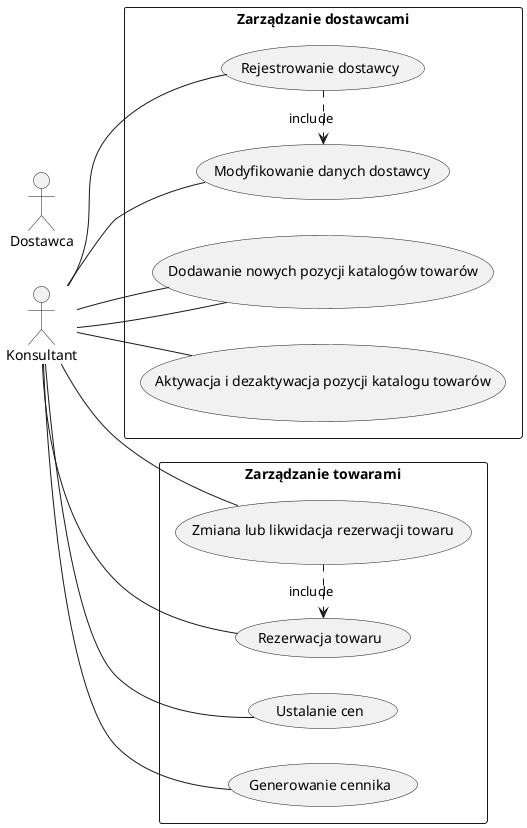
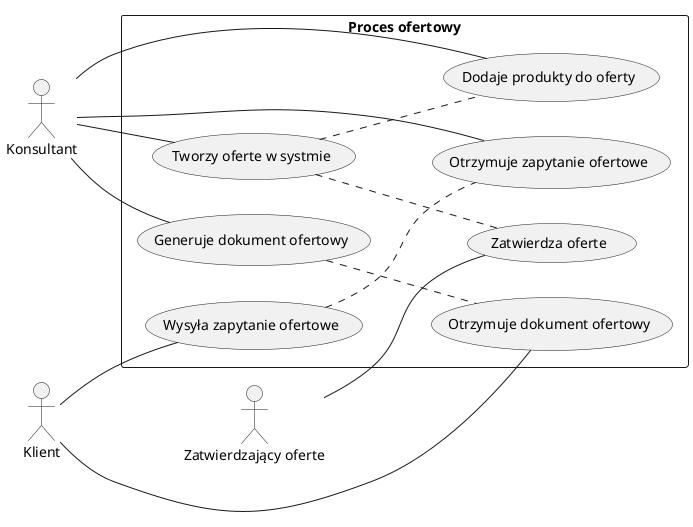
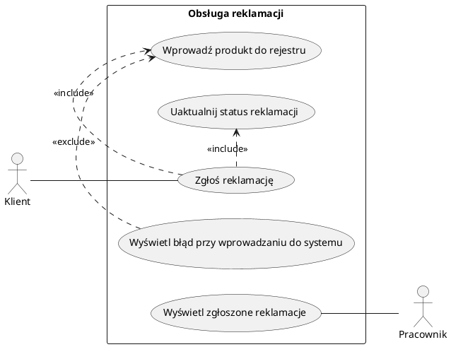
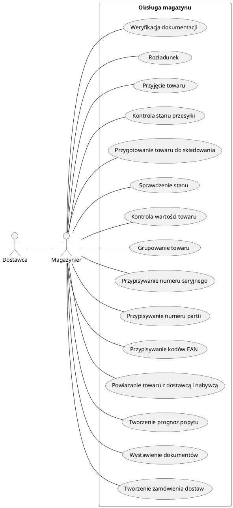
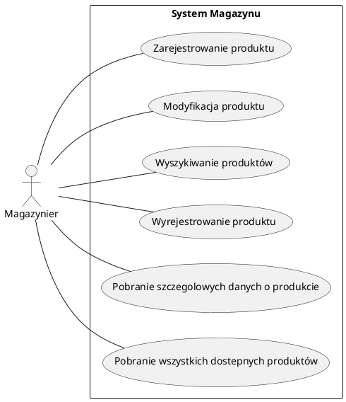
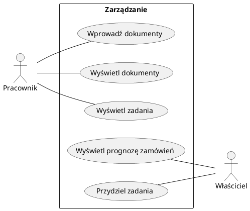
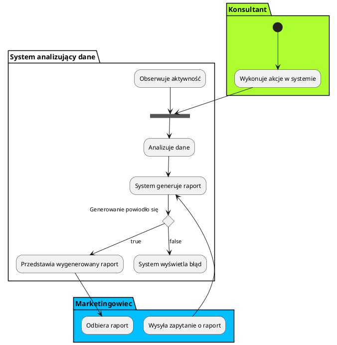

Zespół: 
- _Mateusz Popielarz_
- Adam Samsonowicz
- Kamil Gliński
- Kacper Kwapisz

<h1>System wspomagania sprzedaży/marketingu urządzeń z sektora automatyki przemysłowej</h2>

Żródło danych: Firma rodzinna

AGH WIET - Praca PSI, semestr 6, 2019 - 2020.

Spis Treści

---

<!-- TOC insertanchor:false withlinks:true anchormode:bitbucket.org updateonsave:true orderedlist:true depthfrom:1 depthto:3 -->

- [1. Sformułowanie zadania projektowego](#markdown-header-1-sformułowanie-zadania-projektowego)
    - [1.1. Przedmiot modelowania – opis dziedziny problemu](#markdown-header-11-przedmiot-modelowania-opis-dziedziny-problemu)
        - [1.1.1. Nazwa firmy](#markdown-header-111-nazwa-firmy)
        - [1.1.2. Typ firmy](#markdown-header-112-typ-firmy)
        - [1.1.3. Cel produktu](#markdown-header-113-cel-produktu)
        - [1.1.4. Opis dziedziny działalności](#markdown-header-114-opis-dziedziny-działalności)
        - [1.1.5. Cele firmy](#markdown-header-115-cele-firmy)
        - [1.1.6. Schemat struktury organizacyjnej](#markdown-header-116-schemat-struktury-organizacyjnej)
    - [1.2. Obszar modelowania OM – wstępny opisowy model stanu istniejącego](#markdown-header-12-obszar-modelowania-om-wstępny-opisowy-model-stanu-istniejącego)
        - [1.2.1. Wywiad z zarządem w celu ustalenia przeznaczenia systemu](#markdown-header-121-wywiad-z-zarządem-w-celu-ustalenia-przeznaczenia-systemu)
        - [1.2.2. Definicja celu systemu](#markdown-header-122-definicja-celu-systemu)
        - [1.2.3. Składniki organizacyjne dla Obszaru Modelowania](#markdown-header-123-składniki-organizacyjne-dla-obszaru-modelowania)
    - [1.3. Zakres odpowiedzialności systemu (ZOS)](#markdown-header-13-zakres-odpowiedzialności-systemu-zos)
        - [1.3.1. Obszary aktywności (OA)](#markdown-header-131-obszary-aktywności-oa)
    - [1.4. Zwięzła nazwa problemu](#markdown-header-14-zwięzła-nazwa-problemu)
        - [1.4.1. Nazwa problemu](#markdown-header-141-nazwa-problemu)
        - [1.4.2. Nazwa kodowa projektu](#markdown-header-142-nazwa-kodowa-projektu)
    - [1.5. Cele do osiągnięcia](#markdown-header-15-cele-do-osiągnięcia)
        - [1.5.1. Cele produktu](#markdown-header-151-cele-produktu)
        - [1.5.2. Cele przedsięwzięcia projektowego](#markdown-header-152-cele-przedsięwzięcia-projektowego)
- [2. Opis Wymagań Systemu](#markdown-header-2-opis-wymagań-systemu)
    - [2.1. Funkcje systemu ze strony widzenia użytkownika](#markdown-header-21-funkcje-systemu-ze-strony-widzenia-użytkownika)
        - [2.1.1. Aktorzy w systemie](#markdown-header-211-aktorzy-w-systemie)
    - [2.2. Dane przechowywane w systemie](#markdown-header-22-dane-przechowywane-w-systemie)
        - [2.2.1. Opis Magazynu](#markdown-header-221-opis-magazynu)
    - [2.3. Dokumenty wprowadzane i wyprowadzane z systemu – wzory](#markdown-header-23-dokumenty-wprowadzane-i-wyprowadzane-z-systemu-wzory)
    - [2.4. Wyniki analizy wymagań funkcjonalnych](#markdown-header-24-wyniki-analizy-wymagań-funkcjonalnych)
    - [2.5. Modelowanie zachowań w czasie](#markdown-header-25-modelowanie-zachowań-w-czasie)
        - [2.5.1. Analiza danych na potrzeby marketingowe (OA6)](#markdown-header-251-analiza-danych-na-potrzeby-marketingowe-oa6)
    - [2.6. Wymagania funkcjonalne dla dodatkowych części systemu](#markdown-header-26-wymagania-funkcjonalne-dla-dodatkowych-części-systemu)
        - [2.6.1. Zarejestrowanie faktu dodania dostawcy do systemu](#markdown-header-261-zarejestrowanie-faktu-dodania-dostawcy-do-systemu)
        - [2.6.2. Zmienienie rejestru dostawcy](#markdown-header-262-zmienienie-rejestru-dostawcy)
        - [2.6.3. Dodanie towaru](#markdown-header-263-dodanie-towaru)
        - [2.6.4. Zmiana towaru](#markdown-header-264-zmiana-towaru)
        - [2.6.5. Dezaktywacja towaru](#markdown-header-265-dezaktywacja-towaru)
        - [2.6.6. Ustalenie progu cenowego towaru](#markdown-header-266-ustalenie-progu-cenowego-towaru)
        - [2.6.7. Wygeneruj cennik](#markdown-header-267-wygeneruj-cennik)
        - [2.6.8. Wygeneruj cennik](#markdown-header-268-wygeneruj-cennik)
        - [2.6.9. Zarezerwuj towar](#markdown-header-269-zarezerwuj-towar)
        - [2.6.10. Usuń rezerwację towaru](#markdown-header-2610-usuń-rezerwację-towaru)
        - [2.6.11. Poinformuj SMS](#markdown-header-2611-poinformuj-sms)
        - [2.6.12. Zgłoszenie reklamacji przez klienta](#markdown-header-2612-zgłoszenie-reklamacji-przez-klienta)
        - [2.6.13. Obsługa zgłoszenia reklamacji klienta przez pracownika](#markdown-header-2613-obsługa-zgłoszenia-reklamacji-klienta-przez-pracownika)
        - [2.6.14. Przygotowanie produktów do odesłania do dostawcy](#markdown-header-2614-przygotowanie-produktów-do-odesłania-do-dostawcy)
        - [2.6.15. Realizacja wysłania produktów do dostawcy](#markdown-header-2615-realizacja-wysłania-produktów-do-dostawcy)
        - [2.6.16. Realizacja wysłania produktów do dostawcy](#markdown-header-2616-realizacja-wysłania-produktów-do-dostawcy)
        - [2.6.17. Wprowadzenie reklamowanych produktów do rejestru](#markdown-header-2617-wprowadzenie-reklamowanych-produktów-do-rejestru)
        - [2.6.18. Wprowadzenie dokumentów do systemu](#markdown-header-2618-wprowadzenie-dokumentów-do-systemu)
        - [2.6.19. Możliwość odczytu prognoz zapotrzebowania czasowego na produkty](#markdown-header-2619-możliwość-odczytu-prognoz-zapotrzebowania-czasowego-na-produkty)
        - [2.6.20. Możliwość odczytu prognoz zapotrzebowania ilościowego na produkty](#markdown-header-2620-możliwość-odczytu-prognoz-zapotrzebowania-ilościowego-na-produkty)
        - [2.6.21. Przydział pracowników do określonych zadań](#markdown-header-2621-przydział-pracowników-do-określonych-zadań)
        - [2.6.22. Zarejestrowanie produktu](#markdown-header-2622-zarejestrowanie-produktu)
        - [2.6.23. Modyfikacja produktu](#markdown-header-2623-modyfikacja-produktu)
        - [2.6.24. Wyrejestrowanie produktu](#markdown-header-2624-wyrejestrowanie-produktu)
        - [2.6.25. Pobranie szczególowych danych o produkcie](#markdown-header-2625-pobranie-szczególowych-danych-o-produkcie)
        - [2.6.26. Pobranie wszystkich dostepnych produktow](#markdown-header-2626-pobranie-wszystkich-dostepnych-produktow)
    - [2.7. Wymagania niefunkcjonalne](#markdown-header-27-wymagania-niefunkcjonalne)
        - [2.7.1. Wymagania Produktowe](#markdown-header-271-wymagania-produktowe)
        - [2.7.2. Wymagania organizacyjne](#markdown-header-272-wymagania-organizacyjne)
        - [2.7.3. Wymagania zewnętrzne](#markdown-header-273-wymagania-zewnętrzne)
- [3. Załącznik A: Słownik pojęć dziedzinowych:](#markdown-header-3-załącznik-a-słownik-pojęć-dziedzinowych)
    - [3.1. A](#markdown-header-31-a)
    - [3.2. F](#markdown-header-32-f)
    - [3.3. I](#markdown-header-33-i)
    - [3.4. K](#markdown-header-34-k)
    - [3.5. P](#markdown-header-35-p)
    - [3.6. R](#markdown-header-36-r)
    - [3.7. S](#markdown-header-37-s)
    - [3.8. Z](#markdown-header-38-z)
- [4. Załącznik B: Wzory dokumentów](#markdown-header-4-załącznik-b-wzory-dokumentów)
        - [4.1. Danedostawcy.docx](#markdown-header-41-danedostawcydocx)
        - [4.2. Danefabryki.docx](#markdown-header-42-danefabrykidocx)
        - [4.3. Wpistowaruwkatalogu.docx](#markdown-header-43-wpistowaruwkatalogudocx)
        - [4.4. Wpisdotyczącycenytowaru.docx](#markdown-header-44-wpisdotyczącycenytowarudocx)
        - [4.5. Dokumentofertowy.doc](#markdown-header-45-dokumentofertowydoc)
        - [4.6. Dokumentpotwierdzajacyrealizacjereklamacji.docx](#markdown-header-46-dokumentpotwierdzajacyrealizacjereklamacjidocx)
        - [4.7. Formularzofertyudzielonejdlaklienta.doc](#markdown-header-47-formularzofertyudzielonejdlaklientadoc)
        - [4.8. Formularzprosbyodostepnosctowaru.docx](#markdown-header-48-formularzprosbyodostepnosctowarudocx)
        - [4.9. Formularzreklamacjidodostawcy.docx](#markdown-header-49-formularzreklamacjidodostawcydocx)
        - [4.10. Formularzreklamacjiodklienta.docx](#markdown-header-410-formularzreklamacjiodklientadocx)
        - [4.11. Instomformularzdanychklienta.docx](#markdown-header-411-instomformularzdanychklientadocx)
        - [4.12. Instomprzesunieciemiedzymagazynowe.docx](#markdown-header-412-instomprzesunieciemiedzymagazynowedocx)
        - [4.13. Instomprzyjecie zewnetrzne.docx](#markdown-header-413-instomprzyjecie-zewnetrznedocx)
        - [4.14. Instomrozchodwewnetrzny.docx](#markdown-header-414-instomrozchodwewnetrznydocx)
        - [4.15. Instomwydanie zewnetrzne.docx](#markdown-header-415-instomwydanie-zewnetrznedocx)
        - [4.16. Raportzakcjimarketingowych.doc](#markdown-header-416-raportzakcjimarketingowychdoc)
        - [4.17. Zamówienieklienta.doc](#markdown-header-417-zamówienieklientadoc)
- [5. Załącznik C:](#markdown-header-5-załącznik-c)
- [6. Załącznik D:](#markdown-header-6-załącznik-d)
- [7. Załącznik E: Spis rysunków](#markdown-header-7-załącznik-e-spis-rysunków)
- [8. Załącznik F: Podział zadań](#markdown-header-8-załącznik-f-podział-zadań)

<!-- /TOC -->

# 1. Sformułowanie zadania projektowego

## 1.1 Przedmiot modelowania – opis dziedziny problemu

### 1.1.1 Nazwa firmy

Instom

### 1.1.2 Typ firmy

Firma handlowa - `FH`, firma jest spółką z ograniczoną odpowiedzialnością

### 1.1.2 Cel produktu

System służy do wspomagania zarządzania `FH`.

Firma jako działający na rynku pretendent do lidera w sprzedaży urządzeń z automatyki przemysłowej na codzień ma przed sobą wiele wyzwań. Jednym z nich jest świadczenie usług najwyższej jakości. W tym celu kadra specjalistów z zakresu marketingu, sprzedaży i obsługi magazynowej codziennie dokłada wszelkich starań, by utrzymać wysoki poziom zadowolenia klientów, co przekłada się na wysoką liczbę zrealizowanych zamówień przy zmniejszającym się czasie ich realizacji.
Dla zmniejszenia czasu dostawy najpopularniejszych towarów są one magazynowane na miejscu i dostarczane z lokalnego miejsca przechowywania.

Jako że nie każdy klient ma odpowiednio przeszkoloną kadrę do montażu sprzętu, firma pośredniczy w implementacji rozwiązania u klienta komunikując się z integratorami.
Jednym z problemów z którym firma musi się zmierzyć jest rosnąca ilość zamówień, co sprawia, że kontrola nad procesami oraz zleceniami i zamówieniami jest coraz trudniejsza.

Wysoko wykwalifikowana kadra do spraw sprzedaży służy klientowi wiedzą przy wyborze sprzętu.

### 1.1.3 Opis dziedziny działalności

Klientami są: przemysł, hurtowanie, integratorzy.
Klienci w większości są inżynierami.

Komunikacja odbywa się przez email. Wysyłają zapytania z listą interesujących ich produktów.

Niektórzy kliencie potrzebują pomocy w dobraniu produktów, konfiguracji zestawu produktów.

Integratorzy kupują produkty od firmy, lub zajmują się samym montażem, gdy klient dokona zakupu. Są to firmy zewnętrzne niepowiązane.

Firma współpracuje z dostawcami, którymi są międzynarodowe fabryki.

Dostawcy zajmują się wysyłką.

Jeżeli produkt jest wysłany do dostawcy na podstawie reklamacji, i jest to bezpodstawne wg. dostawcy to koszty ponosi firma nie dostawcy. Z tego powodu ważne są procedury decydujące o oględziny produktów wysyłanych do reklamacji przez wewnętrzny zespół.

### 1.1.4 Cele firmy

Celem firmy jest doskonalenie usług, zgodnie z potrzebami klientów i ich oczekiwaniami. Firma chce kontynuować ekspansję na Polskim rynku, a w tym celu jest potrzeba:

- Pozyskania nowych klientów

- Zmniejszenia średniego czasu do zamknięcia zamówienia
- Zwiększenie liczby opinii odebranych od klientów i bardziej przekrojowej ich analizie
- Optymalizacji procesów w firmie
- Optymalizacji ilości i typu magazynowanych produktów

### 1.1.5 Schemat struktury organizacyjnej

W tym punkcie opiszemy strukturę organizacyjną ( Do każdego punktu krótki opis)

##### _Rysunek 01. Diagram struktura zarządu_

W obecnym okresie jest około 60 pracowników.
W sprzedzaży pracuje około 20, w zarządzie 5, W dziale marketingu 5, natomiast w księgowości 10, w dziale usług 20

- Zarząd: Pracownicy tego poziomu zajmują się koordynowaniem działania firmy na najwyższym poziomie, planują długofalową strategię ekspansji, zatwierdzają budżet, wyznaczają cele na kolejne kwartały
- Marketing : Pracownicy działu marketingu zajmują się przygotowaniem materiałów reklamowych, zakupem reklam oraz wyszukiwaniem potencjalnie zainteresowanych firm
- Dział R&D : Pracownicy działu marketingu zajmują się tworzeniem nowych rozwiązań z zakresu automatyki- nie będziemy w tym systemie zajmować się obsługą tego działu.
- Dzial handlowy: Pracownicy handlowi zajmują się finalizowaniem zamówień, tworzeniem zleceń zakupu, reagowaniem na niski stan magazynowy i uzupełnianiem braków.
- Księgowość: Pracownicy księgowości zajmują się finansami - przetwarzane są tam faktury, część tego działu jest działem kadrowym

## 1.2 Obszar modelowania OM – wstępny opisowy model stanu istniejącego

### 1.2.1 Wywiad z zarządem w celu ustalenia przeznaczenia systemu

Został przeprowadzony wywiad z zarządem. Transkrypcje odpowiedzi umieścimy w _Załączniku Transkrypcja_.

### 1.2.2 Definicja celu systemu

Celem systemu PSSK jest kompleksowe wspomaganie procesu zamówienia od złożenia go przez klienta, przez pomoc i kontrolowanie procesu zlecenia zakupu komponentów po obsługę gwarancyjną.
Dodatkowym celem będzie stworzenie przejrzystej struktury dokumentów przepływających przez firmę niezbędnych do sprawnego działania organizacji.

### 1.2.3 Składniki organizacyjne dla Obszaru Modelowania

- Dział handlu (Obsługa klienta, pośredniczenie w składaniu zamówień)

  System będzie pomagał sprzedawcy przy odbieraniu zamówienia od klienta.

  Konsultant będzie wprowadzał dane klienta do systemu

  System będzie mógł powiadomić konsultanta o zmianie lub zdarzeniach

  System będzie asystował przy składaniu zleceniu zakupu

  System będzie przechowywał informacje na temat reklamacji i ich stanu

* Dział księgowości (Wewnętrzne rozliczenia, rozliczenia faktur z dostawcami)

  System będzie generować faktury sprzedażowe

  System będzie generował faktury dla współpracowników

  System będzie rejestrował stan wypłaconych pensji

  System będzie generował listę płac

- Dział usług (Rozwijanie systemów bezpieczeństwa) -
  Integracja systemu w tym obszarze będzie polegać tylko na obsłudze kadrowej

* Dział marketingu (Śledzenie rezultatów akcji marketingowych)

  System będzie generował raporty
  System będzie miał możliwość porównywania okresów akcji promocyjnej z wynikami sprzedaży

## 1.3 Zakres odpowiedzialności systemu (ZOS)

### 1.3.1 Obszary aktywności (OA)

##### _Rysunek 02. Przegląd obszarów aktywności_

#### 1.3.1.1 Obsługa zamówień (OA1)

Obszar aktywności obsługi zamówień zawiera w sobie

1. Prowadzenie rejestru dostawcy

   1. Rejestrowanie dostawców

      Jako `Konsultant` potrzebuję `dodać dostawcę do systemu`.

   2. Korygowanie danych dostawcy

      Jako `Konsultant` potrzebuję `zmodyfikować dane dostawcy`, ponieważ zmiana dany dostawcy, lub dane były wprowadzone z błędem.

2) Prowadzenie katalogu i cennika towarów

   1. Dodawanie nowych pozycji katalogów towarów

      Jako `Konsultant` przy odbiorze nowych broszur z towarami od dostawców mogę `dodać nową pozycję towaru` w katalogu.

   2. Aktywacja i dezaktywacja pozycji katalogu towarów

      Jako `Konsultant` przy odbiorze nowych broszur z towarami od dostawców mogę `zaktualizować pozycję towaru` w katalogu.

   3. Ustalanie cen

      Jako `Konsultant` mogę dodać do towaru cenę.

   4. Generowanie cennika

      Jako Konsultant chcę pokazać klientowi dostępne dla niego `towary` w przystępnej postaci

3) Rezerwacja towaru

   1. Rezerwacja towaru

      Jako `Konsultatnt` gdy istnieje prawdopodobieństwo `Zlecenia zakupu` obejmującego dany towar mogę go `zarezerwować`

   1. Zmiana lub likwidacja rezerwacji towaru

      Jako `Konsultant` gdy `Zlecenia Zakupu` przestanie obejmować dany towar mogę zlikwidować całkowicie `rezerwację towaru` u danego dostawcy .

#### 1.3.1.2 Obsługa zleceń zakupu (OA2)

1. Prowadzenie bazy klientów

   1. Rejestrowanie klienta

      `Konsultant` w sytuacji gdy nawiązuję się współpraca z nowym `klientem` powinien mieć możliwość dodania go do system poprzez interface udostępniany przez system.

   2. Korygowanie danych klienta

      `Konsultant` powiadomiony przez `klienta` o zmianie danych `klienta` powinien mieć możliwość wprowadzenia poprawnych danych do systemu.

2. Przyjęcie zapytania ofertowego od klienta

   `Klient` wysyła zapytanie ofertowe do `konsultanta`, `konsultant` powinien być powiadomiony o takim zapytaniu w celu dalszego procesowania danego zapytania.

3. Przygotowanie oferty dla klienta

   1. Utworzenie oferty w systemie

      `Konsultant` po otrzymaniu zapytania ofertowego od klienta powinien mieć możliwośc utworzenia oferty w systemie.

   2. Dodanie produktów do oferty

      1. Znalezienie w systemie oraz dodanie produktów do oferty

         `Konsultant` po stworzeniu oferty powinien mieć możliwość dodania produktów do oferty, które to produkty są zdefiniowane przez samego `klienta` lub wyszukane w systemie przez `konsultanta`.

      2. Sprawdzenie dostępności produktu

         1. Sprawdzenie aktualnego stanu magazynu

            `Konsultant` podczas tworzenia oferty dla klienta musi znać czas realizacji danej oferty, w tym celu powinien mieć możliwość sprawdzenia czy produkty, których potrzebuje klient znajdują się na magazynie.

         2. Sprawdzenie najszybszego możliwego czasu dostawy

            W przypadku braku towarów na magazynie `konsultant` powinien mieć możliwość sprawdzenia czasu oczekiwania na dostawe produktów.

   3. Wygenerowanie dokumentu ofertowego

      `Konsultant` po stworzeniu oferty oraz dodaniu odpowiednio skonfigurowanych produktów powinien mieć możliwość wygenerować dokument ofertowy w czytelnej dla `klienta` formie.

   4. Zatwierdzenie oferty przez przełożonego

      Jeżeli wymaga tego sytuacja, na którą wpływa doświadczenie oraz pozycja `konsultanta`, to system powinien umożliwiać `konsultantowi` przedstawienie oferty do przełożonego w celu jej akceptacji.

4. Kontakt z klientem w celu potwierdzenia oferty

   1. Przedstawienie oferty klientowi

      `Konsultant` po stworzeniu oferty i wygenerowaniu dokumentu ofertowego, przedstawia ten dokument `klientowi`.

   2. Potwierdzenie oferty przez klienta

      `Klient` jest zgodny co do oferty, `konsultant` wtedy powinien mieć możliwość sprawdzenia w systemie jaka forma potwierdzenia jest możliwa dla danego `klienta`. Może być to przedpłata dla nowych klientów, lub też zwykły email potwierdzający od zaufanych klientów. `Konsultant` powinien mieć możliwość sprawdzenia wszystkich danych wpływających na dalszy proces zamówienia, mogą być to kredyty kupieckie lub historia spóźnień w zapłatach przez danego `klienta`. W razie braku informacji lub doświadczenia posiadanych przez `konsultanta`, `konsultant` powinien mieć możliwość uzyskania takiej informacji przez system od przełożonego.

5. Wystawienie faktury

   `Konsultant` powinien mieć możliwość przesłania potwierdzonej oferty do działu księgowości w celu wystawienia faktury dla `klienta`.

6. Zatwierdzenie faktury - Klient zapłacił za faktury

#### 1.3.1.3 Obsługa reklamacji (OA3)

1. Przyjęcie zgłoszenia reklamacji od klienta

   Jako `klient` chciałbym mieć możliwość złożenia reklamacji aby otrzymać działający produkt lub zwrot pieniędzy.

2. Analiza zasadności reklamacji

   1. Sprawdzenie zasadności reklamacji przez zespół

      Jako `właściciel` chciałbym, aby `zespół techniczny` przeanalizował zasadność oddania produktu do reklamacji przez `klienta`, aby nie angażować `dostawcy` we wszystkie zgłoszenia reklamacji.

3. Zgłoszenie reklamacji dostawcy

   1. Przygotowanie produktów do odesłania do dostawcy

      Jako `właściciel` chciałbym, aby `zespół techniczny` przygotował reklamowane produkty do odesłania `dostawcy`.

    2. Realizacja reklamacji do dostawcy

        Jako `właściciel` chciałbym móc wysłać przygotowane, reklamowane produkty do `dostawcy`, aby otrzymać od niego wymienione, działające produkty.

4. Prowadzenie rejestru reklamacji

   Jako `właściciel` chciałbym mieć rejestr reklamowanych produktów, aby móc analizować awaryjność produktów.

#### 1.3.1.4 Obsługa magazynu (OA4)

   1. Weryfikacja dokumentacji

      Jako `magazynier` chce mieć możliwość `weryfikacji dokumentacji` aby `procesować towar zgodnie z procedurami i przepisami`.

   1. Rozładunek za pomocą dostępnej infrastruktury przeładunkowej

      Jako `magazynier` chce mieć możliwość `rozładunku` przesyłki aby `zapełnić magazyn produktami`.

   1. Przyjęcie towaru

      Jako `magazynier` chce mieć możliwość `przyjęcia towaru` magazynu aby `przekazać go do dalszego procesowania - rozładunku`.
	  
   1. Kontrola stanu fizycznego przesyłki
	  
      Jako `magazynier` chce mieć możliwość `kontroli stanu przesyłki` magazynu aby `przekazać ją do dalszego procesowania - wysyłki`.

   1. Przygotowanie towaru do składowania

      Jako `magazynier` chce mieć możliwość `przygotowania towaru do składowania` aby `umożliwić szybką wysyłkę w przypadku zamówienia`.

   1. Sprawdzenie stanu

      Jako `magazynier` chce mieć możliwość `sprawdzenia stanu` magazynu aby `okreslić ilość dostępnych produktów`.

   1. Kontrola wartości towaru

      Jako `magazynier` chce mieć możliwość `kontroli wartości towaru` aby `zapewnić jakość produktów zgodnych z warunkami umowy`
	  
   1. Grupowanie towaru

      Jako `magazynier` chce mieć możliwość `grupowania towaru` aby `zminimalizować czas wyszukiwania`
	  
   1. Przypisywanie numeru seryjnego

      Jako `magazynier` chce mieć możliwość `przypisywania unikalnego numeru seryjnego produktom` aby `umożliwić rozróznienie produktu oraz ułatwić wyszukiwanie`

   1. Przypisywanie numeru partii

      Jako `magazynier` chce mieć możliwość `przypisywania numeru partii` aby `umożliwić rozróznienie produktu oraz ułatwić wyszukiwanie`

   1. Przypisywania kodów EAN

      Jako `magazynier` chce mieć możliwość `przypisywania kodów EAN` aby `umożliwić wysyłkę produktu po całej Europie`

   1. Powiązanie towaru z dostawcą i nabywcą

      Jako `magazynier` chce mieć możliwość `powiązania towaru z dostawcą i nabywcą` aby `dostarczyć przesyłkę pod odpowiednią lokalizację`.

   1. Tworzenie prognoz popytu

      Jako `magazynier` chce mieć możliwość `tworzenia prognoz popytu` aby `utrzymać kluczowe produkty na stanie`
	  
   1. Wystawienie dokumentów (PZ WZ MM PW RW)
	
      Jako `magazynier` chce mieć możliwość `wystawiania dokumentów` aby `zapenić wymagane dokumenty w prcedurze`.
	  
	  
#### 1.3.1.5 Rejestr magazynu (OA5)

   1. Zarejestrowanie produktu

      Jako `magazynier` chce mieć możliwość `zarejestrowania produktu` aby `udostępnić oraz uaktualnić informacje o dostępności produktu`.
	  
   1. Modyfikacja produktu
	
      Jako `magazynier` chce mieć możliwość `modyfikacji danych` aby `uaktualnić informacje o produkcie`.

   1. Wyszukiwanie produktów

      Jako `magazynier` chce mieć możliwość `wyszukiwania produktów` aby `pobrać produkt o określonych atrybutach`.
	  
   1. Pobranie szczegolowych danych o produkcie
	
      Jako `magazynier` chce mieć możliwość `pobrania informacji na temat produktow` aby `otrzymac informacje o aktualnym stanie magazynu`.
		
   1. Pobranie wszystkich dostepnych produktow
	
      Jako `magazynier` chce mieć możliwość `pobrania wszystkich dostepnych produktow` aby `otrzymac informacje o aktualnym stanie magazynu`.
		
   1. Wyrejstrowanie produktu z magazynu

      Jako `magazynier` chce mieć możliwość wyrejestrowania produktu z magazynu aby `uaktualnić informacje o dostępności produktu`.
	  
   1. Tworzenie zamówienia dostaw na podstawie zarejestrowanych rezerwacji wystawienie dokumentów magazynowych

      Jako `magazynier` chce mieć możliwość `tworzyć zamówienia dostaw` aby `zapewnić wymagane dokumenty dotyczące dostaw`.
      
      
#### 1.3.1.6 Analizy danych na potrzeby marketingowe (OA6)

1. Statystyki powiązane z katalogiem produktowym

   Katalog produktowy jest udostępniony na stronie głównej firmy, strona znajduje się w sieci www. Opisywany w dokumencie system powinien mieć możliwość wglądu do statystyk związanych z ruchem w katalogu produktowym w celu udoskonalenia przedstawianych przez system statystyk marketingowych.

2. Wystawienie danych na strategiczne potrzeby marketingowe

   Dział marketingu podejmuje decyzje bazujące na danych sprzedażowych. System takie dane powinien generować oraz dostarczać do pracowników powiązanych z planowaniem strategicznym czynności marketingowych.

#### 1.3.1.7 Rejestr potencjalnych klientów i stanu kontaktu z nimi (OA7)

1. Prowadzenie bazy potencjalnych klientów

   1. Dodawanie informacji i danych o klientach
      Jako `Konsultant` gdy chce wprowadzić nowego `klienta` do systemu mogę wpisać jego podstawowe dane do formularza.

   1. Zmiana informacji o kliencie
      Jako `Konsultant`, gdy dostanę informacje o klienta o zmianie w jego danych mam możliwość zmienić istniejaćy wpis w rejestrze.

   1. Usuwanie informacji i danych o klientach
      Jako `Konsultant` gdy klient wycoda zgodę na rodo muszę mieć możliwość zanonymizowania danych

1. Informowanie o ofercie

   1. Wyświetlenie daty ostatniego kontaktu z klientem
      Jako `Konsultatnt` mam możliwość sprawdzenia, kiedy ostatni raz prezentowałem mu daną ofertę.

   1. Wysylanie notyfikacji o ofercie pocztą elektroniczną email
      Jako `Konsultant` mam możliwość wysłania wygenerowanej oferty na adres e-mail

   1. Udzielanie informacji o ofercie telefonicznie
      Jako `Konsultant` mam możliwość za pomocą systemu ustanowić połączenie telefoniczne z klientem - system pokazuje wygenerowaną, spersonalizowaną ofertę którą `konsultant` może zaprezentować. W systemie powinna być załączona kopia oferty, rozmowy i potwierdzenie zgody klienta na nagrywanie.

#### 1.3.1.8 Zarządzanie (OA8)

1. Organizacja (obieg dokumentacji, system informacji, obszary zadaniowe)

   Jako `właściciel` chciałbym mieć możliwość łatwego obiegu dokumentacji między działami.

1. Szacowanie czasowego i ilościowego zapotrzebowania na produkty dla 1 dostawy

   Jako `właściciel` chciałbym znać zapotrzebowanie czasowe (prognozę zamówień) na produkty do zamówienia od `dostawcy`.

   Jako `właściciel` chciałbym znać zapotrzebowanie ilościowe na produkty do zamówienia od `dostawcy`.

1. Przydział pracowników do określonych zadań

   Jako `właściciel` chciałbym mieć możliwość przydzielania pracowników do określonych zadań za pomocą systemu zarządzania

## 1.4 Zwięzła nazwa problemu

### 1.4.1 Nazwa problemu

System do przekrojowego zarządzania firmą wspomagający sprzedaż, marketing i kontakt z integratorami

### 1.4.2 Nazwa kodowa projektu

Przekrojowy system sprzedażowo-konsultingowy - PSSK

## 1.5 Cele do osiągnięcia

### 1.5.1 Cele produktu

Produkt ma na celu wsparcie firmy poprzez:

- Redukcję narzutu komunikacyjnego między ludźmi i formalizacji komunikacji
- Krystalizację procedur istniejących w firmie
- Umożliwieniem dostępu do statystyk działalności
- Uproszczenie kontaktu sprzedawca klient, uproszczenie obsługi zamówienia przez kilku sprzedawców
- Śledzeniem stanu magazynowego i wprowadzeniem mechanizmu notyfikacji przy niedostatecznym poziomie materiałów
- Zwiększenie jakości obsługi przez ujednoliconą mechanizm informacji o kliencie

### 1.5.2 Cele przedsięwzięcia projektowego

Przedsięwzięcie docelowo miałoby na celu

- Zmniejszenie średniego czasu obsługi pojedyńczego klienta o więcej niż 10%
- Ograniczyć czas brak stanów magazynowych najpopularniejszych produktów o 15%
- Ograniczyć reklamacje odrzucone przez dostawców o 5%
- Zmniejszyć czas realizacji następnego zamówienia o tych samych parametrach jak jedno z poprzednich o 40%
- Ograniczyć czas spędzany na wypełnianiu dokumentów przez wprowadzanie ustandaryzowanych elektroniczych formularzy o 20%

Dodatkową korzyścią z tego przedsięwzięcia byłoby przećwiczenie zbierania wymagań oraz przeprowadzenia ich analizy biznesowej.

# 2. Opis Wymagań Systemu

## 2.1 Funkcje systemu ze strony widzenia użytkownika

### Aktorzy w systemie

##### _Rysunek 03. Aktorzy w systemie_

W systemie możemy wyróżnić następujących aktorów

- Konsultant - wprowadza zamówienia do systemu, aktualizuje je, dezaktywuje, zgłasza zlecenia zakupu, sprawdza stan zamówień, zgłasza reklamację w system, sprawdza notyfikacje, może przejąć opiekę nad klientem innego konsultanta
- Magazynier - aktualizuje stan magazynowy, zgłasza ewentualne nieprawidłowości w stanie faktycznym, zatwierdza wysyłkę towaru
- Marketingowiec - wprowadzą informacje do systemu na temat kampanii promocyjnych, aktualizuje ich stan, ma dostęp do statystyk
- Członek zarządu - Ma dostęp do większości informacji, jego zakresem zainteresowań będzie wpływ przeprowadzanych akcji na wyniki finansowe i efektywność działań ,widoki dla tego aktora powinny ukrywać dane użytkownika RODO
- Księgowy - ma dostęp do zamówień i zleceń zakupu, synchronizuje dane między zewnętrznym
- System zewnętrzny dostawcy - może aktualizować stan zlecenia zakupu (np. na wysłane), lub stan reklamacji

## 2.2 Dane przechowywane w systemie

1. Reprezentant Klienta - jest to osoba fizyczna podejmująca z nami kontakt, należy do Organizacji klienta

   1. Imię
   1. Nazwisko
   1. Email kontaktowy
   1. Telefon kontaktowy
   1. Adres kontaktowy
   1. `Organizacja Klienta`
   1. Zgoda na przetwarzanie danych osobowych w formie cyfrowej
   1. Numer referencyjny

1. Organizacja klienta - jest to działalność gospodarcza

   1. Nazwa firmy
   1. NIP
   1. Wystawione faktury przez naszą firmę
   1. Wystawione faktury do opłacenia przez nasza firmę
   1. Kraj pochodzenia
   1. Reprezentanci
   1. Lokale

1) Dostawca - jest to firma od której zamawiamy

   1. Nazwa firmy
   1. NIP
   1. Wystawione faktury na naszą firmę
   1. Wystawione faktury na firmę dostawcy
   1. Kraj pochodzenia
   1. Łączna kwota zamówień

1. Oferta

   1. Zaproponowane produkty
   1. Data wystawienia
   1. Klient

1. Pracownik
   1. Imię
   1. Nazwisko
   1. Email kontaktowy
   1. Telefon kontaktowy
   1. Adres kontaktowy
   1. Pensja
   1. Data zatrudnienia
   1. Data rozwiązania umowy

### 2.2.4 Opis Magazynu

1. Miejce w magazynie
   1. Sektor
   1. Numer Miejsca
   1. Obecnie przechowywany produkt
   1. Historycznie przechowywane produkty
   1. Rezerwacja pod produkt wielkogabarytowy

## 2.3 Dokumenty wprowadzane i wyprowadzane z systemu – wzory

#### 1.Dane_dostawcy.docx
#### 2.Dane_fabryki.docx
#### 3.Wpis_towaru_w_katalogu.docx
#### 4.Wpis_dotyczący_ceny_towaru.docx
#### 5.Dokument_ofertowy.doc
#### 6.Dokument_potwierdzajacy_realizacje_reklamacji.docx
#### 7.Formularz_oferty_udzielonej_dla_klienta.doc
#### 8.Formularz_prosby_o_dostepnosc_towaru.docx
#### 9.Formularz_reklamacji_do_dostawcy.docx
#### 10.Formularz_reklamacji_od_klienta.docx
#### 11.Instom_formularz_danych_klienta.docx
#### 12.Instom_przesuniecie_miedzymagazynowe.docx
#### 13.Instom_przyjecie zewnetrzne.docx
#### 14.Instom_rozchod_wewnetrzny.docx
#### 15.Instom_wydanie zewnetrzne.docx
#### 16.Raport_z_akcji_marketingowych.doc
#### 17.Zamówienie_klienta.doc

## 2.4 Wyniki analizy wymagań funkcjonalnych

W tym punkcie określimy przypadki użycia do określonych wcześniej historyjek użytkownika.

#### 2.4.1 Obsługa zamówień (OA1)

##### _Rysunek 04. Diagram przypadków użycia aktualizacji danych dostawcy_

**Numer i Nazwa przypadku użycia:** UC-1.1 - Rejestrowanie dostawcy

**Autor:** Mateusz Popielarz

**Cel przypadku użycia:** Dodanie dostawcy do systemu

**Kontekst użycia:** ​Gdy system będzie wprowadzany będziemy potrzebować możliwości wprowadzenia istniejących dostawców do systemu. Innym przypadkiem jest sytuacja, gdy firma pozyska nowego dostawcę - w tym wypadku także będziemy musieli go wpisać do systemu.

**Zakres:** System do obsługi dostawców

**Poziom:** Przetwarzanie danych dostawców

**Aktor główny:** Konsultant

**Warunek początkowy:** Dostawca nie jest zarejestrowany

**Zdarzenie inicjujące:** Dostawca wyraził chęć dołączenia do naszego łańcucha dostaw

**Główny scenariusz powodzenia:**

1. System wyświetla formularz dodania dostawcy do systemu
2. `Konsultant` wpisuje dane
3. System weryfikuje dane
4. `Dostawca` zostaje zapisany

**Scenariusze alternatywne:**

1. `Dostawca` istnieje w systemie, system proponuje `UC-1.2`
1. Dane nie przeszły walidacji, jest wyświetlany błąd

**Uczestnicy i interesy:**

_Konsultant_ - Jest to w jego zakresu obowiązków
_Dostawca_ - Chce być w naszym systemie, żeby móc dostawać od nas zamówienia, będzie powiadomiony o zdarzeniu zmianiy danych w celu ich weryfikacji

---

**Numer i Nazwa przypadku użycia:** UC-1.2 - Modyfikowanie danych dostawcy

**Autor:** Mateusz Popielarz

**Cel przypadku użycia:** Aktualizacja lub poprawienie danych dsotawcy

**Kontekst użycia:** ​Gdy system będzie wprowadzany będziemy potrzebować możliwości wprowadzenia istniejących dostawców do systemu. Innym przypadkiem jest sytuacja, gdy firma pozyska nowego dostawcę - w tym wypadku także będziemy musieli go wpisać do systemu.

**Zakres:** Gdy dane dostawcy, jak siedziba, nazwa, adres kontaktowy lub numer, ulegną zmianie system musi być w stanie bezproblemowo poradzić sobie ze zmianą tych danych. Dokumenty wystawione przed datą zmiany NIE MOGĄ zostać zmienione. Historia zmian musi być zapisana razem z datą, powodem i osobą jej dokonującą do wglądu zarządu.

**Poziom:** Przetwarzanie danych dostawców

**Aktor główny:** Konsultant

**Warunek początkowy:** Dostawca ma nieaktualne dane

**Zdarzenie inicjujące:** Dostawca poinformował o zmianie danych

**Główny scenariusz powodzenia:**

1. System wyświetla formularz dodania dostawcy do systemu wypełniony danymi
2. `Konsultant` poprawia dane
3. System weryfikuje dane
4. `Dostawca` zostaje zapisany

**Scenariusze alternatywne:**

1. Dane nie przeszły walidacji, jest wyświetlany błąd

**Uczestnicy i interesy:**

_Konsultant_ - Jest to w jego zakresu obowiązków
_Dostawca_ - Jego dane muszą być aktualne, żeby system mógł poprawnie zaklasyfikować paczki, będzie powiadomiony o zdarzeniu zmianiy danych w celu ich weryfikacji

---

**Numer i Nazwa przypadku użycia:** UC-1.3 - Dodawanie nowych pozycji katalogów towarów

**Autor:** Mateusz Popielarz

**Cel przypadku użycia:** Dodawanie nowych pozycji katalogów towarów

**Kontekst użycia:** Firma systematycznie dostaje broszury handlowe od znanych dostawców. Niektóre produkty są dodane do oferty. Konsultant ma mieć możliwość dodać nowy towar w ofercie - niektóre towary nie są dostępne od razu, więc musi być możliwość ustalenia dat, w których ten produkt może być dostępny.

**Zakres:** Dodanie pozycji

**Poziom:** Prowadzenie katalogu i cennika towarów

**Aktor główny:** Konsultant

**Warunek początkowy:** Towaru nie ma w systemie

**Zdarzenie inicjujące:** Konsultant dowiaduje się o nowym towarze od dostawcy

**Główny scenariusz powodzenia:**

1. System wyświetla formularz dodania towaru do systemu
2. `Konsultant` wpisuje dane
3. System weryfikuje dane
4. `Towar` zostaje zapisany

**Scenariusze alternatywne:**

1. Dane nie przeszły walidacji, jest wyświetlany błąd

**Uczestnicy i interesy:**

_Konsultant_ - Jest to w jego zakresu obowiązków

---

**Numer i Nazwa przypadku użycia:** UC-1.4 - Aktywacja i dezaktywacja pozycji katalogu towarów

**Autor:** Mateusz Popielarz

**Cel przypadku użycia:** Aktywacja i dezaktywacja pozycji katalogu towarów

**Kontekst użycia:** Firma systematycznie dostaje broszury handlowe od znanych dostawców. Niektóre produkty są tylko dostępne czasowo, lub są zastąpione przez nowe produkty. Konsultant ma mieć możliwość zedytować w ofercie - niektóre towary są wadliwe lub wycofane z powodu bezpieczeństwa i zastępowane przez nowsze rewizje - musi być możliwość dostepu do informacji kto kupił dany towar w jakim okresie i powiadomienie tych klientów.

**Zakres:** Aktualizacja pozycji

**Poziom:** Prowadzenie katalogu i cennika towarów

**Aktor główny:** Konsultant

**Warunek początkowy:** Towaru wyszedł z użytku

**Zdarzenie inicjujące:** Konsultant dowiaduje się o zmianie dostępności towaru

**Główny scenariusz powodzenia:**

1. System wyświetla wpis towaru
2. `Konsultant` klika aktywuj/dezaktywuj
3. `Towar` zostaje zapisany

**Scenariusze alternatywne:**

1. Dane nie przeszły walidacji, jest wyświetlany błąd

**Uczestnicy i interesy:**

_Konsultant_ - Jest to w jego zakresu obowiązków

---

**Numer i Nazwa przypadku użycia:** UC-1.5 - Ustalanie cen

**Autor:** Mateusz Popielarz

**Cel przypadku użycia:** Ustalanie cen

**Kontekst użycia:** W systemie każdy `towar` musi mieć możliwość definiowania `ceny` - cena powinna być możliwa do ustawienia wobec zakupionego progu ilościowego a także grupy klientów w której klient się znajduje. Ceny muszą mieć możliwość dodania przedziału czasowego w których są aktualne.

**Zakres:** Ustalenie pozycji

**Poziom:** Prowadzenie katalogu i cennika towarów

**Aktor główny:** Konsultant

**Warunek początkowy:** Ceny są nieaktualne

**Zdarzenie inicjujące:** Konsultant chce zaktualizować ceny

**Główny scenariusz powodzenia:**

1. System wyświetla wpis towaru
2. `Konsultant` aktualizuje progi cenowe
3. `Towar` zostaje zapisany

**Scenariusze alternatywne:**

1. Dane nie przeszły walidacji, jest wyświetlany błąd

**Uczestnicy i interesy:**

_Konsultant_ - Jest to w jego zakresu obowiązków

---

**Numer i Nazwa przypadku użycia:** UC-1.6 - Generowanie cennika

**Autor:** Mateusz Popielarz

**Cel przypadku użycia:** Generowanie cennika

**Kontekst użycia:** W systemie ma być dostępna opcja generowania cennika per klient z uwzględnieniem czasu, kiedy jest generowany, rozmiaru zamówienia, typu klienta i dostępnych w tym wymiarze czasu `towarów`. Raz wygenerowany cennik musi być wersjonowany.
**Zakres:** Ustalenie pozycji

**Poziom:** Prowadzenie katalogu i cennika towarów

**Aktor główny:** Konsultant

**Zdarzenie inicjujące:** Konsultant chce wygenerować cennik

**Główny scenariusz powodzenia:**

1. `Konsultant` wybiera opcję wygenerowania cennika
1. Cennik zostaje wygenerowany

**Scenariusze alternatywne:**
Nie przewiduje się.

**Uczestnicy i interesy:**

_Konsultant_ - Jest to w jego zakresu obowiązków

---

**Numer i Nazwa przypadku użycia:** UC-1.7 - Rezerwacja towaru

**Autor:** Mateusz Popielarz

**Cel przypadku użycia:** Rezerwacja towaru

**Kontekst użycia:** W sytuacji, gdy podczas rozmowy z klientem dojdzie do złożenia `przedoferty` która zainteresuje klienta powinna być możliwość `rezerwacji` towaru - polega to na albo nie sprzedawaniu tego towaru innym klientom, gdy jest bardzo niski stan magazynowy, albo na wysłaniu zapytania do dostawcy o zarezerwowanie na okres czasu, który został klientowi przedstawiony jako okienko czasowe na jego decyzję - w przypadku wygaśnięcia tego okienka produkt automatycznie zostaje `wycofany z rezerwacji`.

**Zakres:** Rezerwacja towaru

**Poziom:** Prowadzenie katalogu i cennika towarów

**Aktor główny:** Konsultant

**Warunek początkowy:** Towar jest dostępny i aktywny

**Zdarzenie inicjujące:** Konsultant chce zarezerwować towar

**Główny scenariusz powodzenia:**

1. `Konsultant` wybiera towar do rezerwacji i okres
1. Rezerwacja towaru zostaje zapisana w systemie

**Scenariusze alternatywne:**

1. Występuje błąd, gdy wybrany okres rezerwacji przekracza 3 miesiące od dnia obecnego

**Uczestnicy i interesy:**

_Konsultant_ - Jest to w jego zakresu obowiązków

_Klient_ - Inicjuje proces

---

**Numer i Nazwa przypadku użycia:** UC-1.8 - Zmiana lub likwidacja rezerwacji towaru

**Autor:** Mateusz Popielarz

**Cel przypadku użycia:** Zmiana lub likwidacja rezerwacji towaru

**Kontekst użycia:**  
W sytuacji gdy klient zmieni którąś z części `zlecenia zakupu` musi być możliwe anulowanie całości lub części `Zamówienia` - ta informacja musi być jak najszybicej wysłana do `Dostawcy` . W sytuacji, gdy dostawca zaczął już produkcje częsci jest to przypadek niemożliwy do automatycznego rozstrzygnięcia przez system - bezpośredni manager musi zostać poinformowany. Historia zmian musi być przechowywana.

**Zakres:** Rezerwacja towaru

**Poziom:** Prowadzenie katalogu i cennika towarów

**Aktor główny:** Konsultant

**Warunek początkowy:** Rezerwacja istnieje

**Zdarzenie inicjujące:** Konsultant chce zmienić lub zlikwidować rezerwację towaru

**Główny scenariusz powodzenia:**

1. `Konsultant` wybiera wpis rezerwacji towaru i aktualizuje wpis
1. Rezerwacja towaru zostaje zaktualizowana

**Scenariusze alternatywne:**
Nie przewiduje się

**Uczestnicy i interesy:**

_Konsultant_ - Jest to w jego zakresu obowiązków

_Klient_ - Inicjuje proces

#### 2.4.2 Obsługa zleceń zakupu (OA2)

##### Rysunek 05. Rejestrowanie klienta

##### Rysunek 06. Proces ofertowy

##### Rysunek 07. Potwierdzenie zamówienia i wystawienie faktury

**Numer i nazwa przypadku uzycia:** 1.2.1.1 - Rejestrowanie klienta

**Autor:** Adam Samsonowicz

**Cel przypadku użycia:** Dodanie nowego klienta do systemu

**Kontekst użycia:** `Konsultant` musi mieć możliwość wprowadzenia klienta do systemu w celu procesowania oferty.

**Zakres:** Rejstracja klietna

**Poziom:** Przetwarzanie danych klientów

**Warunek początkowy:** `Klient` nie istnieje w systemie

**Zdarzenie inicjujące:** Nowy `klient` zgłasza się z zapytaniem ofertowym

**Główny scenariusz powodzenia:**

1. `Konsultant` naciska przycisk 'Dodaj nowego klienta' znajdujący się w sekcji wyboru klienta na głównej stronie oferty.
2. `Konsultant` wypełnia informacje dotyczące klienta i naciska przycisk 'Zatwierdź'
3. System wyświetla informację potwierdzającą dodanie klienta

**Scenariusze alternatywne:**

1. W punkcie (3) scenariusza głównego, system wyświetla informacje o błędzie i niemożliwości dodania klienta
2. `Konsultant` zgłasza błąd

**Aktor główny:** Konsultant

**Uczestnicy i interesy:**

Konsultant - Potrzebuje danych klienta w celu procesowania oferty

Klient - Dane klienta muszą istnieć w systemie, żeby można było dalej procesować oferte

---

**Numer i nazwa przypadku uzycia:** 1.2.1.2 - Korygowanie danych klienta

**Autor:** Adam Samsonowicz

**Cel przypadku użycia:** Korekta danych klienta w systemie

**Kontekst użycia:** `Konsultant` otrzymuje informację o zmianie danych klienta i wprowadza te zmiany do systemu

**Zakres:** Edycja danych klienta

**Poziom:** Przetwarzanie danych klientów

**Warunek początkowy:** Rejestr `Klienta` istnieje w systemie

**Zdarzenie inicjujące:** `Konsultant` dowiedział się o zmianie danych klienta

**Główny scenariusz powodzenia:**

1. `Konsultant` przechodzi do strony 'Klienci' poprzez naciśnięcie przycisku 'Klienci' znajdującego się na głównej stronie systemu
2. Strona 'Klienci' jest wyświetlona, `Konsultant` wyszukuje `klienta` w wyszukiwarce klientów wpisując w pole identyfikator `klienta`
3. `Klient` został znaleziony w systemie, `Konsultant` klika na rekord `klienta` co przenosi go do widoku informacji szczegółowych `klienta`
4. `Konsultant` klika przycisk 'edytuj', informacje są otwarte do edycji
5. `Konsultant` wypełnia informacje aktualnymi danymi i naciska przycisk 'zapisz'
6. System wyświetla informacje o poprawnym zapisie danych

**Scenariusze alternatywne:**

1. Punkt (6) scenariusza głównego, system wyświetla informacje o błędzie

2. `Konsultant` zgłasza błąd

1) Punkt (3) scenariusza głównego, system nie znajduje `klienta` pomimo poprawnie wprowadzonego identyfikatora, oraz pewności, że dane `klient` został wcześniej wprowadzany do systemu
2) `Konsultant` zgłasza błąd

**Aktor główny: ** Konsultant

**Uczestnicy i interesy:**

Konsultant - Potrzebuje aktualnych danych klienta w celu procesowania oferty

Klient - Aktualne dane klienta muszą istnieć w systemie w celu poprawnego procesowania oferty.

---

**Numer i nazwa przypadku uzycia:** 1.2.2.0 - Przyjęcie zapytania ofertowego od klienta

**Autor:** Adam Samsonowicz

**Cel przypadku użycia:** Poinformowanie `konsultanta` o potrzebie obsługi danego zapytania ofertowego

**Kontekst użycia:** `Klient` wysyła zapytanie ofertowe drogą mailową z opisanym problemem. `Konsultant` po otrzymaniu informacji o potrzebie `klienta` zaczyna proces ofertowy.

**Zakres:** Proces ofertowy

**Poziom:** Proces ofertowy

**Warunek początkowy:** `Klient` i `konsultant` nawiązali wcześniej komunikacje drogą słowną lub elektroniczną.

**Zdarzenie inicjujące:** `Klient` wysyła zapytanie ofertowe do `konsultanta`

**Główny scenariusz powodzenia:**

1. `Konsultant` po otrzymaniu zapytania ofertowego loguje się do systemu, jeżeli nie był wcześniej zalogowany i rozpoczyna proces ofertowy klikając przycisk 'Nowa oferta' znajdujący się na głównej stronie systemu.
2. Formularz nowej oferty został wyświetlony

**Scenariusze alternatywne:** Brak

**Aktor główny:** Klient

**Uczestnicy i interesy:**

Konsultant - Otrzymuje informację o potrzebie klienta

Klient - W celu realizacji swoich interesów potrzebuje rozwiązania lub produktów z czym zwraca się do konsultanta

---

**Numer i nazwa przypadku uzycia:** 1.2.3.1 - Utworzenie oferty w systemie

**Autor:** Adam Samsonowicz

**Cel przypadku użycia:** Wypełnienie podstawowych informacji dotyczących klienta oraz kontekstu przygotowywanej oferty. Przed wybraniem produktów `konsultant` ma możliwość i obowiązek uzupełnienia informacji na temat oferty takich jak przewidywany zysk, priorytet oferty dla klienta, termin ważności oferty.

**Kontekst użycia:** `Konsultant` ma możliwość stworzenia oferty i wyboru klienta dla, którego ta oferta będzie dalej procesowana. `Konsultant` ma równiez możliwość uzupełnienia podstawowych informacji, które będą później widoczne na ofercie oraz będą mogły być użyte do analiz i raportów.

**Zakres:** Proces ofertowy

**Poziom:** Proces ofertowy

**Warunek początkowy:** Formularz nowej oferty jest wyświetlony

**Zdarzenie inicjujące:** `Klient` wysyła zapytanie ofertowe do `konsultanta`

**Główny scenariusz powodzenia:**

1. `Konsultant` uzupełnia podstawowe informacje dotyczące oferty na stronie nowej oferty między innymi wybiera `klienta`, dla którego tworzona jest oferta
2. Wszystkie informację zostały wybrany poprawnie, `konsultant` klika na przycisk 'Utwórz nową oferte'
3. System powiadamia `konsultanta` o poprawnym utworzeniu oferty

**Scenariusze alternatywne:**

1. Punkt (3) głównego scenariusza, system informuje o zainistniałym błędzie
2. `Konsultant` zgłasza błąd

**Aktor główny:** Konsultant

**Uczestnicy i interesy:**

Konsultant - Uzupełnia informacje na temat oferty. Informacje te są później wykorzystywane do raportów.

---

**Numer i nazwa przypadku uzycia:** 1.2.3.2.1 - Dodanie produktów do oferty - Znalezienie w systemie oraz dodanie produktów do oferty

**Autor:** Adam Samsonowicz

**Cel przypadku użycia:** Wyszukanie produktów i dodanie ich do oferty

**Kontekst użycia:** `Konsultant` ma możliwość wyszukania produktów w katalogach dostawców oraz dodania ich do oferty. Wyszukiwanie produktów odbywa się poprzez dedykowaną wyszukiwarkę obsługującą katalogi dostawców oraz magazyn. Każdy produkt dodany do oferty podlega edycji w celu zmiany jego ceny dla klienta w zależności od kontekstu sprzedaży i polityk rabatowych.

**Zakres: **Proces ofertowy

**Poziom:** Proces ofertowy

**Warunek początkowy:** Oferta została poprawnie utworzona w systemie

**Zdarzenie inicjujące:** `Klient` wysyła zapytanie ofertowe do `konsultanta`

**Główny scenariusz powodzenia:**

1. `Konsultant` klika na przycisk 'Dodaj produkty' znajdującym się na stronie produktowej wewnątrz oferty
2. System wyświetla możliwych dostawców do wyboru
3. `Konsultant` wybiera dostawce, którego katalog produktowy spełnia oczekiwania `klienta`
4. System wyświetla katalog produktowy danego dostawcy, wraz z możliwością wyszukiwania oraz filtrowania po zdefiniowanych wcześniej atrybutach technicznych
5. `Konsultant` wybiera odpowiednie produkty i klika na przycisk 'Dodaj do oferty'
6. `Konsultant` zostaje przeniesiony spowrotem na stronę produktowom
7. Produkty wybrane przez `konsultanta` znajdują się na stronie

**Scenariusze alternatywne:**

1. Punkt (6) scenariusza głównego, system wyświetla błąd o braku możliwości dodania produktów
2. W zależności od rodzaju komunikatu, `konsultant` zgłasza błąd, lub w przypadku komunikatu powiązanego z dostawcą, `konsultant` komunikuje się bezpośrednio z dostawcą

**Aktor główny:** Konsultant

**Uczestnicy i interesy:**

Konsultant - Wyszukuje produkty i dodaje je do oferty

---

**Numer i nazwa przypadku uzycia:** 1.2.3.2.2 - Dodanie produktów do oferty - Sprawdzenie dostępności produktu

**Autor:** Adam Samsonowicz

**Cel przypadku użycia:** Klient oczekuje podania daty dostawy produktu, klient wymaga szybkiej dostawy

**Kontekst użycia:** `Klient` oczekuje szybkiej dostawy w celu realizacji swoich zobowiązań. `Konsultant` jest zobowiązany do podania terminu na kiedy dane produktu są w stanie być dostarczone.

**Zakres:** Proces ofertowy

**Poziom:** Proces ofertowy

**Warunek początkowy:** Produkty zostały dodane do oferty

**Zdarzenie inicjujące:** `Klient` wysyła zapytanie ofertowe do `konsultanta`

**Główny scenariusz powodzenia:**

1.

**Scenariusze alternatywne:**

1. brak

**Aktor główny:** Konsultant

**Uczestnicy i interesy:**

Konsultant - sprawdzenie dostepności produktu na magazynie i u dostawcy

---

**Numer i nazwa przypadku uzycia:** 1.2.3.2.2.1 - Dodanie produktów do oferty - Sprawdzenie dostępności produktu - Sprawdzenie aktualnego stanu magazynu

**Autor:** Adam Samsonowicz

**Cel przypadku użycia:** Sprawdzenie możliwości szybkiej wysyłki dla klienta

**Kontekst użycia:** `Konsultant` ma dostęp do magazynu. `Konsultant` sprawdza dostępność produktów na magazynie poprzez graficzny interfejs w wyszukiwarce.

**Zakres:** Proces ofertowy

**Poziom:** Proces ofertowy

**Warunek początkowy:**

**Zdarzenie inicjujące:** `Klient` wysyła zapytanie ofertowe do `konsultanta`

**Główny scenariusz powodzenia:**

**Scenariusze alternatywne:**

1. Scenariuszem alternatywnym jest poniższy przypadek użycia

**Aktor główny:** Konsultant

**Uczestnicy i interesy:**

Konsultant - sprawdza w systemie dostępność produktów na magazynie

---

**Numer i nazwa przypadku uzycia:** 1.2.3.2 - Dodanie produktów do oferty - Sprawdzenie dostępności produktu - Sprawdzenie najszybszego możliwego czasu dostawy

**Autor: ** Adam Samsonowicz

**Cel przypadku użycia:** Sprawdzenie najszybszej możliwej dostawy

**Kontekst użycia:** `Konsultant` ma możliwość sprawdzenia w wyszukiwarce produktów terminy ich dostawy. Jest to scenariusz alternatywny do scenariusza 1.2.3.2.2.1, czyli sytuacja gdy nie ma produktów na magazynie i `klient` akceptuje późniejszy termin dostawy.

**Zakres:** Proces ofertowy

**Poziom:** Proces ofertowy

**Warunek początkowy:**

**Zdarzenie inicjujące:**

**Główny scenariusz powodzenia:**

**Scenariusze alternatywne:**

**Aktor główny:** Konsultant

**Uczestnicy i interesy:**

Konsultant - sprawdza w systemie dostępność produktów u dostawcy

---

**Numer i nazwa przypadku uzycia:** 1.2.3.3 - Wygenerowanie dokumentu ofertowego

**Autor:** Adam Samsonowicz

**Cel przypadku użycia:** Wygenerowanie oferty, która będzie przedstawiona klientowi

**Kontekst użycia:** `Konsultant` przygotował oferte dla `klienta` i potrzebuje reprezentatywnego dokumentu, który będzie można przesłać do `klienta` elektronicznie lub wydrukować i przedstawić podczas spotkania.

**Zakres:** Proces ofertowy

**Poziom:** Proces ofertowy

**Warunek początkowy:**

**Zdarzenie inicjujące:**

**Główny scenariusz powodzenia:**

**Scenariusze alternatywne:**

**Aktor główny:** Konsultant

**Uczestnicy i interesy:**

Konsultant - generuje dokument ofertowy na podstawie danych uzupełnionych na ofercie

Klient - otrzymuje dokument ofertowy w celu podjęcia decyzji o zakupie.

---

**Numer i nazwa przypadku uzycia:** 1.2.3.4 - Zatwierdzenie oferty przez przełożonego

**Autor:** Adam Samsonowicz

**Cel przypadku użycia:** Wartość oferty wykracza poza kryteria samodzielnego składania ofert

**Kontekst użycia:** Oferta, którą zajmował się `konsultant` przekroczyła wartość pozwalającą na samodzielność danego `konsultanta` i wymagane jest potwierdzenie od przełożonego. Przełożonym jest `konsultant` z wyższym stażem lub pracownik na szczeblu kierowniczym nazywany `Zatwierdzającym oferte`. `Konsultant` wysyła poprzez system prośbę o akceptację na dalsze procesowanie i przedstawienie oferty klientowi. `Zatwierdzający oferte` ma możliwość akceptacji lub odrzucenia danej prośby, lub przejęcia procesowania oferty.

**Zakres:** Proces ofertowy

**Poziom:** Proces ofertowy

**Warunek początkowy:**

**Zdarzenie inicjujące:**

**Główny scenariusz powodzenia:**

**Scenariusze alternatywne:**

**Aktor główny:** Konsultant

**Uczestnicy i interesy:**

Konsultant - wysyła prośbe o akceptację procesowania lub przejęcie własności nad ofertą

Zatwierdzający oferte - akceptuje, odrzuca prośbę o zatwierdzenie lub przejmuje oferte i procesują ją dalej.

---

**Numer i nazwa przypadku uzycia:** 1.2.4.1 - Kontakt z klientem w celu potwierdzenia oferty - Przedstawienie oferty klientowi

**Autor:** Adam Samsonowicz

**Cel przypadku użycia:** Oferta została zatwierdzona, dokument ofertowy jest wygenerowany. Oferta jest gotowa do przedstawienia klientowi.

**Kontekst użycia:** `Konsultant` ma możliwość wysłania dokumentu ofertowego do klienta z poziomu systemu, lub wydrukowanie tego dokumentu i przedstawienie go klientowi.

**Zakres:** Proces ofertowy

**Poziom:** Proces ofertowy

**Warunek początkowy:** Dokument ofertowy jest wygenerowany

**Zdarzenie inicjujące:** Wygenerowanie dokumentu ofertowego

**Główny scenariusz powodzenia:**

1. `Konsultant` pobiera dokument ofertowy i dodaje go jako załącznik do e-mail'a informującego o ofercie
2. `Konsultant` wysyła e-mail wraz z załączoną ofertą

**Scenariusze alternatywne:**

1. `Konsultant` pobiera dokument ofertowy i drukuje go w celu ręcznego przedstawienia klientowi
2. `Konsultant` spotyka się z `klientem` i przedstawia mu oferte na papierze

**Aktor główny:** Konsultant

**Uczestnicy i interesy:**

Konsultant - przedstawia oferte klientowi

Klient - otrzymuje oferte od konsultanta

---

**Numer i nazwa przypadku uzycia:** 1.2.4.2 - Kontakt z klientem w celu potwierdzenia oferty - Potwierdzenie oferty przez klienta

**Autor:** Adam Samsonowicz

**Cel przypadku użycia:** Klient podjął decyzję w kontekście danej oferty

**Kontekst użycia:** `Klient` podjął decyzję dotyczącą przedstawionej mu oferty. `Klient` przekazuję decyzję `konsultantowi`, który procesuję tą decyzję w systemie. W przypadku akceptacji danej oferty `konsultant` składa zamówienie u dostawcy na dane produkty, lub składa zamówienie na dane produkty w magazynie. Wszystko to odbywa się podczas jedną funkcje systemu, składania zamówienia.

**Zakres:** Proces ofertowy

**Poziom:** Proces ofertowy

**Warunek początkowy:** `Klient` otrzymał oferte

**Zdarzenie inicjujące:** Minął czas na podjęcie decyzji przez `klienta` od momentu przedstawienia oferty `klientowi`

**Główny scenariusz powodzenia:**

1. `Konsultant` kontaktuje się z klientem w celu potwierdzenia oferty
2. `Klient` informuje `konsultanta` o akceptacji oferty
3. `Konsultant` będąc wcześniej zalogowanym w systemie wyszukuje oferte i otwiera jej strone
4. `Konsultant` przechodzi na strone 'Finalizacja oferty' i klika przycisk 'Złóż zamówienie'
5. System wysyła zapytania o zamówienie produktów do dostawcy oraz magazynu w celach realizacji zamówienia

**Scenariusze alternatywne:**

1. Konsultant` kontaktuje się z klientem w celu potwierdzenia oferty
2. `Klient` informuje `konsultanta` o odmowie przyjęcia oferty
3. `Konsultant` będąc wcześniej zalogowanym w systemie wyszukuje oferte i otwiera jej strone
4. `Konsultant` przechodzi na strone 'Finalizacja oferty' i klika przycisk 'Oferta anulowana przez klienta'
5. System zamyka oferte, oferta przechodzi w stan zamknięty

**Aktor główny:** Klient

**Uczestnicy i interesy:**

Klient - Przekazuje decyzje

Konsultant - procesują otrzymaną decyzje w systemie

---

**Numer i nazwa przypadku uzycia:** 1.2.4.5 - Wystawienie faktury

**Autor:** Adam Samsonowicz

**Cel przypadku użycia:** Dla zamówionej oferty wymagane jest przygotowanie faktury

**Kontekst użycia:** `Księgowość` dostaje informację w systemie o złożonym zamówieniu przez klienta. `Księgowość` generuje fakturę w systemie na podstawie złożonego zamówienia i przesyła ją klientowi oczekując na zapłatę.

**Zakres:** Proces fakturowania

**Poziom:** Proces fakturowania

**Warunek początkowy:** Oferta została zaakceptowana przez klienta

**Zdarzenie inicjujące:** `Konsultant` złożył zamówienie w systemie, `Księgowość` została poinformowana o ofercie

**Główny scenariusz powodzenia:**

1. `Księgowość` dostaje informację o produktach zawartych w ofercie
2. `Księgowość` wystawia fakture

**Scenariusze alternatywne:**

1. Brak

**Aktor główny:** Księgowość

**Uczestnicy i interesy:**

Księgowość - generuje fakture w systemie

Klient - otrzymuje fakture

---

**Numer i nazwa przypadku uzycia:** 1.2.4.6 - Zatwierdzenie faktury - Klient zapłacił za fakture

**Autor:** Adam Samsonowicz

**Cel przypadku użycia:** Oznaczenie danej faktury jako opłacona

**Kontekst użycia:** `Klient` opłacił fakturę. `Księgowość` korzystając z zewnętrznych informacji bankowo finansowych odnotowuje daną fakturę jako opłaconą w systemie.

**Zakres:** Proces fakturowania

**Poziom:** Proces fakturowania

**Warunek początkowy:** `Klient` zapłacił za wystawioną wcześniej fakture

**Zdarzenie inicjujące:** `Księgowość` odnotowuje płatność za fakture na koncie firmowym

**Główny scenariusz powodzenia:**

1. `Księgowość` loguje się do systemu
2. `Księgowość` księgowość wyszukuje oferte powiązaną z fakturą i na stronie 'Finalizacja oferty' klika przycisk 'Oferta opłacona'
3. System zamyka oferte, oferta przechodzi w stan 'Opłaconej'

**Scenariusze alternatywne:**

1. Brak

**Aktor główny:** Księgowość

**Uczestnicy i interesy:**

Księgowość - odnotowuje płatność w systemie, informacja o płatności pochodz spoza systemu

Klient - opłaca fakture

#### 2.1.2.3 Obsługa reklamacji

##### _Rysunek 11. Diagram przypadków użycia zgłoszenia reklamacji przez klienta_

**Numer i nazwa przypadku użycia:** UC-3.1 - Zgłoszenie reklamacji przez klienta

**Autor:** Kacper Kwapisz

**Cel przypadku użycia:** Zgłoszenie reklamacji przez klienta

**Kontekst użycia:** `Klient` zgłasza reklamację za pośrednictwem formularza reklamacji na stronie dostępnego na stronie internetowej

**Zakres:** Reklamacja produktu przez klienta

**Poziom:** Przyjęcie zgłoszenia reklamacji

**Aktor główny:** Klient

**Warunek początkowy:** Rejestr `Klienta` istnieje w systemie

**Zdarzenie inicjujące:** `Klient`rozpoczyna wypełnianie formularza

**Główny scenariusz powodzenia:**

1. `Klient` uruchamia stronę internetową umożliwiającą zgłoszenie reklamacji
2. `Klient` wypełnia formularz reklamacji
3. `Klient` załącza do formularza skan potwierdzenia zakupu reklamowanego produktu
4. `Klient` naciska przycisk 'wyślij formularz'
5. System wyświetla informacje o wysłanym formularzu

**Scenariusze alternatywne:**

1. System nie wyświetla informacji o wysłanym formularzu - np. błąd strony
2. `Klient` chce wysyłać formularz z brakującymi polami - system wyświetla informacje o brakujących danych

**Uczestnicy i interesy:**

_Klient_ - Inicjuje proces. Jego dane muszą być dostępne w systemie, aby zweryfikować np. datę zakupu.

---

**Numer i nazwa przypadku użycia:** UC-3.2 - Obsługa zgłoszenia reklamacji klienta przez pracownika

**Autor:** Kacper Kwapisz

**Cel przypadku użycia:** Podjęcie kolejnych kroków w obsłudze reklamacji przez klienta

**Kontekst użycia:** `Pracownik` wyświetla zgłoszoną reklamację przez `Klienta`i przekierowuje ją `zespołowi technicznemu` do analizy zasadności.

**Zakres:** Reklamacja produktu przez klienta

**Poziom:** Przyjęcie zgłoszenia reklamacji

**Aktor główny:** Pracownik

**Warunek początkowy:** Formularz reklamacyjny widoczny w systemie

**Zdarzenie inicjujące:** `Pracownik` dowiedział się o nowym formularzu reklamacyjnym zgłoszonym przez `Klienta`

**Główny scenariusz powodzenia:**

1. `Pracownik` wyświetla zgłoszone reklamacje
2. `Pracownik` aktualizuje status reklamacji

**Scenariusze alternatywne:**

1. `Pracownik` nie może wyświetlić zgłoszenych reklamacji
2. `Pracownik` nie moze zaktualizować statusu reklamacji

**Uczestnicy i interesy:**

_Pracownik_ - Inicjuje proces

_Klient_ - zgłasza reklamacje

_Zespół techniczny_ - przejmuje dalsze czynności

---

**Numer i nazwa przypadku użycia:** UC-3.3 - Wprowadzenie reklamowanych produktów do rejestru

**Autor:** Kacper Kwapisz

**Cel przypadku użycia:** Wprowadzenie reklamowanych produktów do rejestru w celu późniejszych statystyk i analiz awaryjności produktów.

**Kontekst użycia:** Po przyjęciu reklamacji `pracownik` wprowadza informacje o produkcie i powodzie reklamacji do rejestru

**Zakres:** Wysłanie produktów do dostawcy

**Poziom:** Prowadzenie rejestru reklamacji

**Aktor główny:** Pracownik

**Warunek początkowy:** Uzupełniony formularz reklamacyjny przez `klienta`

**Zdarzenie inicjujące:** `Pracownik` odczytuje formularz zzgłoszzony przez `klienta`

**Główny scenariusz powodzenia:**

1. `Pracownik` wprowadza reklamowany produkt do rejestru
2. System wyświetla informacje o poprawnym zapisie danych

**Scenariusze alternatywne:**

1. System wyświelta informacje o błędzie podczas próby zapisu do rejestru

**Uczestnicy i interesy:**

_Pracownik_ - wprowadza zareklamowane produkty wraz z przyczyną reklamacji do rejestru

#### 2.1.2.4 Obsługa magazynu

##### _Rysunek 12. Diagram przypadków użycia obsługi Obsługa magazynu_

**Numer i Nazwa przypadku użycia:** UC-4.1 - Weryfikacja dokumentacji

**Autor:** Kamil Gliński

**Cel przypadku użycia:** Weryfikacja dokumentacji

**Kontekst użycia:** Gdy towar bedzie gotowy do rozładunku/załadunku Jako magazynier chce mieć możliwość weryfikacji dokumentacji aby procesować towar zgodnie z procedurami i przepisami

**Zakres:** Obsługa magazynu

**Poziom:** Weryfikacja dokumentacji

**Aktor główny:** Magazynier

**Warunek początkowy:** Dokumentacja nie jest zweryfikowana

**Zdarzenie inicjujące:** Dostawca przekazuje towar do magazynu

**Główny scenariusz powodzenia:**

1. `Magazynier` odbiera dokumentacje
2. `Magazynier` werfikuje dokumentacje
3. `Magazynier` procesuje towar zgodnie z procedurami zawartymi w dokumentacji

**Scenariusze alternatywne:**

1. Bledna dokumentacja
2. Odmowa przyjecia towaru przez 'Magazyniera'

**Uczestnicy i interesy:**

_Magazynier_ - Jest to w jego zakresie obowiązków

_Dostawca_ - Inicjuje proces

---

**Numer i Nazwa przypadku użycia:** UC-4.2 - Rozładunek

**Autor:** Kamil Gliński

**Cel przypadku użycia:** Rozładunek

**Kontekst użycia:** Gdy dostawa bedzie gotowa do rozładunku Jako magazynier chce mieć możliwość rozładunku przesyłki aby zapełnić magazyn produktami.

**Zakres:** Obsługa magazynu

**Poziom:** Rozładunek

**Aktor główny:** Magazynier

**Warunek początkowy:** Dostawa jest gotowa do rozladunku

**Zdarzenie inicjujące:** `Dostawca` przekazuje towar do magazynu

**Główny scenariusz powodzenia:**

1. `Magazynier` odbiera towar od `Dostawcy`
2. `Magazynier` dokonuje rozladunku towaru na magazyn

**Scenariusze alternatywne:**

1. `Magazynier` odmawia rozladunku towaru w przypadku decyzji o nieprzyjeciu towaru
2. `Dostawca` odsyla towar do nadawcy

**Uczestnicy i interesy:**

_Magazynier_ - Jest to w jego zakresie obowiązków

_Dostawca_ - Inicjuje proces

---

**Numer i Nazwa przypadku użycia:** UC-4.3 - Przyjęcie towaru

**Autor:** Kamil Gliński

**Cel przypadku użycia:** Przyjęcie towaru

**Kontekst użycia:** Gdy dostawa bedzie gotowa do odbioru, Jako magazynier chce mieć możliwość przyjęcia towaru i kontroli stanu przesyłki magazynu aby przekazać go do dalszego procesowania - rozładunku

**Zakres:** Obsługa magazynu

**Poziom:** Przyjęcie towaru

**Aktor główny:** Magazynier

**Warunek początkowy:** Towar jest gotowy do przyjecia

**Zdarzenie inicjujące:** `Dostawca` przekazuje towar do magazynu

**Główny scenariusz powodzenia:**

1. `Magazynier` przyjmuje towar od dostawcy
2. `Magazynier` przystepuje do kolejnego etapu rozladunku

**Scenariusze alternatywne:**

1. `Magazynier` odmawia przyjecia w przypadku braku otrzymanej dokumentacji
2. `Dostawca` odsyla towar do nadawcy

3. `Magazynier` odmawia przyjecia w przypadku wadliwego towaru
4. `Dostawca` odsyla towar do nadawcy

**Uczestnicy i interesy:**

_Magazynier_ - Jest to w jego zakresie obowiązków

_Dostawca_ - Inicjuje proces

---

**Numer i Nazwa przypadku użycia:** UC-4.4 - Kontrola stanu przesyłki

**Autor:** Kamil Gliński

**Cel przypadku użycia:** Kontrola stanu przesyłki

**Kontekst użycia:** Gdy przesyłka bedzie gotowa, Jako magazynier chce mieć możliwość kontroli stanu przesyłki aby przekazać ją do dalszego procesowania - wysyłki

**Zakres:** Obsługa magazynu

**Poziom:** Kontrola przesyłki

**Aktor główny:** Magazynier

**Warunek początkowy:** Produkt gotowy do wysylki

**Zdarzenie inicjujące:** Zamowienie produktu (przez klienta)

**Główny scenariusz powodzenia:**

1. `Magazynier` poddaje przesylke kontroli
2. Przesylka przechodzi walidacje
3. `Magazynier` przystepuje do nastepnego etapu - wysylki

**Scenariusze alternatywne:**

1. Przesylka nie przechodzi walidacji ze wzgledu na ilosc lub jakosc produktu
2. `Magazynier` produkt zostaje wymieniony na walidny, zgodny z zamowieniem

**Uczestnicy i interesy:**

_Magazynier_ - Jest to w jego zakresie obowiązków

---

**Numer i Nazwa przypadku użycia:** UC-4.5 - Przygotowanie towaru do składowania

**Autor:** Kamil Gliński

**Cel przypadku użycia:** Przygotowanie towaru do składowania

**Kontekst użycia:** Gdy produkt bedzie gotowy, Jako magazynier chce mieć możliwość przygotowania towaru do składowania aby umożliwić szybką wysyłkę w przypadku zamówienia.

**Zakres:** Obsługa magazynu

**Poziom:** Przygotowanie towaru

**Aktor główny:** Magazynier

**Warunek początkowy:** Towar nie jest przygotowany do skladowania

**Zdarzenie inicjujące:** Produkt gotowy

**Główny scenariusz powodzenia:**

1. Produkt gotowy
2. `Magazynier` skladuje produkt

**Scenariusze alternatywne:**

1. Produkt nie jest gotowy do skladowania
1. `Magazynier` nie jest wstanie skladowac produktu (brak infrastruktury przeladunkowej)

**Uczestnicy i interesy:**

_Magazynier_ - Jest to w jego zakresie obowiązków

---

**Numer i Nazwa przypadku użycia:** UC-4.5 - Sprawdzenie stanu

**Autor:** Kamil Gliński

**Cel przypadku użycia:** Sprawdzenie stanu

**Kontekst użycia:** Gdy towar jest składowany na magazynie, Jako magazynier chce mieć możliwość sprawdzenia stanu magazynu aby okreslić ilość dostępnych produktów.

**Zakres:** Obsługa magazynu

**Poziom:** Sprawdzenie stanu

**Aktor główny:** Magazynier

**Warunek początkowy:** Nieokreslony stan magazynu

**Zdarzenie inicjujące:** Potrzeba dokladnego okreslenia ilosci produktow

**Główny scenariusz powodzenia:**

1. `Magazynier` sprawdza stan magazynu
2. `Magazynier` wprowadza dane odnosnie magazynu do systemu

**Scenariusze alternatywne:**

1. Brak produktow na magazynie

**Uczestnicy i interesy:**

_Magazynier_ - Jest to w jego zakresie obowiązków

---

**Numer i Nazwa przypadku użycia:** UC-4.6 - Kontrola wartości towaru

**Autor:** Kamil Gliński

**Cel przypadku użycia:** Kontrola wartości towaru

**Kontekst użycia:** Przed procesem wysłania przesyłki, Jako magazynier chce mieć możliwość kontrolowania wartosci towaru aby wysyłany towar byl zawsze zgodny z umową

**Zakres:** Obsługa magazynu

**Poziom:** Kontrola wartości towaru

**Aktor główny:** Magazynier

**Warunek początkowy:** Potrzeba skontrolowania wartosci przesylki

**Zdarzenie inicjujące:** Zamowienie produktu

**Główny scenariusz powodzenia:**

1. `Magazynier` poddaje przesylke kontroli wartosci
2. `Magazynier` przystepuje do kolejnego etapu - wysylki

**Scenariusze alternatywne:**

1. Wartosc przesylki niezgodna z warunkami umowy
2. Korekta produktow zawartych w przesylce

**Uczestnicy i interesy:**

_Magazynier_ - Jest to w jego zakresie obowiązków

---

**Numer i Nazwa przypadku użycia:** UC-4.7 - Grupowanie towaru

**Autor:** Kamil Gliński

**Cel przypadku użycia:** Grupowanie towaru

**Kontekst użycia:** Po rozładunku dostaw, Jako magazynier chce mieć możliwość grupowania towaru aby zminimalizować czas wyszukiwania

**Zakres:** Obsługa magazynu

**Poziom:** Grupowanie towaru

**Aktor główny:** Magazynier

**Warunek początkowy:** Towar nie jest pogrupowany

**Zdarzenie inicjujące:** Rozladunek

**Główny scenariusz powodzenia:**

1. `Magazynier` dokonuje grupowania rozladowanego towar

**Scenariusze alternatywne:**

1. Brak kryteriow grupowania
1. Brak towaru w magazynie

**Uczestnicy i interesy:**

_Magazynier_ - Jest to w jego zakresie obowiązków

---

**Numer i Nazwa przypadku użycia:** UC-4.8 - Przypisywanie numeru seryjnego

**Autor:** Kamil Gliński

**Cel przypadku użycia:** Przypisywanie numeru seryjnego

**Kontekst użycia:** Po rozładunku dostaw, Jako magazynier chce mieć możliwość przypisywania unikalnego numeru seryjnego produktom aby umożliwić rozróznienie produktu oraz ułatwić wyszukiwanie

**Zakres:** Obsługa magazynu

**Poziom:** Przypisywanie numeru seryjnego

**Aktor główny:** Magazynier

**Warunek początkowy:** Potrzeba unikalnego rozroznienia produktu

**Zdarzenie inicjujące:** Rozladunek towaru na magazynie

**Główny scenariusz powodzenia:**

1. `Magazynier` nadaje unikalny numer produktu

**Scenariusze alternatywne:**

1. Mala ilosc produktow na magazynie - brak potrzeby unikalnego rozroznienia

**Uczestnicy i interesy:**

_Magazynier_ - Jest to w jego zakresie obowiązków

---

**Numer i Nazwa przypadku użycia:** UC-4.9 - Przypisywanie numeru partii

**Autor:** Kamil Gliński

**Cel przypadku użycia:** Przypisywanie numeru partii

**Kontekst użycia:** Po rozładunku dostaw, Jako magazynier chce mieć możliwość przypisywania numeru partii aby umożliwić rozróznienie produktu oraz ułatwić wyszukiwanie

**Zakres:** Obsługa magazynu

**Poziom:** Przypisywanie numeru partii

**Aktor główny:** Magazynier

**Warunek początkowy:** Potrzeba unikalnego rozroznienia produktu

**Zdarzenie inicjujące:** Rozladunek towaru na magazynie

**Główny scenariusz powodzenia:**

1. `Magazynier` nadaje unikalny numer produktu

**Scenariusze alternatywne:**

1. Mala ilosc produktow na magazynie - brak potrzeby unikalnego rozroznienia

**Uczestnicy i interesy:**

_Magazynier_ - Jest to w jego zakresie obowiązków

---

**Numer i Nazwa przypadku użycia:** UC-4.10 - Przypisywanie kodów EAN

**Autor:** Kamil Gliński

**Cel przypadku użycia:** Przypisywanie kodów EAN

**Kontekst użycia:** Po rozładunku dostaw, Jako magazynier chce mieć możliwość przypisywania kodów EAN aby umożliwić wysyłkę produktu po całej Europie

**Zakres:** Obsługa magazynu

**Poziom:** Przypisywanie kodów EAN

**Aktor główny:** Magazynier

**Warunek początkowy:** Potrzeba wyslania produktu do innego kraju w Europie

**Zdarzenie inicjujące:** Zamowienie produktu za granice (Europa)

**Główny scenariusz powodzenia:**

1. `Magazynier` nadaje kod EAN
2. `Magazynier` procesuje towar do nastepnego etapu - wysylki

**Scenariusze alternatywne:**

1. Brak potrzeby wyslki produktu za granice (Europa)

**Uczestnicy i interesy:**

_Magazynier_ - Jest to w jego zakresie obowiązków

---

**Numer i Nazwa przypadku użycia:** UC-4.11 - Powiazanie towaru z dostawcą i nabywcą

**Autor:** Kamil Gliński

**Cel przypadku użycia:** Powiazanie towaru z dostawcą i nabywcą

**Kontekst użycia:** Gdy towar będzie gotowy do wysłania, Jako magazynier chce mieć możliwość powiązania towaru z dostawcą i nabywcą aby dostarczyć przesyłkę pod odpowiednią lokalizację.

**Zakres:** Obsługa magazynu

**Poziom:** Powiazanie towaru z dostawcą i nabywcą

**Aktor główny:** Magazynier

**Warunek początkowy:** Towar nie jest powiazany z dostawcą oraz nabywcą
**Zdarzenie inicjujące:** Zamówienie produktów

**Główny scenariusz powodzenia:**

1. `Magazynier` tworzy powiązanie miedzy dostawcą i nabywcą
2. `Magazynier` procesuje towar do dalszego etapu - wysyłki

**Scenariusze alternatywne:**

0. Brak

**Uczestnicy i interesy:**

_Magazynier_ - Jest to w jego zakresie obowiązków

---

**Numer i Nazwa przypadku użycia:** UC-4.12 - Tworzenie prognoz popytu

Autor: Kamil Gliński

**Cel przypadku użycia:** Tworzenie prognoz popytu

**Kontekst użycia:** W sytuacji gdy chcemy osiągnąć optymalny czas prac na magazynie potrzebujemy stworzyc prognozy popytu, Jako magazynier chce mieć możliwość tworzenia prognoz popytu aby utrzymać kluczowe produkty na stanie

**Zakres:** Prognozowanie popytu

**Poziom:** Tworzenie prognoz popytu

**Aktor główny:** Magazynier

**Warunek początkowy:** Zapotrzebowanie na produkty nie jest okreslone

**Zdarzenie inicjujące:** Duza ilosc zamowien w danym okresie czasu

**Główny scenariusz powodzenia:**

1. `Magazynier` tworzy analize, na podstawie analizy okresla zapotrzebowanie na produkty
2. `Magazynier` dzieli sie zapotrzebowaniem z innymi pracownikami uzywajac systemu

**Scenariusze alternatywne: **

1. brak zapotrzebowania na produkty - `Magazynier` nie jest w stanie stworzyc analizy zapotrzebowania

**Uczestnicy i interesy:**

_Magazynier_ - Jest to w jego zakresie obowiązków

---

**Numer i Nazwa przypadku użycia:** UC-4.13 - Wystawienie dokumentów (PZ WZ MM PW RW)

**Autor:** Kamil Gliński

**Cel przypadku użycia:** Wystawienie dokumentów (PZ WZ MM PW RW)

**Kontekst użycia:** Przy każdej czynności wymagającej udokumentowania, Jako magazynier chce mieć możliwość wystawiania dokumentów aby zapenić wymagane dokumenty w procedurze.

**Zakres:** Obsługa Magazynu

**Poziom:** Wystawienie dokumentów (PZ WZ MM PW RW)

**Aktor główny:** Magazynier

**Warunek początkowy:** Dokumenty nie zostaly wystawione

**Zdarzenie inicjujące:** Dowolne przesuniecie towaru wewnatrz lub na zewnatrz magazynu

**Główny scenariusz powodzenia:**

1. `Magazynier` dokonuje przesuniecia towaru
2. `Magazynier` wystawia niezbedne dokumenty

**Scenariusze alternatywne: **

0.  -

**Uczestnicy i interesy:**

_Magazynier_ - Jest to w jego zakresie obowiązków

---

##### _Rysunek 13. Diagram przypadków użycia obsługi Rejestr magazynu_

**Numer i Nazwa przypadku użycia:** UC-5.1 - Zarejestrowanie produktu

**Autor:** Kamil Gliński

**Cel przypadku użycia:** Zarejestrowanie produktu

**Kontekst użycia:** Gdy dostawa zostanie odebrana, Jako magazynier chce mieć możliwość zarejestrowania produktu aby udostępnić oraz uaktualnić informacje o dostępności produktu

**Zakres:** Rejestr magazynu

**Poziom:** Zarejestrowanie produktu

**Aktor główny:** Magazynier

**Warunek początkowy:** Produkt nie jest zarejestrowany

**Zdarzenie inicjujące:** Nowy produkt na magazynie

**Główny scenariusz powodzenia:**

1. Rejestr wyświetla formularz dodania produktu do rejestru
2. `Magazynier` wpisuje dane produktu
3. Rejestr weryfikuje dane produktu
4. Produkt zostaje zapisany

**Scenariusze alternatywne:**

1. Produkt istnieje w rejestrze - jest nadpisywany
1. Dane nie przeszły walidacji, jest wyświetlany błąd

**Uczestnicy i interesy:**

_Magazynier_ - Jest to w jego zakresie obowiązków

---

**Numer i Nazwa przypadku użycia:** UC-5.2 - Modyfikacja produktu

**Autor:** Kamil Gliński

**Cel przypadku użycia:** Modyfikacja produktu

**Kontekst użycia:** Gdy dane zostaly wprowadzone, Jako magazynier chce mieć możliwość modyfikacji danych aby uaktualnić informacje o produkcie

**Zakres:** Rejestr magazynu

**Poziom:** Modyfikacja produktu

**Aktor główny:** Magazynier

**Warunek początkowy:** Potrzeba modyfikacji danych produktu

**Zdarzenie inicjujące:** Zmiana atrybutow produktu na magazynie

**Główny scenariusz powodzenia:**

1. Rejestr wyświetla formularz modyfikacji produktu w rejestrze
2. `Magazynier` wpisuje dane produktu
3. Rejestr weryfikuje dane produktu
4. Produkt zostaje zmodyfikowany

**Scenariusze alternatywne:**

1. Dane nie przeszły walidacji, jest wyświetlany błąd

**Uczestnicy i interesy:**

_Magazynier_ - Jest to w jego zakresie obowiązków

---

**Numer i Nazwa przypadku użycia:** UC-5.3 - Wyszukiwanie produktów

**Autor:** Kamil Gliński

**Cel przypadku użycia:** Wyszukiwanie produktów

**Kontekst użycia:** Gdy dane zostaly wprowadzone, Jako magazynier chce mieć możliwość wyszukiwania prodktów aby uzyskać informacje o danym produkcie

**Zakres:** Rejestr magazynu

**Poziom:** Wyszukiwanie produktów

**Aktor główny:** Magazynier

**Warunek początkowy:** Potrzeba wyszukania produktu

**Zdarzenie inicjujące:** Potrzeba pobrania danych o produkcie

**Główny scenariusz powodzenia:**

1. Rejestr wyświetla kryteria wyszukania produktu w rejestrze
2. `Magazynier` określa kryteria wyszukania
3. Rejestr znajduje produkt
4. Dane Produktu zostają zwrócone do użytykownika

**Scenariusze alternatywne:**

1. Brak danego produktu w rejestrze

**Uczestnicy i interesy:**

_Magazynier_ - Jest to w jego zakresie obowiązków

---

**Numer i Nazwa przypadku użycia:** UC-5.4 - Wyrejestrowanie produktu

**Autor:** Kamil Gliński

**Cel przypadku użycia:** Wyrejstrowanie produktu

**Kontekst użycia:** Gdy towar został wysłany, Jako magazynier chce mieć możliwość wyrejestrowania produktu z magazynu aby uaktualnić informacje o dostępności produktu

**Zakres:** Rejestr magazynu

**Poziom:** Wyrejstrowanie produktu

**Aktor główny:** Magazynier

**Warunek początkowy:** Produkt jest zarejestrowany

**Zdarzenie inicjujące:** Produkt zostal wyslany

**Główny scenariusz powodzenia:**

1. Rejestr wyświetla formularz usuniecia produktu z rejestru
2. Produkt zostaje usuniety

**Scenariusze alternatywne:**

1. Brak produktu w rejestrze - brak dzialania

**Uczestnicy i interesy:**

_Magazynier_ - Jest to w jego zakresie obowiązków

---

**Numer i Nazwa przypadku użycia:** UC-5.5 - Pobranie szczegolowych danych o produkcie

**Autor:** Kamil Gliński

**Cel przypadku użycia:** Pobranie szczegolowych danych o produkcie

**Kontekst użycia:** Gdy dane zostaly wprowadzone, Jako magazynier chce mieć możliwość pobrania informacji na temat produktow aby otrzymac informacje o aktualnym stanie magazynu

**Zakres:** Rejestr magazynu

**Poziom:** Pobranie szczegolowych danych o produkcie

**Aktor główny:** Magazynier

**Warunek początkowy:** Produkt znajduje sie w rejestrze

**Zdarzenie inicjujące:** Potrzeba pobrania informacji o aktualnym stanie magazynu

**Główny scenariusz powodzenia:**

1. Rejestr wyświetla formularz pobrania danych o produkcie z rejestru
2. `Magazynier` wpisuje parametry szukanego produktu
3. Produkt zostaje pobrany

**Scenariusze alternatywne:**

1. Brak produktu w rejestrze - brak dzialania

**Uczestnicy i interesy:**

_Magazynier_ - Jest to w jego zakresie obowiązków

---

**Numer i Nazwa przypadku użycia:** UC-5.6 - Pobranie wszystkich dostepnych produktow

**Autor:** Kamil Gliński

**Cel przypadku użycia:** Pobranie szczegolowych danych o produkcie

**Kontekst użycia:** Gdy dane zostaly wprowadzone, Jako magazynier chce mieć możliwość pobrania wszystkich dostepnych produktow aby otrzymac informacje o aktualnym stanie magazynu

**Zakres:** Rejestr magazynu

**Poziom:** Pobranie szczegolowych danych o produkcie

**Aktor główny:** Magazynier

**Warunek początkowy:** Produkty znajduja sie w rejestrze

**Zdarzenie inicjujące:** Potrzeba pobrania informacji o wszystkich produktach

**Główny scenariusz powodzenia:**

1. Rejestr wyświetla formularz pobrania danych o produktach z rejestrze
2. Produkty zostaja pobrane

**Scenariusze alternatywne:**

1. Brak produktu w rejestrze - brak dzialania

**Uczestnicy i interesy:**

_Magazynier_ - Jest to w jego zakresie obowiązków

---

**Numer i Nazwa przypadku użycia:** UC-5.7 - Tworzenie zamówienia dostaw

**Autor:** Kamil Gliński

**Cel przypadku użycia:** Tworzenie zamówienia dostaw

**Kontekst użycia:** W razie zapotrzebowania na produkty, Jako magazynier chce mieć możliwość tworzyć zamówienia dostaw aby zapewnić wymagane dokumenty dotyczące dostaw.

**Zakres:** Rejestr magazynu

**Poziom:** Tworzenie zamówienia dostaw

**Aktor główny:** Magazynier

**Warunek początkowy:** Zamówienie dostaw nie jest utworzone

**Zdarzenie inicjujące:** Zapotrzebowanie na produkty

**Główny scenariusz powodzenia:**

1. `Magazynier` tworzy zamowienia dostaw
2. `Magazynier` zapewnia dokumenty dotyczace dostaw

**Scenariusze alternatywne:**

1. Brak zapotrzebowania na produkty

**Uczestnicy i interesy:**

_Magazynier_ - Jest to w jego zakresie obowiązków

---

#### 2.4.6 Analiza danych na potrzeby marketingowe (OA6)

##### Rysunek 12. Statyki powiązane z katalogiem produktowym\_

**Numer i nazwa przypadku uzycia:** 1.6.1 - Statystyki powiązane z katalogiem produktowym

**Autor:** Adam Samsonowicz

**Cel przypadku użycia:** Lepsze pozycjonowanie produktów

**Kontekst użycia:** Przy każdym użyciu wyszukiwarki produktów, kliknięcia są zapisywane na potrzeby analiz danych. `System analizujący dane` na podstawie decyzji `konsultanta` jest w stanie zaproponować najczęściej wybierane produkty.

**Zakres:** Wyszukiwanie i konfiguracja produktów

**Poziom:** Analiza danych

**Warunek początkowy:** System działa ponad 1 miesiąc, dzieki czemu analizy są miarodajne. Oferta jest stworzona, podstawowe informacje są wypełnione.

**Zdarzenie inicjujące:** Manualne zainicjowanie analizy lub automatyczna analiza inicjowana zgodnie z zaplanowanym wcześniej harmonogramem

**Główny scenariusz powodzenia:**

1. `Konsultant` wchodzi na katalog produktowy klikając przycisk 'Katalog produktów' znajdujący się na stronie wcześniej stworzonej oferty w systemie
2. `Konsultant` jest w stanie potwierdzić organoleptycznie, że proponowane produkty przez `system` odpowiadają produktom często zamawianym

**Scenariusze alternatywne:**

1. `Konsultant` po wejściu na katalog nie rozpoznaje propowanym produktów, lub rozpoznaje je jako rzadko zamawiane.

**Aktor główny:** Konsultant

**Uczestnicy i interesy:**

Konsultant - realizacja codziennych obowiązków

System analizujący dane - śledzenie ruchu `konsultanta` na cele analiz

---

**Numer i nazwa przypadku uzycia:** 1.6.2 - Wystawienie danych na strategiczne potrzeby marketingowe

**Autor:** Adam Samsonowicz

**Cel przypadku użycia:** Wsparcie podejmowania decyzji marketingowych za pomoca dedykowanych analiz danych

**Kontekst użycia:** Wszystkie stworzone oferty oraz ich historia zawierają informacje, które można wykorzystać do podjęcia strategicznych decyzji. Analizy umieszczone są na raporcie. Raport może być generowany manualnie. Raport może być generowany automatycznie po wcześniejszej konfiguracji i ustawienia ram czasowych.

**Zakres:** Analiza danych

**Poziom:** Analiza danych

**Warunek początkowy:** System działa ponad 1 miesiąc, dzieki czemu analizy są miarodajne, `Marketingowiec` jest zalogowany do aplikacji

**Zdarzenie inicjujące:** Manualne zainicjowanie analizy lub automatyczna analiza inicjowana zgodnie z zaplanowanym wcześniej harmonogramem

**Główny scenariusz powodzenia:**

1. `Marketingowiec` klika przycisk 'Analizy marketingowe' znajdującym się na głównej stronie aplikacji
2. `Marketingowiec` znajduje się na stronie 'Analizy marktetingowe'
3. `Marketingowiec` wybiera format raportu(.pdf, .xls) a następnie klika przycisk 'Wygeneruj raport'
4. Raport jest wygenerowany w poprawnym formacie

**Scenariusze alternatywne:**

1. Po wykonaniu kroku (3) przez `Marketingowca` system wyświetla błąd sugerujący niepowodzenie
2. `Marketingowiec` zgłasza błąd

**Aktor główny:** System analizujący dane

**Uczestnicy i interesy: **

System analizujący dane - na podstawie wszystkich dostarczonych danych dotyczących ofert, system generuje dedykowane analizy w celach lepszej przejrzystości w podejmowaniu decyzji.

Marketingowiec - dostaje raport zawierający analizy

---

#### 2.1.2.7 Rejestr potencjalnych klientów i stanu kontaktu z nimi

##### _Rysunek 14. Diagram przypadków użycia obsługi Rejestru potencjalnych klientów_

**Numer i nazwa przypadku uzycia:** UC.07-01 - Dodawanie informacji i danych o klientach

**Autor:** Mateusz Popielarz

**Cel przypadku użycia:** Dodawanie informacji i danych o klientach

**Kontekst użycia:** Gdy do naszej firmy zgłosi się nowy klient i jeszcze nie potwierdzi zgody na rodo do rejestru wpisujemy tylko niezbędne dane jak Numer Identyfikacyjny i numer telefonu.

**Zakres:** Prowadzenie bazy potencjalnych klientów

**Poziom:** Prowadzenie bazy potencjalnych klientów

**Warunek początkowy:** Klient nie istnieje w systemie

**Zdarzenie inicjujące:** Konsultant chce dodać pozyskanego klienta

**Główny scenariusz powodzenia:**

1. `Konsultant` otwiera formularz dodania `klienta`
1. `Konsultant` wypełnia dane klienta
1. `Konsultant` zapisuje formularz

**Scenariusze alternatywne:**

1. Wystąpił błąd - `Klient` ma dane pokrywające się z innym

**Aktor główny:** Konsultant

**Uczestnicy i interesy:**

_Konsultant_ - Utrzymywanie informacji w systemie jest jego obowiązkiem

---

**Numer i nazwa przypadku uzycia:** UC.07-02 - Zmiana informacji o kliencie

**Autor:** Mateusz Popielarz

**Cel przypadku użycia:** Zmiana informacji o kliencie

**Kontekst użycia:** Gdy `klient` wróci do naszej firmy z aktualizacją danych o sobie i ze zgodą na `RODO` mamy mieć możliwość zaktualizwania istniejącego statusu.

**Zakres:** Prowadzenie bazy potencjalnych klientów

**Poziom:** Prowadzenie bazy potencjalnych klientów

**Aktor główny:** Konsultant

**Warunek początkowy:** Klient istnieje w systemie

**Zdarzenie inicjujące:** Konsultant chce dodać pozyskanego klienta

**Główny scenariusz powodzenia:**

1. `Konsultant` otwiera formularz dodania `klienta`
1. `Konsultant` wypełnia dane klienta
1. `Konsultant` zapisuje formularz

**Scenariusze alternatywne:**

1. Wystąpił błąd - `Klient` ma dane pokrywające się z innym

**Uczestnicy i interesy:**

_Konsultant_ - Utrzymywanie informacji w systemie jest jego obowiązkiem

---

**Numer i nazwa przypadku uzycia:** 1.7.1.3 - Usuwanie informacji i danych wrażliwych o klientach

**Autor:** Mateusz Popielarz

**Cel przypadku użycia:** Usuwanie informacji i danych o klientach

**Kontekst użycia:** Zgodnie z obowiązującymi przepisami nie możemy przetwarzać danych wrażliwych w przypadku usunięcia zgody na przetwarzanie daynch. W tym przypadku zostawiamy tylko email kontaktowy, reszta danych powinna zostać zanonimizownana.

**Zakres:** Prowadzenie bazy potencjalnych klientów

**Poziom:** Prowadzenie bazy potencjalnych klientów

**Aktor główny:** Konsultant

**Warunek początkowy:** Klient istnieje w systemie

**Zdarzenie inicjujące:** Konsultant chce usunąc dane wrażliwe z systemu

**Główny scenariusz powodzenia:**

1. `Konsultant` otwiera formularz `klienta`
1. `Konsultant` wybiera opcję usunięcia danych wrażliwych
1. System usuwa dane

**Uczestnicy i interesy:**

_Konsultant_ - Utrzymywanie informacji w systemie jest jego obowiązkiem

---

##### _Rysunek 15. Diagram przypadków użycia funkcji informowania o ofercie_

**Numer i nazwa przypadku uzycia:** 1.7.2.1 - Wyświetlenie daty ostatniego kontaktu z klientem

**Autor:** Mateusz Popielarz

**Cel przypadku użycia:** Wyświetlenie daty ostatniego kontaktu z klientem

**Kontekst użycia:** Informacja o dacie ostatniego kontaktu powinna być bardzo dobrze widoczna

**Zakres:** Informowanie o ofercie

**Poziom:** Informowanie o ofercie

**Aktor główny:** Konsultant

**Warunek początkowy:** Klient istnieje w systemie i posiada historię kontaktu

**Zdarzenie inicjujące:** `Konsultant` chce wiedzieć, czy powinien odezwać się do `klienta` z ofertą

**Główny scenariusz powodzenia:**

1. `Konsultant` otwiera wpis `klienta`
1. `Konsultant` wybiera opcję daty ostatniego kontaktu
1. System wyświetla datę

**Scenariusze alternatywne:**

1. Wystąpił błąd - zostaje wyświetlony komunikat błędu i prosi o sprawdzenie integralności danych (UC.07-02)

**Uczestnicy i interesy:**

_Konsultant_ - Utrzymywanie informacji w systemie jest jego obowiązkiem

---

**Numer i nazwa przypadku uzycia:** 1.7.2.2 - Wysylanie notyfikacji o ofercie pocztą elektroniczną email

**Autor:** Mateusz Popielarz

**Cel przypadku użycia:** Wysylanie notyfikacji o ofercie pocztą elektroniczną email

**Kontekst użycia:** Gdy konsultant zauważy, że dawno nikt nie kontaktował się z klientem ma możliwość wysłania mu oferty spersonalizowanej przez system na podstawie jego poprzednich zamówień. Zdarzenie to powinno być odnotowane w systemie z kopią oferty, która została wysłana.

**Zakres:** Informowanie o ofercie

**Poziom:** Informowanie o ofercie

**Aktor główny:** Konsultant

**Warunek początkowy:** Klient istnieje w systemie

**Zdarzenie inicjujące:** `Konsultant` chce poinformować klienta o ofercie

**Główny scenariusz powodzenia:**

1. `Konsultant` otwiera wpis `klienta`
1. `Konsultant` wybiera opcję wysłania wiadomości
1. System wysyła wiadomość

**Scenariusze alternatywne:**

1. Wystąpił błąd - `klient` nie ma adresu e-mail - `konsultant` zostaje przekierowany do (UC.07-02)

**Uczestnicy i interesy:**

_Konsultant_ - Utrzymywanie informacji w systemie jest jego obowiązkiem

---

#### 2.1.2.8 Zarzadzanie

##### _Rysunek 16. Diagram przypadków użycia wprowadzenia dokumentów i zadań przez pracownika oraz wprowadzenia zadań właściciela do systemu oraz wglądu do prognozy zamówień_

**Numer i nazwa przypadku użycia:** UC-8.1 - Wprowadzenie dokumentów do systemu

**Autor:** Kacper Kwapisz

**Cel przypadku użycia:** Wprowadzenie dokumentów do dostępnej dla pracowników platformy w celu ułatwienia obiegu dokumentacji i zadań między działami.

**Kontekst użycia:** `Pracownik` wprowadza dokumenty lub zadania do systemu, aby poprzez system były widoczne dla innych pracowników.

**Zakres:** Platforma dla pracowników

**Poziom:** Organizacja w firmie

**Aktor główny:** Pracownik

**Warunek początkowy:** `Pracownik` poprawnie zalogowany do systemu

**Zdarzenie inicjujące:** `Pracownik` ma zamiar wprowadzić nowy dokument do systemu

**Główny scenariusz powodzenia:**

1. `Pracownik` wprowadza dokument do systemu
2. System wyświetla informacje o poprawnym zapisie danych

**Scenariusze alternatywne:**

1. System wyświelta informacje o błędzie podczas próby zapisu

**Uczestnicy i interesy:**

_Pracownik_ - wprowadza dokumenty, zadania, ogłoszenia do systemu

---

**Numer i nazwa przypadku użycia:** UC-8.2 - Możliwość odczytu prognoz zapotrzebowania czasowego na produkty

**Autor:** Kacper Kwapisz

**Cel przypadku użycia:** `Właściciel` zna zapotrzebowanie czasowe (prognozę zamówień) na produkty do zamówienia od `dostawcy`. Dzięki temu może lepiej zaplanować budżet oraz miejsce w magazynie.

**Kontekst użycia:** Właściciel za pośrednictwem systemu ma dostęp do prognozy zamówień pod kątem czasowym

**Zakres:** Platforma dla pracowników

**Poziom:** Organizacja w firmie

**Aktor główny:** Właściciel

**Warunek początkowy:** `Właściciel` poprawnie zalogowany do systemu

**Zdarzenie inicjujące:** `Właściciel` ma zamiar odczytać prognozy zapotrzebowania czasowego na produkty

**Główny scenariusz powodzenia:**

1. `Właściciel` otwiera raport z prognozą zapotrzebowania czasowego na produkty

**Scenariusze alternatywne:**

1. Nieudana próba otworzenia raportu

**Uczestnicy i interesy:**

_Właściciel_ - odczytuje i ma możliwość analizy prognoz czasowych zamówień

_Dostawca_ - od niego firma zamawia produkty

---

**Numer i nazwa przypadku użycia:** UC-8.3 -Możliwość odczytu prognoz zapotrzebowania ilościowego na produkty

**Autor:** Kacper Kwapisz

**Cel przypadku użycia:** Właściciel zna zapotrzebowanie ilościowe na produkty do zamówienia od dostawcy. Dzięki temu może lepiej zaplanować budżet oraz miejsce w magazynie.

**Kontekst użycia:** Właściciel za pośrednictwem systemu ma dostęp do prognozy zamówień pod kątem ilościowym

**Zakres:**

**Poziom:** Organizacja w firmie

**Aktor główny:** Właściciel

**Warunek początkowy:** `Właściciel` poprawnie zalogowany do systemu

**Zdarzenie inicjujące:** `Właściciel` ma zamiar odczytać prognozy zapotrzebowania ilościowego na produkty

**Główny scenariusz powodzenia:**

1. `Właściciel` otwiera raport z prognozą zapotrzebowania ilościowego na produkty

**Scenariusze alternatywne:**

1. Nieudana próba otworzenia raportu

**Uczestnicy i interesy:**

_Właściciel_ - odczytuje i ma możliwość analizy prognoz ilościowych zamówień

---

**Numer i nazwa przypadku użycia:** UC-8.4 - Przydział pracowników do określonych zadań

**Autor:** Kacper Kwapisz

**Cel przypadku użycia:** Właściciel chciałby mieć możliwość przydzielania pracowników do określonych zadań za pomocą systemu zarządzania

**Kontekst użycia:** Właściciel wprowadza do systemu zadania dla konkretnych pracowników. Pracownicy za pośrednictwem platformy widzą przydzielone im zadania.

**Zakres:** Przydział pracowników do określonych zadań

**Poziom:** Organizacja w firmie

**Aktor główny:** Właściciel

**Warunek początkowy:** `Właściciel` i `Pracownik` poprawnie zalogowany do systemu

**Zdarzenie inicjujące:** `Właściciel` wprowadza nowe zadanie dla pracowników

**Główny scenariusz powodzenia:**

1. `Właściciel` wprowadza nowe zadanie dla konkretnego pracownika
2. `Właściciel` zatwierdza wprowadzone zadania i klika przycisk "udostępnij"
3. Dany `Pracownik` widzi nowe zadanie zlecone mu przez `Właściciela`

**Scenariusze alternatywne:**

1. Nieudana próba zapisu i udostępnienia zadania
2. Nowo wprowadzone zadanie nie widoczne dla konkretnego pracownika

**Uczestnicy i interesy:**

_Właściciel_ - przydziela pracowników do określonych zadań

_Pracownik_ - widzi przydzielone mu zadanie przez właściciela

---

## 2.5 Modelowanie zachowań w czasie

### 2.5.6 Analiza danych na potrzeby marketingowe (OA6)

##### _Rysunek 17. Diagram aktywności analizy danych na potrzeby marketingowe_

---

## 2.6 Wymagania funkcjonalne dla dodatkowych części systemu

### 2.6.1 Zarejestrowanie faktu dodania dostawcy do systemu

**Przypadek użycia:** UC-1.1

**Nazwa funkcji:** WF-1.1 - Dodaj dostawcę

**Opis:** Dodaje dostawce

**Dane wejściowe:** Załącznik B - 1.Dane_dostawcy

**Dane wyjściowe:** Id w systemie (Jeżeli brak)

**Przeznaczenie:** Dostawca jest utrwalany w rejestrze systemu

**Wymaga:** Nie istniejącego dostawcy w systemie

**Warunek początkowy:** - Kliknięcie przycisku `Dodaj dostawcę` - Wprowadzenie skrótu Ctrl+A (Add), Ctrl+D (Dostawca)

**Warunek końcowy:** Stan rejestru z wyjątkiem rejestru dostawców nie ulega zmianie

**Efekty uboczne:** -

**Uwagi:** -

### 2.6.2 Zmienienie rejestru dostawcy

**Przypadek użycia:** UC-1.2

**Nazwa funkcji:** WF-1.2 - Zmień dostawcę

**Opis:** Funkcja systemu służąca do zmienienia danych dostawcy.

**Dane wejściowe:** Załącznik B - 1.Dane_dostawcy, wybór dostawcy do zmiany poprzez wybranie wpisu w systemie

**Dane wyjściowe:** Informacja o powodzeniu/niepowodzeniu

**Przeznaczenie:** Dostawca jest utrwalany w rejestrze systemu

**Wymaga:** Istniejącego dostawcy w systemie

**Warunek początkowy:** - Kliknięcie danego `dostawcy` dwukrotnie - Kliknięcie danego `dostawcy` jednokrotnie i skrótu Ctrl+E

**Warunek końcowy:** Stan rejestru z wyjątkiem rejestru dostawców nie ulega zmianie

**Efekty uboczne:** Aktualizacja niewysłanych faktur

**Uwagi:** -

### 2.6.3 Dodanie towaru

**Przypadek użycia:** UC-1.3

**Nazwa funkcji:** WF-1.3 - Dodaj towar

**Opis:** Funkcja systemu służąca do dodania towaru do rejestru towarów

**Dane wejściowe:** Załącznik B - 3.Wpis_towaru_w_katalogu

**Dane wyjściowe:** Informacja o powodzeniu/niepowodzeniu

**Przeznaczenie:** Towar jest utrwalany w rejestrze systemu

**Wymaga:** Nie istnienie danego towaru w systemie

**Warunek początkowy:** - Kliknięcie przycisku `Dodaj towar` - Wprowadzenie skrótu Ctrl+A (Add), Ctrl+T (Towar)

**Warunek końcowy:** Stan rejestru z wyjątkiem rejestru towarów nie ulega zmianie

**Efekty uboczne:** Aktualizacja niewysłanych faktur

**Uwagi:** -

### 2.6.4 Zmiana towaru

**Przypadek użycia:** UC-1.3

**Nazwa funkcji:** WF-1.4 - Zmień towar

**Opis:** Funkcja systemu służąca do zmieniania danych towaru

**Dane wejściowe:** Załącznik B - 3.Wpis_towaru_w_katalogu

**Dane wyjściowe:** Informacja o powodzeniu/niepowodzeniu

**Przeznaczenie:** Towar jest utrwalany w rejestrze systemu

**Wymaga:** Obecności danego towaru w systemie

**Warunek początkowy:** - Kliknięcie danego `towaru` dwukrotnie - Kliknięcie danego `towaru` jednokrotnie i skrótu Ctrl+E

**Warunek końcowy:** Stan rejestru z wyjątkiem rejestru towarów nie ulega zmianie

**Efekty uboczne:** Aktualizacja niewysłanych faktur

**Uwagi:** -

### 2.6.5 Dezaktywacja towaru

**Przypadek użycia:** UC-1.4

**Nazwa funkcji:** WF-1.5 - Aktualizuje status dostępności towaru

**Opis:** Funkcja systemu służąca do zmieniania statusu dostępności towaru

**Dane wejściowe:** Załącznik B - 4.Wpis_dotyczący_ceny_towaru i wypełnienie pól `Cena` na `-`

**Dane wyjściowe:** Informacja o powodzeniu/niepowodzeniu

**Przeznaczenie:** Zmiana aktualizacji statusu dostępności towaru

**Wymaga:** Nie istnienie danego towaru w systemie

**Warunek początkowy:** - Kliknięcie danego `towaru` dwukrotnie - Kliknięcie danego `towaru` jednokrotnie i skrótu Ctrl+E

**Warunek końcowy:** Stan rejestru z wyjątkiem rejestru towarów nie ulega zmianie

**Efekty uboczne:** Aktualizacja niewysłanych faktur

**Uwagi:** -

### 2.6.6 Ustalenie progu cenowego towaru

**Przypadek użycia:** UC-1.5

**Nazwa funkcji:** WF-1.6 - Aktualizuje próg cenowy towaru

**Opis:** Funkcja systemu służąca do zmieniania statusu dostępności towaru

**Dane wejściowe:** Załącznik B - 4.Wpis_dotyczący_ceny_towaru i wypełnienie pól `Cena` kwotą

**Dane wyjściowe:** Informacja o powodzeniu/niepowodzeniu

**Przeznaczenie:** Aktualizacja progu cenowego towaru

**Wymaga:** Istnienie danego towaru w systemie

**Warunek początkowy:** - Kliknięcie danego `towaru` jednokrotnie i wybranie przycisku `próg cenowy` - Kliknięcie danego `towaru` jednokrotnie i skrótu Ctrl+Shift+C

**Warunek końcowy:** Stan rejestru z wyjątkiem rejestru towarów nie ulega zmianie

**Efekty uboczne:** Aktualizacja niewysłanych faktur

**Uwagi:** -

### 2.6.7 Wygeneruj cennik

**Przypadek użycia:** UC-1.5

**Nazwa funkcji:** WF-1.7 - Wygeneruj cennik

**Opis:** Funkcja systemu służąca do wygenerowania cennika w celu zaprezentowania klientowi

**Dane wejściowe:** Okres obejmujący zapytanie ofertowe, Klient

**Dane wyjściowe:** Cennik

**Przeznaczenie:** Wyprowadzenie z systemu aktualnego cennika

**Wymaga:** - Istnienie dostawcy w systemie

**Warunek początkowy:** - Kliknięcie danego `dostawcy` jednokrotnie i wybranie przycisku `cennik` - Kliknięcie danego `dostawcy` i wciśnięcie kombinacji Ctrl+Shift+C

**Warunek końcowy:** Poprawny cennik zostaje wygenerowany

**Efekty uboczne:** Aktualizacja wpisu `dostawcy` o wygenerowany cennik

**Uwagi:** Cennik jest w formie cyfrowej, ale może zostać wydrukowany, lub przesłany faxem

### 2.6.8 Wygeneruj cennik

**Przypadek użycia:** UC-1.7

**Nazwa funkcji:** WF-1.8 - Zarezerwuj towar

**Opis:** Funkcja systemu służąca do wprowadzenia informacji o rezerwacji towaru

**Dane wejściowe:** Okres rezerwacji, Identyikator towaru, Identyfikator Klienta

**Dane wyjściowe:** Informacja o powodzenia operacji

**Przeznaczenie:** Rezerwacja towaru dla danego klienta

**Wymaga:** - Istnienie dostawcy w systemie

**Warunek początkowy:** - Kliknięcie danego `towaru` jednokrotnie i wybranie przycisku `rezerwuj`, następnie wybranie z wyswietlonej listy `klienta` - Kliknięcie danego `klienta` jednokrotnie i wybranie przycisku `rezerwuj`, następnie wybranie z wyswietlonej listy `towaru`

**Warunek końcowy:** Towar zostanie zarejestrowany, `Dostawca` zostanie poinformowany

**Efekty uboczne:** Aktualizacja wpisu `dostawcy` o `rezerwacji`

**Uwagi:**

### 2.6.9 Zarezerwuj towar

**Przypadek użycia:** UC-1.7

**Nazwa funkcji:** WF-1.9 - Zarezerwuj towar

**Opis:** Funkcja systemu służąca do wprowadzenia informacji o rezerwacji towaru

**Dane wejściowe:** Okres rezerwacji, Identyikator towaru, Identyfikator Klienta

**Dane wyjściowe:** Informacja o powodzenia operacji

**Przeznaczenie:** Rezerwacja towaru dla danego klienta

**Wymaga:** - Istnienie dostawcy w systemie

**Warunek początkowy:** - Kliknięcie danego `towaru` jednokrotnie i wybranie przycisku `rezerwuj`, następnie wybranie z wyswietlonej listy `klienta` - Kliknięcie danego `klienta` jednokrotnie i wybranie przycisku `rezerwuj`, następnie wybranie z wyswietlonej listy `towaru`

**Warunek końcowy:** Towar zostanie zarejestrowany, `Dostawca` zostanie poinformowany

**Efekty uboczne:** Aktualizacja wpisu `dostawcy` o `rezerwacji`

**Uwagi:**

### 2.6.10 Usuń rezerwację towaru

**Przypadek użycia:** UC-1.7

**Nazwa funkcji:** WF-1.10 - Usuń rezerwację towaru

**Opis:** Funkcja systemu służąca do usuwania rezerwacji towaru

**Dane wejściowe:** Identyfikator rezewacji, Powód

**Dane wyjściowe:** Informacja o powodzenia operacji

**Przeznaczenie:** Zmiana rezerwacji towaru dla danego klienta

**Wymaga:** - Istnienie rezerwacji towaru

**Warunek początkowy:** - Kliknięcie danej `rezerwacji towaru` i wciśnięcie delete, - Kliknięcie danej `rezerwacji towaru` i wciśnięcie przycisku `usuń`,

**Warunek końcowy:** Rezerwacja zostanie usunięta, `dostawca` zostanie poinformowany

**Efekty uboczne:** Aktualizacja wpisu `dostawcy` o `rezerwacji`

**Uwagi:**

### 2.6.11 Poinformuj SMS

**Przypadek użycia:** Wszystkie

**Nazwa funkcji:** WF-1.11 - Poinformuj o zmianie w systemie przez SMS

**Opis:** Funkcja systemu służąca do notyfikowaniach o ważnych zmianiach

**Dane wejściowe:** Automatycznie w systemie - Numery telefonów zainteresowanych wiadomość

**Dane wyjściowe:** Akcja wysłania SMS

**Przeznaczenie:** Zmiana rezerwacji towaru dla danego klienta

**Wymaga:** - Zdarzenia w systemie

**Warunek początkowy:** - Zaistnienie zdarzenia w systemie

**Warunek końcowy:** Zdarzenie zostanie zapisane do rejestru

**Efekty uboczne:** SMSy zostaną wysłane na ww adresy

**Uwagi:**

### 2.6.12 Zgłoszenie reklamacji przez klienta

**Przypadek użycia:** UC-3.1

**Nazwa funkcji:** WF-3.1 - Zgłoś reklamację

**Opis:** Klient zgłasza reklamację

**Dane wejściowe:** Załącznik B - 10.Formularz_reklamacji_od_klienta

**Dane wyjściowe:** Załącznik B - 6.Dokument_potwierdzajacy_realizacje_reklamacji

**Przeznaczenie:** Reklamacja od klienta pojawia się w systemie

**Wymaga:** Rejestr `Klienta` istnieje w systemie

**Warunek początkowy:** - Kliknięcie przycisku `Zgłoś reklamacje`

**Warunek końcowy:** `Klient` dostaje komunikat potwierdzający zgłoszenie reklamacji

**Efekty uboczne:** -

**Uwagi:** -

### 2.6.13 Obsługa zgłoszenia reklamacji klienta przez pracownika

**Przypadek użycia:** UC-3.2

**Nazwa funkcji:** WF-3.2 - Rozpocznij procesowanie reklamacji

**Opis:** System z pomocą `pracownika` przzekierowuje reklamację do `zespołu technicznego`

**Dane wejściowe:** Obecna pozycja zgłoszonej reklamacji przez `klienta`

**Dane wyjściowe:** Potwierdzenie przekierowania reklamacji do `zespołu technicznego`

**Przeznaczenie:** Prezkirowanie reklamacji do `zespołu technicznego`

**Wymaga:** Pozycja reklamacji istnieje w systemie

**Warunek początkowy:** - Kliknięcie przycisku `Prekieruj reklamacje`

**Warunek końcowy:** `Pracownik` dostaje komunikat potwierdzający przekierowanie reklamacji do `zespołu technicznego`

**Efekty uboczne:** -

**Uwagi:** -

### 2.6.14 Przygotowanie produktów do odesłania do dostawcy

**Przypadek użycia:** UC-3.3

**Nazwa funkcji:** WF-3.3 - Zaktualizuj status reklamacji po analizie przez `zespół techniczny`

**Opis:** `Zespół techniczny` aktualizuje status reklamacji po ukończonej analizie

**Dane wejściowe:** Obecna pozycja zgłoszonej reklamacji przekierowanej przez `pracownika`

**Dane wyjściowe:** Aktualizacja statusu reklamacji po ukończonej analizie

**Przeznaczenie:** Umożliwienie analizy `zespołowi technicznemu` oraz aktualizacja statusu reklamacji

**Wymaga:** Pozycja reklamacji istnieje w systemie

**Warunek początkowy:** - Kliknięcie przycisku `Przyjmij do analizy`

**Warunek końcowy:** - Kliknięcie przycisku `Analiza zakończona` - Kliknięcie przycisku `Zaktualizuj status reklamacji`

**Efekty uboczne:** -

**Uwagi:** -

### 2.6.15 Realizacja wysłania produktów do dostawcy

**Przypadek użycia:** UC-3.4

**Nazwa funkcji:** WF-3.4 - Zgłoś reklamcję do `dostawcy`

**Opis:** `Zespół techniczny` zgłasza reklamację do dostawcy oraz aktualizuje status reklamacji

**Dane wejściowe:** Załącznik B - 9.Formularz_reklamacji_do_dostawcy

**Dane wyjściowe:** Załącznik B - 6.Dokument_potwierdzajacy_realizacje_reklamacji

**Przeznaczenie:** Reklamacja do dostawcy, zaktualizzowany status reklamacji w systemie

**Wymaga:** Pozycja reklamacji przeanalizowana przez `zespół techniczny`

**Warunek początkowy:** - Kliknięcie przycisku `Zgłoś reklamacje do dostawcy`

**Warunek końcowy:** `Pracownik` dostaje komunikat potwierdzający zgłoszenie reklamacji do dostawcy

**Efekty uboczne:** -

**Uwagi:** -

### 2.6.16 Realizacja wysłania produktów do dostawcy

**Przypadek użycia:** UC-3.4

**Nazwa funkcji:** WF-3.4 - Zgłoś reklamcję do `dostawcy`

**Opis:** `Zespół techniczny` zgłasza reklamację do dostawcy oraz aktualizuje status reklamacji

**Dane wejściowe:** Załącznik B - 9.Formularz_reklamacji_do_dostawcy

**Dane wyjściowe:** Załącznik B - 6.Dokument_potwierdzajacy_realizacje_reklamacji

**Przeznaczenie:** Reklamacja do dostawcy, zaktualizzowany status reklamacji w systemie

**Wymaga:** Pozycja reklamacji przeanalizowana przez `zespół techniczny`

**Warunek początkowy:** - Kliknięcie przycisku `Zgłoś reklamacje do dostawcy`

**Warunek końcowy:** `Pracownik` dostaje komunikat potwierdzający zgłoszenie reklamacji do dostawcy

**Efekty uboczne:** -

**Uwagi:** -

### 2.6.17 Wprowadzenie reklamowanych produktów do rejestru

**Przypadek użycia:** UC-3.5

**Nazwa funkcji:** WF-3.5 - Wprowadź produkt do systemu

**Opis:** `Pracownik` wprowadza reklamowany produkt do rejestru

**Dane wejściowe:** Reklamacja zgłoszona do dostawcy

**Dane wyjściowe:** Informacja o powodzeniu operacji

**Przeznaczenie:** Wprowadzenie reklamowanych produktów do rejestru

**Wymaga:** Status reklamacji: "wysłana do dostawy"

**Warunek początkowy:** - Kliknięcie przycisku `Wprowadź reklamowany produkt`

**Warunek końcowy:** `Pracownik` dostaje komunikat potwierdzający pomyślne załadowanie wprowadzenie produktu do rejestru

**Efekty uboczne:** -

**Uwagi:** -

### 2.6.18 Wprowadzenie dokumentów do systemu

**Przypadek użycia:** UC-8.1

**Nazwa funkcji:** WF-8.1 - Wprowadź dokument do systemu aby go udostepnić

**Opis:** `Pracownik` wprowadza dokiment do systemu. Jest on widoczny dla innych pracowników

**Dane wejściowe:** Dowolny dokument lub arkusz kalkulacyjny

**Dane wyjściowe:**

**Przeznaczenie:** Wprowadzenie do systemu dokumentów do udostępnienia

**Wymaga:** `Pracownik` zalogowany do systemu

**Warunek początkowy:** - Kliknięcie przycisku `Udostępnij dokument`

**Warunek końcowy:** `Pracownik` dostaje komunikat potwierdzający pomyślne załadowanie dokumentu do systemu

**Efekty uboczne:** -

**Uwagi:** -

### 2.6.19 Możliwość odczytu prognoz zapotrzebowania czasowego na produkty

**Przypadek użycia:** UC-8.2

**Nazwa funkcji:** WF-8.2 - Odczytaj prognozy czasowe

**Opis:** `Właściciel` otwiera raport prognozy zapotrzebowania czasowego na produkty

**Dane wejściowe:** Wybór raportu zapotrzebowania

**Dane wyjściowe:** Raport z prognozą zapotrzebowania czasowego na produkty

**Przeznaczenie:** Możliwość odczytu prognoz zapotrzebowania czasowego na produkty

**Wymaga:** `Właściciel` zalogowany do systemu

**Warunek początkowy:** - Kliknięcie przycisku `Wygeneruj prognozy`

**Warunek końcowy:** `Właściciel` otrzymuje prognozy zapotrzebowania czasowego na produkty

**Efekty uboczne:** -

**Uwagi:** -

### 2.6.20 Możliwość odczytu prognoz zapotrzebowania ilościowego na produkty

**Przypadek użycia:** UC-8.3

**Nazwa funkcji:** WF-8.3 - Odczytaj prognozy czasowe

**Opis:** `Właściciel` otwiera raport prognozy zapotrzebowania ilościowego na produkty

**Dane wejściowe:** Wybór raportu zapotrzebowania

**Dane wyjściowe:** Raport z prognozą zapotrzebowania ilościowego na produkty

**Przeznaczenie:** Możliwość odczytu prognoz zapotrzebowania ilościowego na produkty

**Wymaga:** `Właściciel` zalogowany do systemu

**Warunek początkowy:** - Kliknięcie przycisku `Wygeneruj prognozy`

**Warunek końcowy:** `Właściciel` otrzymuje prognozy zapotrzebowania ilościowego na produkty

**Efekty uboczne:** -

**Uwagi:** -

### 2.6.21 Przydział pracowników do określonych zadań

**Przypadek użycia:** UC-8.4

**Nazwa funkcji:** WF-8.4 - Przydziel zadania

**Opis:** `Właściciel` przydziela zadania pracownikom

**Dane wejściowe:** Zadanie wprowadzone przez `Właściciela`

**Dane wyjściowe:** Potwierdzenie wprowadzenia zadania

**Przeznaczenie:** Przydział pracowników do określonych zadań

**Wymaga:** `Właściciel` zalogowany do systemu

**Warunek początkowy:** - Kliknięcie przycisku `Przydziel zadanie`

**Warunek końcowy:** `Właściciel` otrzymuje potwierdzenie wprowadzenia zadania

**Efekty uboczne:** -

**Uwagi:** -

### 2.6.22 Zarejestrowanie produktu

**Przypadek użycia:** UC-5.1

**Nazwa funkcji:** WF-5.1 - Rejestruj produkt

**Opis:** Funkcja systemu służąca do rejestracji produktów

**Dane wejściowe:** Załącznik B - 13.Instom_przyjecie zewnetrzne.docx

**Dane wyjściowe:** Informacja o powodzeniu/niepowodzeniu

**Przeznaczenie:** Aktualizacja ilości produktu

**Wymaga:** Istnienie magazyniera w systemie

**Warunek początkowy:** - Kliknięcie przycisku `Zarejestruj produkt`

**Warunek końcowy:** Dodany produkt

**Efekty uboczne:** -

**Uwagi:** -

### 2.6.23 Modyfikacja produktu

**Przypadek użycia:** UC-5.2

**Nazwa funkcji:** WF-5.2 - Modyfikuj produkt

**Opis:** Funkcja systemu służąca do modyfikacji istniejących produktów

**Dane wejściowe:** Załącznik B - 12.Instom_przesuniecie_miedzymagazynowe.docx

**Dane wyjściowe:** Informacja o powodzeniu/niepowodzeniu

**Przeznaczenie:** Aktualizacja progu cenowego towaru

**Wymaga:** Istnienie produktu w systemie, Istnienie magazyniera w systemie

**Warunek początkowy:** - Kliknięcie przycisku `Modyfikuj produkt`

**Warunek końcowy:** Zmienione dane produktu

**Efekty uboczne:** -

**Uwagi:** -

### 2.6.24 Wyrejestrowanie produktu

**Przypadek użycia:** UC-5.3

**Nazwa funkcji:** WF-5.3 - Wyrejestruj produkt

**Opis:** Funkcja systemu służąca do derejestracji produktów

**Dane wejściowe:** X

**Dane wyjściowe:** Załącznik B - 15.Instom_wydanie zewnetrzne.docx

**Przeznaczenie:** Aktualizacja ilości produktu

**Wymaga:** Istnienie magazyniera w systemie

**Warunek początkowy:** - Kliknięcie przycisku `Wyrejestruj produkt`

**Warunek końcowy:** Usunięty produkt

**Efekty uboczne:** -

**Uwagi:** -

### 2.6.25 Pobranie szczególowych danych o produkcie

**Przypadek użycia:** UC-5.4

**Nazwa funkcji:** WF-5.4 - Pobranie szczególowych danych o produkcie

**Opis:** Funkcja systemu służąca do pobrania szczególowych danych o produkcie

**Dane wejściowe:** id produktu

**Dane wyjściowe:** Informacja o powodzeniu/niepowodzeniu

**Przeznaczenie:** Pobranie informacji

**Wymaga:** Istnienie produktu w systemie

**Warunek początkowy:** - Kliknięcie przycisku `Pobranie szczególowych danych`

**Warunek końcowy:** Informacje o produkcie

**Efekty uboczne:** -

**Uwagi:** -

### 2.6.26 Pobranie wszystkich dostepnych produktow

**Przypadek użycia:** UC-5.5

**Nazwa funkcji:** WF-5.5 - Pobranie wszystkich dostepnych produktow

**Opis:** Funkcja systemu służąca do pobrania dostępnych produktów

**Dane wejściowe:** X

**Dane wyjściowe:** Informacja o powodzeniu/niepowodzeniu

**Przeznaczenie:** Pobranie informacji

**Wymaga:** Istnienie produktów w systemie

**Warunek początkowy:** - Kliknięcie przycisku `Pobranie wszystkich produktów`

**Warunek końcowy:** Informacje o produkcie

**Efekty uboczne:** -

**Uwagi:** -

## 2.7 Wymagania niefunkcjonalne

Wymagania niefunkcjonalne dotyczą systemu jako całości - określimy w tym punkcie cechy, które muszą być spełnione w naszym systemie, aby zagwarantować jego jakość.

### 2.7.1 Wymagania Produktowe

Wymagania produktu w odniesieniu do jego sposobu działania.

#### 2.7.1.1 Użyteczności

- **Skróty klawiszowe**

  - **Cecha:** System posiada skróty klawiszowe do ważnych akcji
  - **Miary:** Ilość akcji w systemie dostępnych za pomocą kombinacji klawiszowych

- **Klarowność**
  - **Cecha:** System jasno sygnalizuje zmiany
  - **Miary:** Ilość akcji w systemie, które sygnalizują zmianę statusu notyfikacjami

#### 2.7.1.2 Sprawnościowe

- **Szybkość działania**

  - **Cecha:** Użytkownik nie musi czekać długo na odpowiedź systemu
  - **Miary:**
    - Czas po każdej interakcji użytkownika będzie mierzony w sekundach `s`
    - Czas oczekiwania na system podczas pojedyńczego procesu będzie mierzony w sekundach `s`

- **Responsywność systemu**

  - **Cecha:** Nawet, gdy system jest zajęty operacją, powinien sygnalizować przetwarzanie danych indykatorem
  - **Miary:** Ilość akcji w systemie, które sprawiają, że sprawia wrażenie zawieszonego (musi być jak najmniejsza)

- **Zużycie pamięci**
  - **Cecha:** System nie powinien zużywać ilości pamięci przekraczającej typowy sprzęt biurowy (4 GB)
  - **Miary:** Zużycie pamięci będzie monitorowane (GB)
- **Zużycie rdzeni procesora**
  - **Cecha:** System nie powinien zużywać więcej rdzeni procesora, niż w typowym sprzęcie biurowym (4)
  - **Miary:** Zużycie rdzeni procesora będzie monitorowane (GB)

#### 2.7.1.3 Niezawodności

- **Stabilność systemu**
  - **Cecha:** System powinien zapewniać stabilne wykonanie
  - **Miary:** Liczenie prawdopodobieństwa błędnego wykonania podczas realizacji transakcji
- **Odporność systemu na błędy**

  - **Cecha:** System dopuszczalnie może mieć jedno błędne wykonanie w skali miesiąca
  - **Miary:** Częstotliwość błędnych wykonań

- **Bezawaryjne działanie**
  - **Cecha:** System działa bezawaryjnie przez co najmniej jeden miesiąc
  - **Miary:** Średni czas między błędnymi wykonaniami
- **Dostępność systemu**
  - **Cecha:** System powinien być dostępny i gotowy do użycia przzez określoną ilość czasu
  - **Miary:** Procent czasu

#### 2.7.1.4 Przenośności

- **Przenośność kodu**

  - **Cecha:** System nie będzie posiadał kodu nieprzenośnego na różne platformy
  - **Miary:** Procent kodu zaleznego od platformy docelowej

- **Liczzba docelowych platform**
  - **Cecha:** System docelowo będzie napisany na jedną platformę
  - **Miary:** Liczba platform docelowych

### 2.7.2 Wymagania organizacyjne

Wymagania produktu w odniesieniu do strategii i procedur w firmie - kliencie, jak i w firmie - wytwórcy

#### 2.7.2.1 Dostawy

- **Dostarczenie systemu**

  - **Cecha:** System jest dostarczany poprzez zainstalowanie na zdalnej maszynie wirtualnej
  - **Miary:** Użytkowanie systemu jest realizowane przez strone www

- **Dostarczenie bazy danych**
  - **Cecha:** Baza danych jest dostarczana jako skrypt generujacy tabele
  - **Miary:** Tabele oraz dane

#### 2.7.2.2 Implementacyjne

- **Czytość kodu**

  - **Cecha:** System jest zaimplementowany zgodnie z zasdami czystego kodu
  - **Miary:** Oceny programistów

- **Jakość kodu**
  - **Cecha:** System jest zaimplementowany zgodnie z zasadami SOLID - **Cecha:** System jest zaimplementowany zgodnie z zasadami programowania obiektowaego
  - **Miary:** Oceny programistów
- **Optymalizacja**
  - **Cecha:** System jest zaimplementowany aby zapewnić jak najszybsze działanie
  - **Miary:** Szybkość wykonania operacji

#### 2.7.2.3 Standardów

- **Metodyka**

  - **Cecha:** Projekt będzie realizowany w oparciu o metodykę zwinną Scrum

- **Koncepcja programowania**
  - **Cecha:** System będzie implementowany w oparciu o podejsci obiektowe (OOP)
- **Języki programowania**
  - **Cecha:** System będzie implementowany z wykorzystaniem języków obiektowych takich jak: Java, C#.
- **Statyczna analiza kodu**
  - **Cecha:** Statyczna analiza kodu będzie wykonywana np. za pomocą narzędzia SonarQube
- **Budowanie i releasowanie kodu**
  - **Cecha:** Build system produktu będzie realizowany np. za pomocą narzędzia Gradle
- **Testowanie jednostkowe i funkcyjne kodu**
  - **Cecha:** Testy jednostkowe i funkcyjne implementowane będą np. przy pomocy narzędzi: JUnit, Mockito

### 2.7.3 Wymagania zewnętrzne

Wymagania wynikające z czynników zewnętrznych dla systemu i procesu jego tworzenia.

#### 2.7.3.1 Współpracy

- **Wystawienie WebService**
  - **Cecha:** Aplikacja posiada poprawnie zdefiniowany web service typu `REST API` umożliwiający innym firmom interakcje z systemem w przypadku integracji, gdzie aplikacja jest dostawcą danych
- **Aplikacja korzysta z web service'ów dostawców**
  - **Cecha:** Aplikacja ma możliwość korzystania z serwisów innych firm, z którymi prowadzone są integracje, gdzie aplikacja jest konsumentem danych

#### 2.7.3.2 Etyczne

- **System będzie działać w interesie firmy**

  - **Cecha:** System działa w interesie firmy według ustalonych wymagań, implementacja jest wykonana według najlepszej wiedzy programistów

- **System nie powoduje szkód**
  - **Cecha:** System nie zmusza użytkowników do podejmowania się nieetycznych działań w celu realizacji swoich obowiązków

#### 2.7.3.4 Prawne - ochrona prywatności

- **Przestrzeganie prawa**
  - **Cecha:** System podczas swojego działania nie łamie przepisów prawa
  - **Miary:** Brak postępowania karnego
- **Ochrona danych**

  - **Cecha:** System chroni dane użytkowników
  - **Miary:** Brak udostępniania poufnych danych

- **Autentykacja**
  - **Cecha:** System wymaga autentykacji użytkownika
  - **Miary:** Brak udostępniania poufnych danych

#### 2.7.3.5 Prawne - Wymagania zabezpieczeń

- **Odporność na ataki DoS**
  - **Cecha:** Aplikacja jest odporna na ataki typu `Denial of Service`
  - **Miara:** Raport z audytu potwierdzający daną ceche
- **Aplikacja odporna na ataki**
  - **Cecha:** Aplikacja przechodzi testy bezpieczeństwa `OWASP`
  - **Miara:** Raport z audytu testów penetracyjnych
- **Połączenie za pomocą bezpiecznych protokołów**

  - **Cecha:** Interakcje są prowadzone za pomocą protokułu nie starszego niż `TLS1.2`
  - **Miara:** Potwierdzenie niewspierania innych protokołów

- **Wyciek wrażliwych danych**
  - **Cecha:** Aplikacja nie wspiera przetrzymywania wrażliwych danych w pamięci podręcznej przeglądarki
  - **Miara:** ResponseHeader {Cache-Control: no-store}

# Załącznik A: Słownik pojęć dziedzinowych:

## A

- Analiza danych - przetwarzanie danych ofertowych w celu wygenerowania raportów

## F

- Faktura – dokument sprzedaży potwierdzający zaistniałą transakcję pośredniczących ze sobą stron

## I

- Integrator - Zewnętrzna firma zajmująca się monatżem u klienta

## K

- Konsultatnt - Pracownik firmy pracujący w `dziale Handlowym`, jego rolą jest kontakt z `Klientem` oraz z `Dostawcą` w celu zrealizowania `Zlecenia Zakupu`

## P

- Przedoferta - Oferta, która jest tylko propozycją

## R

- Raport - Dokument zawierający zdefiniowane analizy danych, dostępny w wersji elektronicznej i papierowej po wcześniejszym wydrukowaniu. Raport konfigurowany jest z administratorem systemu.

## S

- System analizujący dane - Program śledzący i zapisujący ruch użytkowników systemu oraz dane dotyczące ofert

## Z

- Zamówienie - Nasza firma zamawia produkt od dystrybutora i musi opłacić fakturę.
- Zlecenie zakupu - Klient zgadza się na wystawienie mu faktury i zobowiązuje zapłacić, za co otrzyma towar.
- Zatwierdzający oferte - Konsultant wyższego stopnia, zatwierdza oferty prezentowane klientowi

# Załącznik B: Wzory dokumentów

### 1.Dane_dostawcy.docx
### 2.Dane_fabryki.docx
### 3.Wpis_towaru_w_katalogu.docx
### 4.Wpis_dotyczący_ceny_towaru.docx
### 5.Dokument_ofertowy.doc
### 6.Dokument_potwierdzajacy_realizacje_reklamacji.docx
### 7.Formularz_oferty_udzielonej_dla_klienta.doc
### 8.Formularz_prosby_o_dostepnosc_towaru.docx
### 9.Formularz_reklamacji_do_dostawcy.docx
### 10.Formularz_reklamacji_od_klienta.docx
### 11.Instom_formularz_danych_klienta.docx
### 12.Instom_przesuniecie_miedzymagazynowe.docx
### 13.Instom_przyjecie zewnetrzne.docx
### 14.Instom_rozchod_wewnetrzny.docx
### 15.Instom_wydanie zewnetrzne.docx
### 16.Raport_z_akcji_marketingowych.doc
### 17.Zamówienie_klienta.doc

# Załącznik C:

# Załącznik D:

# Załącznik E: Spis rysunków

- [1.1.6.1. Rysunek 01. Diagram struktura zarządu](#markdown-header-1161-rysunek-01-diagram-struktura-zarządu)
- [1.3.1.1. Rysunek 02. Przegląd obszarów aktywności](#markdown-header-1311-rysunek-02-przegląd-obszarów-aktywności)
- [2.1.1.1. Rysunek 03. Aktorzy w systemie](#markdown-header-2111-rysunek-03-aktorzy-w-systemie)
- [2.4.1.1. Rysunek 04. Diagram przypadków użycia aktualizacji danych dostawcy](#markdown-header-2411-rysunek-04-diagram-przypadków-użycia-aktualizacji-danych-dostawcy)
- [2.4.2.1. Rysunek 05. Rejestrowanie klienta](#markdown-header-2421-rysunek-05-rejestrowanie-klienta)
- [2.4.2.2. Rysunek 06. Proces ofertowy](#markdown-header-2422-rysunek-06-proces-ofertowy)
- [2.4.2.3. Rysunek 07. Potwierdzenie zamówienia i wystawienie faktury](#markdown-header-2423-rysunek-07-potwierdzenie-zamówienia-i-wystawienie-faktury)
- [2.4.3.1. Rysunek 11. Diagram przypadków użycia zgłoszenia reklamacji przez klienta](#markdown-header-2431-rysunek-11-diagram-przypadków-użycia-zgłoszenia-reklamacji-przez-klienta)
- [2.4.4.1. Rysunek 18. Diagram przypadków użycia obsługi Rozładunek oraz załadunek](#markdown-header-2441-rysunek-18-diagram-przypadków-użycia-obsługi-rozładunek-oraz-załadunek)
- [2.4.4.2. Rysunek 19. Diagram przypadków użycia obsługi Czynności monitorujące](#markdown-header-2442-rysunek-19-diagram-przypadków-użycia-obsługi-czynności-monitorujące)
- [2.4.5.1. Rysunek 20. Diagram przypadków użycia obsługi Kontrolowanie](#markdown-header-2451-rysunek-20-diagram-przypadków-użycia-obsługi-kontrolowanie)
- [2.4.5.2. Rysunek 21. Diagram przypadków użycia obsługi Kategoryzowanie](#markdown-header-2452-rysunek-21-diagram-przypadków-użycia-obsługi-kategoryzowanie)
- [2.4.5.3. Rysunek 22. Diagram przypadków użycia obsługi Prognozowanie popytu](#markdown-header-2453-rysunek-22-diagram-przypadków-użycia-obsługi-prognozowanie-popytu)
- [2.4.6.1. Rysunek 12. Statyki powiązane z katalogiem produktowym](#markdown-header-2461-rysunek-12-statyki-powiązane-z-katalogiem-produktowym)
- [2.4.7.1. Rysunek 14. Diagram przypadków użycia obsługi Rejestru potencjalnych klientów](#markdown-header-2471-rysunek-14-diagram-przypadków-użycia-obsługi-rejestru-potencjalnych-klientów)
- [2.4.7.2. Rysunek 15. Diagram przypadków użycia funkcji informowania o ofercie](#markdown-header-2472-rysunek-15-diagram-przypadków-użycia-funkcji-informowania-o-ofercie)
- [2.4.8.1. Rysunek 16. Diagram przypadków użycia wprowadzenia dokumentów i zadań przez pracownika oraz właściciela do systemu oraz wglądu do prognozy zamówień](#markdown-header-2481-rysunek-16-diagram-przypadków-użycia-wprowadzenia-dokumentów-i-zadań-przez-pracownika-oraz-właściciela-do-systemu-oraz-wglądu-do-prognozy-zamówień)

# Załącznik F: Podział zadań

OA:
1 - Mateusz
2 - Adam
3 - Kacper
4 - Kamil
5 - Kamil
6 - Adam
7 - Mateusz
8 - Kacper

Dokumenty:

- 1.Dane_dostawcy.docx - Mateusz
- 2.Dane_fabryki.docx - Mateusz
- 3.Wpis_towaru_w_katalogu.docx - Mateusz
- 4.Wpis_dotyczący_ceny_towaru.docx - Mateusz
- 5.Dokument_ofertowy.doc - Adam
- 6.Dokument_potwierdzajacy_realizacje_reklamacji.docx - Kacper
- 7.Formularz_oferty_udzielonej_dla_klienta.doc - Adam
- 8.Formularz_prosby_o_dostepnosc_towaru.docx - Kacper
- 9.Formularz_reklamacji_do_dostawcy.docx - Kacper
- 10.Formularz_reklamacji_od_klienta.docx - Kacper
- 11.Instom_formularz_danych_klienta.docx - Kamil
- 12.Instom_przesuniecie_miedzymagazynowe.docx - Kamil
- 13.Instom_przyjecie zewnetrzne.docx - Kamil
- 14.Instom_rozchod_wewnetrzny.docx - Kamil
- 15.Instom_wydanie zewnetrzne.docx - Kamil
- 16.Raport_z_akcji_marketingowych.doc - Adam
- 17.Zamówienie_klienta.doc - Adam

ActivityDiagram:

OA6 - Adam
OA1 - Mateusz

