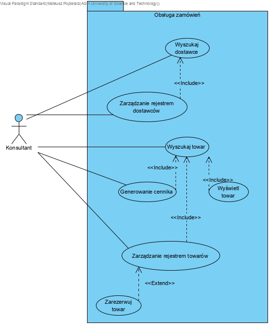
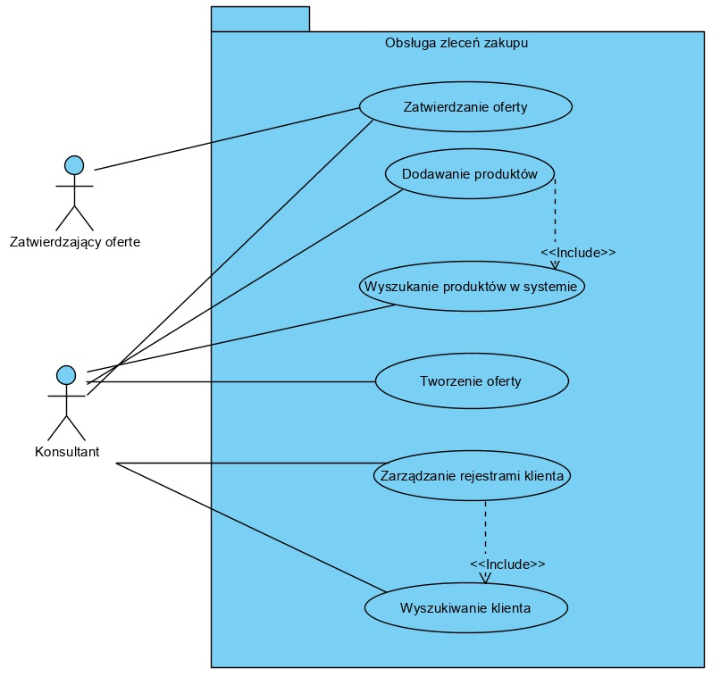
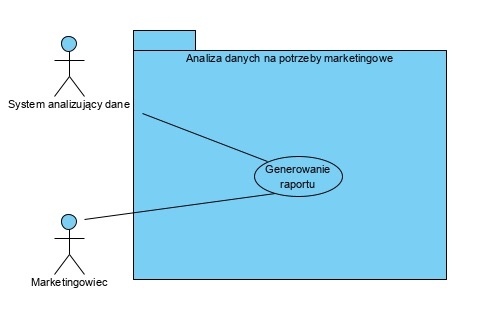
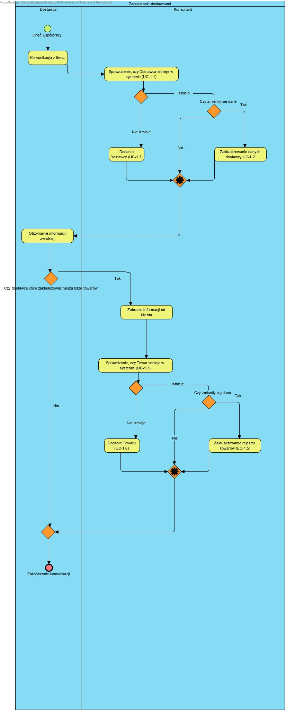
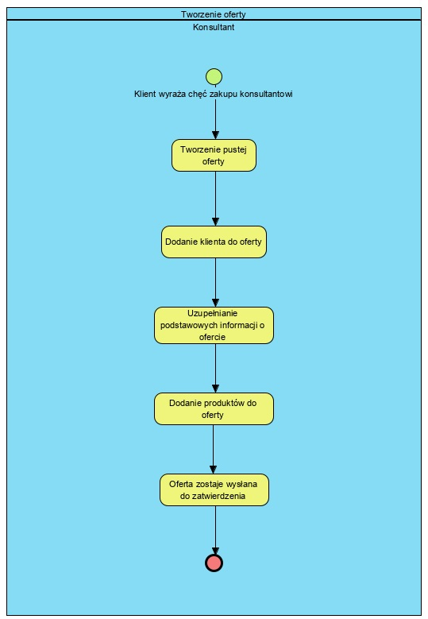
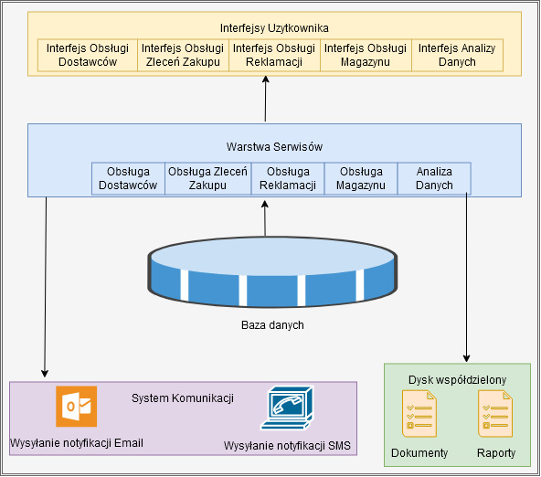

Zespół:
- _Mateusz Popielarz_ - Leader zespołu
- Adam Samsonowicz
- Kamil Gliński
- Kacper Kwapisz


<h1>System wspomagania sprzedaży/marketingu urządzeń z sektora automatyki przemysłowej</h2>


Źródło danych: Firma rodzinna


AGH WIET - Praca PSI, semestr 6, 2019 - 2020.

<div class="page">

Spis Treści

<!-- TOC insertanchor:false withlinks:true anchormode:github.com updateonsave:true orderedlist:true depthfrom:1 depthto:4 -->

- [1. Sformułowanie zadania projektowego](#1-sformułowanie-zadania-projektowego)
    - [1.1. Przedmiot modelowania – opis dziedziny problemu](#11-przedmiot-modelowania--opis-dziedziny-problemu)
        - [1.1.1. Nazwa firmy](#111-nazwa-firmy)
        - [1.1.2. Typ firmy](#112-typ-firmy)
        - [1.1.3. Cel produktu](#113-cel-produktu)
        - [1.1.4. Opis dziedziny działalności](#114-opis-dziedziny-działalności)
        - [1.1.5. Cele firmy](#115-cele-firmy)
        - [1.1.6. Schemat struktury organizacyjnej](#116-schemat-struktury-organizacyjnej)
    - [1.2. Obszar modelowania OM – wstępny opisowy model stanu istniejącego](#12-obszar-modelowania-om--wstępny-opisowy-model-stanu-istniejącego)
        - [1.2.1. Wywiad z zarządem w celu ustalenia przeznaczenia systemu](#121-wywiad-z-zarządem-w-celu-ustalenia-przeznaczenia-systemu)
        - [1.2.2. Definicja celu systemu](#122-definicja-celu-systemu)
        - [1.2.3. Składniki organizacyjne dla Obszaru Modelowania](#123-składniki-organizacyjne-dla-obszaru-modelowania)
    - [1.3. Zakres odpowiedzialności systemu (ZOS)](#13-zakres-odpowiedzialności-systemu-zos)
        - [1.3.1. Obszary aktywności (OA)](#131-obszary-aktywności-oa)
            - [1.3.1.1. Obsługa zamówień (OA1)](#1311-obsługa-zamówień-oa1)
            - [1.3.1.2. Obsługa zleceń zakupu (OA2)](#1312-obsługa-zleceń-zakupu-oa2)
            - [1.3.1.3. Obsługa reklamacji (OA3)](#1313-obsługa-reklamacji-oa3)
            - [1.3.1.4. Obsługa magazynu (OA4)](#1314-obsługa-magazynu-oa4)
            - [1.3.1.5. Analizy danych na potrzeby marketingowe (OA6)](#1315-analizy-danych-na-potrzeby-marketingowe-oa6)
    - [1.4. Zwięzła nazwa problemu](#14-zwięzła-nazwa-problemu)
        - [1.4.1. Nazwa problemu](#141-nazwa-problemu)
        - [1.4.2. Nazwa kodowa projektu](#142-nazwa-kodowa-projektu)
    - [1.5. Cele do osiągnięcia](#15-cele-do-osiągnięcia)
        - [1.5.1. Cele produktu](#151-cele-produktu)
        - [1.5.2. Cele przedsięwzięcia projektowego](#152-cele-przedsięwzięcia-projektowego)
- [2. Opis Wymagań Systemu](#2-opis-wymagań-systemu)
    - [2.1. Funkcje systemu ze strony widzenia użytkownika](#21-funkcje-systemu-ze-strony-widzenia-użytkownika)
    - [2.2. Rejestry w systemie](#22-rejestry-w-systemie)
    - [2.3. Dokumenty wprowadzane i wyprowadzane z systemu – wzory](#23-dokumenty-wprowadzane-i-wyprowadzane-z-systemu--wzory)
    - [2.4. Wyniki analizy wymagań funkcjonalnych](#24-wyniki-analizy-wymagań-funkcjonalnych)
        - [2.4.1. Obsługa Dostawców (OA1)](#241-obsługa-dostawców-oa1)
        - [2.4.2. Obsługa zleceń zakupu (OA2)](#242-obsługa-zleceń-zakupu-oa2)
        - [2.4.3. Obsługa reklamacji (OA3)](#243-obsługa-reklamacji-oa3)
        - [2.4.4. Obsługa Rejestr Magazynu (OA4)](#244-obsługa-rejestr-magazynu-oa4)
        - [2.4.5. Analiza danych na potrzeby marketingowe (OA5)](#245-analiza-danych-na-potrzeby-marketingowe-oa5)
    - [2.5. Modelowanie zachowań w czasie](#25-modelowanie-zachowań-w-czasie)
        - [2.5.1. Obsługa zamówień (OA1)](#251-obsługa-zamówień-oa1)
        - [2.5.2. Obsługa zleceń zakupu (OA2)](#252-obsługa-zleceń-zakupu-oa2)
        - [2.5.3. Obsługa reklamacji (OA3)](#253-obsługa-reklamacji-oa3)
        - [2.5.4. Obsługa rejestru magazynu (OA4)](#254-obsługa-rejestru-magazynu-oa4)
        - [2.5.5. Analiza danych na potrzeby marketingowe (OA5)](#255-analiza-danych-na-potrzeby-marketingowe-oa5)
    - [2.6. Wymagania funkcjonalne dla dodatkowych części systemu](#26-wymagania-funkcjonalne-dla-dodatkowych-części-systemu)
        - [2.6.1. Poinformuj SMS](#261-poinformuj-sms)
        - [2.6.2. Wprowadzenie dokumentów do systemu](#262-wprowadzenie-dokumentów-do-systemu)
        - [2.6.3. Przydział pracowników do określonych zadań](#263-przydział-pracowników-do-określonych-zadań)
        - [2.6.4. Logowanie](#264-logowanie)
        - [2.6.5. Wylogowywanie](#265-wylogowywanie)
    - [2.7. Wymagania niefunkcjonalne](#27-wymagania-niefunkcjonalne)
        - [2.7.1. Wymagania Produktowe](#271-wymagania-produktowe)
            - [2.7.1.1. Użyteczności](#2711-użyteczności)
            - [2.7.1.2. Sprawnościowe](#2712-sprawnościowe)
            - [2.7.1.3. Niezawodności](#2713-niezawodności)
            - [2.7.1.4. Przenośności](#2714-przenośności)
        - [2.7.2. Wymagania organizacyjne](#272-wymagania-organizacyjne)
            - [2.7.2.1. Dostawy](#2721-dostawy)
            - [2.7.2.2. Implementacyjne](#2722-implementacyjne)
            - [2.7.2.3. Standardów](#2723-standardów)
        - [2.7.3. Wymagania zewnętrzne](#273-wymagania-zewnętrzne)
            - [2.7.3.1. Współpracy](#2731-współpracy)
            - [2.7.3.2. Etyczne](#2732-etyczne)
            - [2.7.3.3. Prawne - ochrona prywatności](#2733-prawne---ochrona-prywatności)
            - [2.7.3.4. Prawne - Wymagania zabezpieczeń](#2734-prawne---wymagania-zabezpieczeń)
- [3. Analiza funkcjonalna systemu (przy pomocy przepływów danych  i proces dekompozycji)](#3-analiza-funkcjonalna-systemu-przy-pomocy-przepływów-danych--i-proces-dekompozycji)
    - [3.1. Diagram kontekstowy (DK)](#31-diagram-kontekstowy-dk)
    - [3.2. Rozwinięty diagram kontekstowy](#32-rozwinięty-diagram-kontekstowy)
    - [3.3. Analiza top-down](#33-analiza-top-down)
        - [3.3.1. Rozszerzony diagram kontekstowy z rejestrami danych](#331-rozszerzony-diagram-kontekstowy-z-rejestrami-danych)
        - [3.3.2. Analiza dla Podsystemu 1.](#332-analiza-dla-podsystemu-1)
        - [3.3.3. Analiza dla Podsystemu 2.](#333-analiza-dla-podsystemu-2)
        - [3.3.4. Analiza dla Podsystemu 3.](#334-analiza-dla-podsystemu-3)
        - [3.3.5. Analiza dla Podsystemu 4.](#335-analiza-dla-podsystemu-4)
        - [3.3.6. Analiza dla Podsystemu 5.](#336-analiza-dla-podsystemu-5)
- [4. Słownik danych](#4-słownik-danych)
- [5. Analiza struktur danych przechowywanych w systemie](#5-analiza-struktur-danych-przechowywanych-w-systemie)
- [6. Diagram maszyny stanowej](#6-diagram-maszyny-stanowej)
- [7. Interfejsy użytkownika (Ekrany)](#7-interfejsy-użytkownika-ekrany)
- [8. Weryfikacja wytworzonych artefaktów i koncepcji systemu](#8-weryfikacja-wytworzonych-artefaktów-i-koncepcji-systemu)
    - [8.1. Niezgodność 1. Obsługa magazynu i obsługa rejestru magazynu](#81-niezgodność-1-obsługa-magazynu-i-obsługa-rejestru-magazynu)
    - [8.2. Niezgodność 2. Obsługa rejestrów w poszczególnych OA](#82-niezgodność-2-obsługa-rejestrów-w-poszczególnych-oa)
    - [8.3. Niezgodność 3. Nie konsystencja strumieni danych na diagramach DFD](#83-niezgodność-3-nie-konsystencja-strumieni-danych-na-diagramach-dfd)
    - [8.4. Niezgodność 4. Braki w rejestrach w stosunku do proponowanych funkcji systemu](#84-niezgodność-4-braki-w-rejestrach-w-stosunku-do-proponowanych-funkcji-systemu)
- [9. Architektura Systemu](#9-architektura-systemu)
    - [9.1. Architektura całego Systemu](#91-architektura-całego-systemu)
    - [9.2. Architektura Podsystemów](#92-architektura-podsystemów)
- [10. Podsumowanie](#10-podsumowanie)
    - [10.1. Założenia implementacyjne](#101-założenia-implementacyjne)
    - [10.2. Weryfikacja całości projektu systemu](#102-weryfikacja-całości-projektu-systemu)
    - [10.3. Uwagi i wnioski końcowe](#103-uwagi-i-wnioski-końcowe)
- [11. Załącznik A: Słownik pojęć dziedzinowych:](#11-załącznik-a-słownik-pojęć-dziedzinowych)
    - [11.1. A](#111-a)
    - [11.2. F](#112-f)
    - [11.3. I](#113-i)
    - [11.4. K](#114-k)
    - [11.5. P](#115-p)
    - [11.6. R](#116-r)
    - [11.7. S](#117-s)
    - [11.8. Z](#118-z)
- [12. Załącznik B: Wzory dokumentów](#12-załącznik-b-wzory-dokumentów)
            - [12.1. Danedostawcy.docx](#121-danedostawcydocx)
            - [12.2. Danefabryki.docx](#122-danefabrykidocx)
            - [12.3. Wpistowaruwkatalogu.docx](#123-wpistowaruwkatalogudocx)
            - [12.4. Wpisdotyczącycenytowaru.docx](#124-wpisdotyczącycenytowarudocx)
            - [12.5. Dokumentofertowy.doc](#125-dokumentofertowydoc)
            - [12.6. Dokumentpotwierdzajacyrealizacjereklamacji.docx](#126-dokumentpotwierdzajacyrealizacjereklamacjidocx)
            - [12.7. Formularzofertyudzielonejdlaklienta.doc](#127-formularzofertyudzielonejdlaklientadoc)
            - [12.8. Formularzprosbyodostepnosctowaru.docx](#128-formularzprosbyodostepnosctowarudocx)
            - [12.9. Formularzreklamacjidodostawcy.docx](#129-formularzreklamacjidodostawcydocx)
            - [12.10. Formularzreklamacjiodklienta.docx](#1210-formularzreklamacjiodklientadocx)
            - [12.11. Instomformularzdanychklienta.docx](#1211-instomformularzdanychklientadocx)
            - [12.12. Instomprzesunieciemiedzymagazynowe.docx](#1212-instomprzesunieciemiedzymagazynowedocx)
            - [12.13. Instomprzyjecie zewnetrzne.docx](#1213-instomprzyjecie-zewnetrznedocx)
            - [12.14. Instomrozchodwewnetrzny.docx](#1214-instomrozchodwewnetrznydocx)
            - [12.15. Instomwydanie zewnetrzne.docx](#1215-instomwydanie-zewnetrznedocx)
            - [12.16. Raportzakcjimarketingowych.doc](#1216-raportzakcjimarketingowychdoc)
            - [12.17. Zamówienieklienta.doc](#1217-zamówienieklientadoc)
            - [12.18. Instomformularzdanychpotencjalnegoklienta.docx](#1218-instomformularzdanychpotencjalnegoklientadocx)
- [13. Załącznik C:](#13-załącznik-c)
- [14. Załącznik D. Recenzja dokumentacji projektowej wskazanego Zespołu](#14-załącznik-d-recenzja-dokumentacji-projektowej-wskazanego-zespołu)
- [15. Załącznik E. Na Moodle: kompletna dokumentacja w .pdf ; źródłowa wersja dokumentacji i rysunków, prezentacja w .ppt, recenzja, ew. inne materiały źródłowe)](#15-załącznik-e-na-moodle-kompletna-dokumentacja-w-pdf--źródłowa-wersja-dokumentacji-i-rysunków-prezentacja-w-ppt-recenzja-ew-inne-materiały-źródłowe)
- [16. Załącznik E: Spis rysunków](#16-załącznik-e-spis-rysunków)

<!-- /TOC -->

<div class="page">

# 1. Sformułowanie zadania projektowego

## 1.1 Przedmiot modelowania – opis dziedziny problemu

### 1.1.1 Nazwa firmy

Instom

### 1.1.2 Typ firmy

Firma handlowa - `FH`, firma jest spółką z ograniczoną odpowiedzialnością
<div class="page">

### 1.1.3 Cel produktu

System służy do wspomagania zarządzania `FH`.

Firma jako działający na rynku pretendent do lidera w sprzedaży urządzeń z automatyki przemysłowej na co dzień ma przed sobą wiele wyzwań. Jednym z nich jest świadczenie usług najwyższej jakości. W tym celu kadra specjalistów z zakresu marketingu, sprzedaży i obsługi magazynowej codziennie dokłada wszelkich starań, by utrzymać wysoki poziom zadowolenia klientów, co przekłada się na wysoką liczbę zrealizowanych zamówień przy zmniejszającym się czasie ich realizacji.
Dla zmniejszenia czasu dostawy najpopularniejszych towarów są one magazynowane na miejscu i dostarczane z lokalnego miejsca przechowywania.

Jako że nie każdy klient ma odpowiednio przeszkoloną kadrę do montażu sprzętu, firma pośredniczy w implementacji rozwiązania u klienta komunikując się z integratorami.
Jednym z problemów z którym firma musi się zmierzyć jest rosnąca ilość zamówień, co sprawia, że kontrola nad procesami oraz zleceniami i zamówieniami jest coraz trudniejsza.

Wysoko wykwalifikowana kadra do spraw sprzedaży służy klientowi wiedzą przy wyborze sprzętu.
<div class="page">

### 1.1.4 Opis dziedziny działalności

Klientami są: przemysł, hurtowanie, integratorzy.
Klienci w większości są inżynierami.

Komunikacja odbywa się przez email. Wysyłają zapytania z listą interesujących ich produktów.

Niektórzy kliencie potrzebują pomocy w dobraniu produktów, konfiguracji zestawu produktów.

Integratorzy kupują produkty od firmy, lub zajmują się samym montażem, gdy klient dokona zakupu. Są to firmy zewnętrzne niepowiązane.

Firma współpracuje z dostawcami, którymi są międzynarodowe fabryki.

Dostawcy zajmują się wysyłką.

Jeżeli produkt jest wysłany do dostawcy na podstawie reklamacji, i jest to bezpodstawne wg. dostawcy to koszty ponosi firma nie dostawcy. Z tego powodu ważne są procedury decydujące o oględziny produktów wysyłanych do reklamacji przez wewnętrzny zespół.
<div class="page">

### 1.1.5 Cele firmy

Celem firmy jest doskonalenie usług, zgodnie z potrzebami klientów i ich oczekiwaniami. Firma chce kontynuować ekspansję na polskim rynku, a w tym celu jest potrzeba:

- Pozyskania nowych klientów

- Zmniejszenia średniego czasu do zamknięcia zamówienia
- Zwiększenie liczby opinii odebranych od klientów i bardziej przekrojowej ich analizie
- Optymalizacji procesów w firmie
- Optymalizacji ilości i typu magazynowanych produktów
<div class="page">

### 1.1.6 Schemat struktury organizacyjnej

W tym punkcie opiszemy strukturę organizacyjną ( Do każdego punktu krótki opis)


##### _Rysunek 1. Diagram struktura zarządu_

W obecnym okresie jest około 60 pracowników.
W sprzedaży pracuje około 20, w zarządzie 5, W dziale marketingu 5, natomiast w księgowości 10, w dziale usług 20

- Zarząd: Pracownicy tego poziomu zajmują się koordynowaniem działania firmy na najwyższym poziomie, planują długofalową strategię ekspansji, zatwierdzają budżet, wyznaczają cele na kolejne kwartały
- Marketing : Pracownicy działu marketingu zajmują się przygotowaniem materiałów reklamowych, zakupem reklam oraz wyszukiwaniem potencjalnie zainteresowanych firm
- Dział R&D : Pracownicy działu marketingu zajmują się tworzeniem nowych rozwiązań z zakresu automatyki- nie będziemy w tym systemie zajmować się obsługą tego działu.
- Dział handlowy: Pracownicy handlowi zajmują się finalizowaniem zamówień, tworzeniem zleceń zakupu, reagowaniem na niski stan magazynowy i uzupełnianiem braków.
- Księgowość: Pracownicy księgowości zajmują się finansami - przetwarzane są tam faktury, część tego działu jest działem kadrowym

<div class="page">

## 1.2 Obszar modelowania OM – wstępny opisowy model stanu istniejącego

### 1.2.1 Wywiad z zarządem w celu ustalenia przeznaczenia systemu

Został przeprowadzony wywiad z zarządem. Transkrypcje odpowiedzi umieścimy w _Załączniku Transkrypcja_.
<div class="page">

### 1.2.2 Definicja celu systemu

Celem systemu PSSK jest kompleksowe wspomaganie procesu zamówienia od złożenia go przez klienta, przez pomoc i kontrolowanie procesu zlecenia zakupu komponentów po obsługę gwarancyjną.
Dodatkowym celem będzie stworzenie przejrzystej struktury dokumentów przepływających przez firmę niezbędnych do sprawnego działania organizacji.

<div class="page">

### 1.2.3 Składniki organizacyjne dla Obszaru Modelowania

- Dział handlu (Obsługa klienta, pośredniczenie w składaniu zamówień)

  System będzie pomagał sprzedawcy przy odbieraniu zamówienia od klienta.

  Konsultant będzie wprowadzał dane klienta do systemu

  System będzie mógł powiadomić konsultanta o zmianie lub zdarzeniach

  System będzie asystował przy składaniu zleceniu zakupu

  System będzie przechowywał informacje na temat reklamacji i ich stanu

* Dział księgowości (Wewnętrzne rozliczenia, rozliczenia faktur z dostawcami)

  System będzie generować faktury sprzedażowe

  System będzie generował faktury dla współpracowników

  System będzie rejestrował stan wypłaconych pensji

  System będzie generował listę płac

- Dział usług (Rozwijanie systemów bezpieczeństwa) -
  Integracja systemu w tym obszarze będzie polegać tylko na obsłudze kadrowej

* Dział marketingu (Śledzenie rezultatów akcji marketingowych)

  System będzie generował raporty
  System będzie miał możliwość porównywania okresów akcji promocyjnej z wynikami sprzedaży

<div class="page">

## 1.3 Zakres odpowiedzialności systemu (ZOS)

### 1.3.1 Obszary aktywności (OA)


##### _Rysunek 2. Przegląd obszarów aktywności_

#### 1.3.1.1 Obsługa zamówień (OA1)


Obszar aktywności obsługi zamówień zawiera w sobie

1. Prowadzenie rejestru dostawcy

   1. Rejestrowanie dostawców

      Jako `Konsultant` potrzebuję `dodać dostawcę do systemu`.

   2. Korygowanie danych dostawcy

      Jako `Konsultant` potrzebuję `zmodyfikować dane dostawcy`, ponieważ zmiana dany dostawcy, lub dane były wprowadzone z błędem.

2) Prowadzenie katalogu i cennika towarów

   1. Dodawanie nowych pozycji katalogów towarów

      Jako `Konsultant` przy odbiorze nowych broszur z towarami od dostawców mogę `dodać nową pozycję towaru` w katalogu.

   2. Aktywacja i dezaktywacja pozycji katalogu towarów

      Jako `Konsultant` przy odbiorze nowych broszur z towarami od dostawców mogę `zaktualizować pozycję towaru` w katalogu.

   3. Ustalanie cen

      Jako `Konsultant` mogę dodać do towaru cenę.

   4. Generowanie cennika

      Jako Konsultant chcę pokazać klientowi dostępne dla niego `towary` w przystępnej postaci

3) Rezerwacja towaru

   1. Rezerwacja towaru

      Jako `Konsultatnt` gdy istnieje prawdopodobieństwo `Zlecenia zakupu` obejmującego dany towar mogę go `zarezerwować`

   1. Zmiana lub likwidacja rezerwacji towaru

      Jako `Konsultant` gdy `Zlecenia Zakupu` przestanie obejmować dany towar mogę zlikwidować całkowicie `rezerwację towaru` u danego dostawcy .
<div class="page">

#### 1.3.1.2 Obsługa zleceń zakupu (OA2)

1. Prowadzenie bazy klientów

   1. Rejestrowanie klienta

      `Konsultant` w sytuacji gdy nawiązuję się współpraca z nowym `klientem` powinien mieć możliwość dodania go do system poprzez interface udostępniany przez system.

   2. Korygowanie danych klienta

      `Konsultant` powiadomiony przez `klienta` o zmianie danych `klienta` powinien mieć możliwość wprowadzenia poprawnych danych do systemu.

2. Przyjęcie zapytania ofertowego od klienta

   `Klient` wysyła zapytanie ofertowe do `konsultanta`, `konsultant` powinien być powiadomiony o takim zapytaniu w celu dalszego procesowania danego zapytania.

3. Przygotowanie oferty dla klienta

   1. Utworzenie oferty w systemie

      `Konsultant` po otrzymaniu zapytania ofertowego od klienta powinien mieć możliwośc utworzenia oferty w systemie.

   2. Dodanie produktów do oferty

      1. Znalezienie w systemie oraz dodanie produktów do oferty

         `Konsultant` po stworzeniu oferty powinien mieć możliwość dodania produktów do oferty, które to produkty są zdefiniowane przez samego `klienta` lub wyszukane w systemie przez `konsultanta`.

      2. Sprawdzenie dostępności produktu

         1. Sprawdzenie aktualnego stanu magazynu

            `Konsultant` podczas tworzenia oferty dla klienta musi znać czas realizacji danej oferty, w tym celu powinien mieć możliwość sprawdzenia czy produkty, których potrzebuje klient znajdują się na magazynie.

         2. Sprawdzenie najszybszego możliwego czasu dostawy

            W przypadku braku towarów na magazynie `konsultant` powinien mieć możliwość sprawdzenia czasu oczekiwania na dostawe produktów.

   3. Wygenerowanie dokumentu ofertowego

      `Konsultant` po stworzeniu oferty oraz dodaniu odpowiednio skonfigurowanych produktów powinien mieć możliwość wygenerować dokument ofertowy w czytelnej dla `klienta` formie.

   4. Zatwierdzenie oferty przez przełożonego

      Jeżeli wymaga tego sytuacja, na którą wpływa doświadczenie oraz pozycja `konsultanta`, to system powinien umożliwiać `konsultantowi` przedstawienie oferty do przełożonego w celu jej akceptacji.

4. Kontakt z klientem w celu potwierdzenia oferty

   1. Przedstawienie oferty klientowi

      `Konsultant` po stworzeniu oferty i wygenerowaniu dokumentu ofertowego, przedstawia ten dokument `klientowi`.

   2. Potwierdzenie oferty przez klienta

      `Klient` jest zgodny co do oferty, `konsultant` wtedy powinien mieć możliwość sprawdzenia w systemie jaka forma potwierdzenia jest możliwa dla danego `klienta`. Może być to przedpłata dla nowych klientów, lub też zwykły email potwierdzający od zaufanych klientów. `Konsultant` powinien mieć możliwość sprawdzenia wszystkich danych wpływających na dalszy proces zamówienia, mogą być to kredyty kupieckie lub historia spóźnień w zapłatach przez danego `klienta`. W razie braku informacji lub doświadczenia posiadanych przez `konsultanta`, `konsultant` powinien mieć możliwość uzyskania takiej informacji przez system od przełożonego.

5. Wystawienie faktury

   `Konsultant` powinien mieć możliwość przesłania potwierdzonej oferty do działu księgowości w celu wystawienia faktury dla `klienta`.

6. Zatwierdzenie faktury - Klient zapłacił za faktury
<div class="page">

#### 1.3.1.3 Obsługa reklamacji (OA3)

1. Przyjęcie zgłoszenia reklamacji od klienta

   Jako `klient` chciałbym mieć możliwość złożenia reklamacji aby otrzymać działający produkt lub zwrot pieniędzy.

2. Analiza zasadności reklamacji

   1. Sprawdzenie zasadności reklamacji przez zespół

      Jako `właściciel` chciałbym, aby `zespół techniczny` przeanalizował zasadność oddania produktu do reklamacji przez `klienta`, aby nie angażować `dostawcy` we wszystkie zgłoszenia reklamacji.

3. Zgłoszenie reklamacji dostawcy

   1. Przygotowanie produktów do odesłania do dostawcy

      Jako `właściciel` chciałbym, aby `zespół techniczny` przygotował reklamowane produkty do odesłania `dostawcy`.


    2. Realizacja reklamacji do dostawcy
    
        Jako `właściciel` chciałbym móc wysłać przygotowane, reklamowane produkty do `dostawcy`, aby otrzymać od niego wymienione, działające produkty.

4. Prowadzenie rejestru reklamacji

   Jako `właściciel` chciałbym mieć rejestr reklamowanych produktów, aby móc analizować awaryjność produktów.
<div class="page">

#### 1.3.1.4 Obsługa magazynu (OA4)

   1. Weryfikacja dokumentacji

      Jako `magazynier` chce mieć możliwość `weryfikacji dokumentacji` aby `procesować towar zgodnie z procedurami i przepisami`.

   1. Rozładunek za pomocą dostępnej infrastruktury przeładunkowej

      Jako `magazynier` chce mieć możliwość `rozładunku` przesyłki aby `zapełnić magazyn produktami`.

   1. Przyjęcie towaru

      Jako `magazynier` chce mieć możliwość `przyjęcia towaru` magazynu aby `przekazać go do dalszego procesowania - rozładunku`.

   1. Kontrola stanu fizycznego przesyłki

      Jako `magazynier` chce mieć możliwość `kontroli stanu przesyłki` magazynu aby `przekazać ją do dalszego procesowania - wysyłki`.

   1. Przygotowanie towaru do składowania

      Jako `magazynier` chce mieć możliwość `przygotowania towaru do składowania` aby `umożliwić szybką wysyłkę w przypadku zamówienia`.

   1. Sprawdzenie stanu

      Jako `magazynier` chce mieć możliwość `sprawdzenia stanu` magazynu aby `okreslić ilość dostępnych produktów`.

   1. Kontrola wartości towaru

      Jako `magazynier` chce mieć możliwość `kontroli wartości towaru` aby `zapewnić jakość produktów zgodnych z warunkami umowy`

   1. Grupowanie towaru

      Jako `magazynier` chce mieć możliwość `grupowania towaru` aby `zminimalizować czas wyszukiwania`

   1. Przypisywanie numeru seryjnego

      Jako `magazynier` chce mieć możliwość `przypisywania unikalnego numeru seryjnego produktom` aby `umożliwić rozróznienie produktu oraz ułatwić wyszukiwanie`

   1. Przypisywanie numeru partii

      Jako `magazynier` chce mieć możliwość `przypisywania numeru partii` aby `umożliwić rozróznienie produktu oraz ułatwić wyszukiwanie`

   1. Przypisywania kodów EAN

      Jako `magazynier` chce mieć możliwość `przypisywania kodów EAN` aby `umożliwić wysyłkę produktu po całej Europie`

   1. Powiązanie towaru z dostawcą i nabywcą

      Jako `magazynier` chce mieć możliwość `powiązania towaru z dostawcą i nabywcą` aby `dostarczyć przesyłkę pod odpowiednią lokalizację`.

   1. Tworzenie prognoz popytu

      Jako `magazynier` chce mieć możliwość `tworzenia prognoz popytu` aby `utrzymać kluczowe produkty na stanie`

   1. Wystawienie dokumentów (PZ WZ MM PW RW)

      Jako `magazynier` chce mieć możliwość `wystawiania dokumentów` aby `zapewnić wymagane dokumenty w procedurze`.


   1. Zarejestrowanie produktu

      Jako `magazynier` chce mieć możliwość `zarejestrowania produktu` aby `udostępnić oraz uaktualnić informacje o dostępności produktu`.

   1. Modyfikacja produktu

      Jako `magazynier` chce mieć możliwość `modyfikacji danych` aby `uaktualnić informacje o produkcie`.

   1. Wyszukiwanie produktów

      Jako `magazynier` chce mieć możliwość `wyszukiwania produktów` aby `pobrać produkt o określonych atrybutach`.

   1. Pobranie szczegółowych danych o produkcie

      Jako `magazynier` chce mieć możliwość `pobrania informacji na temat produktów` aby `otrzymać informacje o aktualnym stanie magazynu`.

   1. Pobranie wszystkich dostępnych produktów

      Jako `magazynier` chce mieć możliwość `pobrania wszystkich dostepnych produktow` aby `otrzymac informacje o aktualnym stanie magazynu`.

   1. Wyrejestrowanie produktu z magazynu

      Jako `magazynier` chce mieć możliwość wyrejestrowania produktu z magazynu aby `uaktualnić informacje o dostępności produktu`.

   1. Tworzenie zamówienia dostaw na podstawie zarejestrowanych rezerwacji wystawienie dokumentów magazynowych

      Jako `magazynier` chce mieć możliwość `tworzyć zamówienia dostaw` aby `zapewnić wymagane dokumenty dotyczące dostaw`.

<div class="page">

#### 1.3.1.6 Analizy danych na potrzeby marketingowe (OA6)

1. Statystyki powiązane z katalogiem produktowym

   Katalog produktowy jest udostępniony na stronie głównej firmy, strona znajduje się w sieci www. Opisywany w dokumencie system powinien mieć możliwość wglądu do statystyk związanych z ruchem w katalogu produktowym w celu udoskonalenia przedstawianych przez system statystyk marketingowych.

2. Wystawienie danych na strategiczne potrzeby marketingowe
    Dział marketingu podejmuje decyzje bazujące na danych sprzedażowych. System takie dane powinien generować oraz dostarczać do pracowników powiązanych z planowaniem strategicznym czynności marketingowych.
<div class="page">

## 1.4 Zwięzła nazwa problemu

### 1.4.1 Nazwa problemu

System do przekrojowego zarządzania firmą wspomagający sprzedaż, marketing i kontakt z integratorami

### 1.4.2 Nazwa kodowa projektu

Przekrojowy system sprzedażowo-konsultingowy - PSSK

<div class="page">

## 1.5 Cele do osiągnięcia

### 1.5.1 Cele produktu

Produkt ma na celu wsparcie firmy poprzez:

- Redukcję narzutu komunikacyjnego między ludźmi i formalizacji komunikacji
- Krystalizację procedur istniejących w firmie
- Umożliwieniem dostępu do statystyk działalności
- Uproszczenie kontaktu sprzedawca klient, uproszczenie obsługi zamówienia przez kilku sprzedawców
- Śledzeniem stanu magazynowego i wprowadzeniem mechanizmu notyfikacji przy niedostatecznym poziomie materiałów
- Zwiększenie jakości obsługi przez ujednoliconą mechanizm informacji o kliencie

### 1.5.2 Cele przedsięwzięcia projektowego

Przedsięwzięcie docelowo miałoby na celu

- Zmniejszenie średniego czasu obsługi pojedynczego klienta o więcej niż 10%
- Ograniczyć czas brak stanów magazynowych najpopularniejszych produktów o 15%
- Ograniczyć reklamacje odrzucone przez dostawców o 5%
- Zmniejszyć czas realizacji następnego zamówienia o tych samych parametrach jak jedno z poprzednich o 40%
- Ograniczyć czas spędzany na wypełnianiu dokumentów przez wprowadzanie ustandaryzowanych elektronicznych formularzy o 20%

Dodatkową korzyścią z tego przedsięwzięcia byłoby przećwiczenie zbierania wymagań oraz przeprowadzenia ich analizy biznesowej.

<div class="page">

# 2. Opis Wymagań Systemu

## 2.1 Funkcje systemu ze strony widzenia użytkownika


##### _Rysunek 3. Aktorzy w systemie_

W systemie możemy wyróżnić następujących aktorów

- Konsultant - wprowadza zamówienia do systemu, aktualizuje je, dezaktywuje, zgłasza zlecenia zakupu, sprawdza stan zamówień, zgłasza reklamację w system, sprawdza notyfikacje, może przejąć opiekę nad klientem innego konsultanta
- Magazynier - aktualizuje stan magazynowy, zgłasza ewentualne nieprawidłowości w stanie faktycznym, zatwierdza wysyłkę towaru
- Marketingowiec - wprowadzą informacje do systemu na temat kampanii promocyjnych, aktualizuje ich stan, ma dostęp do statystyk
- Członek zarządu - Ma dostęp do większości informacji, jego zakresem zainteresowań będzie wpływ przeprowadzanych akcji na wyniki finansowe i efektywność działań ,widoki dla tego aktora powinny ukrywać dane użytkownika RODO
- Księgowy - ma dostęp do zamówień i zleceń zakupu, synchronizuje dane między zewnętrznym
- System zewnętrzny dostawcy - może aktualizować stan zlecenia zakupu (np. na wysłane), lub stan reklamacji

<div class="page">

## 2.2 Rejestry w systemie

1. Klient - jest to firma, której sprzedajemy
   1. Nazwa firmy
   1. NIP
   1. Kraj
   1. Adres
   1. Branża
1. Dostawca - jest to firma od której zamawiamy
   1. Nazwa firmy
   1. NIP
   1. Wystawione faktury na naszą firmę
   1. Wystawione faktury na firmę dostawcy
   1. Kraj pochodzenia
   1. Łączna kwota zamówień
1. Oferta
   1. Produkty
   1. Data wystawienia
   1. Klient
1. Pracownik
   1. Imię
   1. Nazwisko
   1. Email kontaktowy
   1. Telefon kontaktowy
   1. Adres kontaktowy
1. Magazyn
   1. Sektor
   1. Numer Miejsca
   1. Obecnie przechowywany produkt
   1. Historycznie przechowywane produkty
   1. Wymiary
1. Produkt
   1. Kod
   1. Nazwa
   1. Cena katalogowa
   1. Cena sprzedaży
   1. Cena kupna
   1. Opis
   1. Dostawca
1. Zamówienie klienta
   1. Produkt
   2. Data
   3. Adres
   4. Klient
1. Zamówienie do dostawcy
   1. Produkt
   2. Dostawca
1. Reklamacja od klienta
   1. Zamówiony produkt
   2. Opis usterki
1. Reklamacja do dostawcy
   1. Produkt z reklamacji od klienta
   2. Opis usterki


<div class="page">

## 2.3 Dokumenty wprowadzane i wyprowadzane z systemu – wzory

##### 1.Dane_dostawcy.docx
##### 2.Dane_fabryki.docx
##### 3.Wpis_towaru_w_katalogu.docx
##### 4.Wpis_dotyczący_ceny_towaru.docx
##### 5.Dokument_ofertowy.doc
##### 6.Dokument_potwierdzajacy_realizacje_reklamacji.docx
##### 7.Formularz_oferty_udzielonej_dla_klienta.doc
##### 8.Formularz_prosby_o_dostepnosc_towaru.docx
##### 9.Formularz_reklamacji_do_dostawcy.docx
##### 10.Formularz_reklamacji_od_klienta.docx
##### 11.Instom_formularz_danych_klienta.docx
##### 12.Instom_przesuniecie_miedzymagazynowe.docx
##### 13.Instom_przyjecie zewnetrzne.docx
##### 14.Instom_rozchod_wewnetrzny.docx
##### 15.Instom_wydanie zewnetrzne.docx
##### 16.Raport_z_akcji_marketingowych.doc
##### 17.Zamówienie_klienta.doc

<div class="page">

## 2.4 Wyniki analizy wymagań funkcjonalnych

W tym punkcie określimy przypadki użycia do określonych wcześniej historyjek użytkownika.

### 2.4.1 Obsługa Dostawców (OA1)
 

##### _Rysunek 4. Diagram przypadków użycia obsługi zamówień_

**Numer i Nazwa przypadku użycia:** UC-1.1 - Wyszukaj dostawcę

**Autor:** Mateusz Popielarz

**Cel przypadku użycia:** Wyszukanie dostawcy w systemie

**Kontekst użycia:** Konsultant chce dowiedzieć się o istniejącym dostawcy

**Zakres:** System do obsługi dostawców

**Poziom:** Przetwarzanie danych dostawców

**Aktor główny:** Konsultant

**Warunek początkowy:** Dostawca istnieje w systemie

**Zdarzenie inicjujące:** Dostawca wyraził chęć dołączenia do naszego łańcucha dostaw

**Główny scenariusz powodzenia:**

1. `Konsultant` wpisuje wartość
2. System filtruje rekordy
3. Wyświetlane są pasujące rekordy

**Scenariusze alternatywne:**

1. `Dostawca` nie istnieje w systemie, system proponuje `UC-1.2`

**Uczestnicy i interesy:**

_Konsultant_ - Jest to w jego zakresu obowiązków
_Dostawca_ - Chce być w naszym systemie, żeby móc dostawać od nas zamówienia, będzie powiadomiony o zdarzeniu zmiany danych w celu ich weryfikacji

---

**Numer i Nazwa przypadku użycia:** UC-1.2 - Zarządzanie rejestrem dostawców

**Autor:** Mateusz Popielarz

**Cel przypadku użycia:** Aktualizacja danych dostawcy

**Kontekst użycia:** ​Gdy system będzie wprowadzany będziemy potrzebować możliwości zmiany istniejących dostawców lub dodania nowych.

**Zakres:** System do obsługi dostawców

**Poziom:** Przetwarzanie danych dostawców

**Aktor główny:** Konsultant

**Warunek początkowy:** Dostawca istnieje w systemie

**Zdarzenie inicjujące:** Dostawca poinformował o zmianie danych

**Główny scenariusz powodzenia:**

1. System wyświetla [formularz danych](./wzory/1.Dane_dostawcy.docx)
1. System próbuje wypełnić go danymi znalezionymi przez `UC-1.1`, gdy nie może Id jest generowane
1. `Konsultant` poprawia dane
1. System weryfikuje dane
1. `Dostawca` zostaje zapisany

**Scenariusze alternatywne:**

1. Dane nie przeszły walidacji, jest wyświetlany błąd

**Uczestnicy i interesy:**

_Konsultant_ - Jest to w jego zakresu obowiązków
_Dostawca_ - Jego dane muszą być aktualne, żeby system mógł poprawnie zaklasyfikować paczki, będzie powiadomiony o zdarzeniu zmiany danych w celu ich weryfikacji

---


**Numer i Nazwa przypadku użycia:** UC-1.3 - Wyszukaj towar

**Autor:** Mateusz Popielarz

**Cel przypadku użycia:** Wyszukanie towaru w systemie

**Kontekst użycia:** Konsultant chce dowiedzieć się o istniejącym towarze

**Zakres:** System do obsługi towarów

**Poziom:** Przetwarzanie towarów

**Aktor główny:** Konsultant

**Warunek początkowy:** Towar istnieje w systemie

**Zdarzenie inicjujące:** Konsultant chce zobaczyć wpis towaru

**Główny scenariusz powodzenia:**

1. `Konsultant` wpisuje wartość
2. System filtruje rekordy
3. Wyświetlane są pasujące rekordy

**Scenariusze alternatywne:**

1. `Towar` nie istnieje w systemie, system proponuje dodanie towaru używając `UC-1.4`

**Uczestnicy i interesy:**

_Konsultant_ - Jest to w jego zakresu obowiązków

---

**Numer i Nazwa przypadku użycia:** UC-1.4 - Zarządzanie rejestrem towarów

**Autor:** Mateusz Popielarz

**Cel przypadku użycia:** Dodawanie, modyfikacja i markowanie jako usunięty towarów

**Kontekst użycia:** Dane towaru muszą zostać zaktualizowane

**Zakres:** Prowadzenie rejestru towarów

**Poziom:** Prowadzenie katalogu i cennika towarów

**Aktor główny:** Konsultant

**Warunek początkowy:** -

**Zdarzenie inicjujące:** Konsultant dowiaduje się o zmianie w danych towaru od dostawcy

**Główny scenariusz powodzenia:**

1. System próbuje wypełnić go danymi znalezionymi przez `UC-1.3`, gdy nie może Id jest generowane
1. System wyświetla [wypełniony wpis towaru](./wzory/3.Wpis_towaru_w_katalogu.docx)
1. `Konsultant` poprawia dane
1. System weryfikuje dane
4. `Towar` Zostaje zapisany

**Scenariusze alternatywne:**

1. Dane nie przeszły walidacji, jest wyświetlany błąd

**Uczestnicy i interesy:**

_Konsultant_ - Jest to w jego zakresu obowiązków

---

**Numer i Nazwa przypadku użycia:** UC-1.5 - Generowanie cennika

**Autor:** Mateusz Popielarz

**Cel przypadku użycia:** Generowanie cennika

**Kontekst użycia:** W systemie ma być dostępna opcja generowania cennika per klient z uwzględnieniem czasu, kiedy jest generowany, rozmiaru zamówienia, typu klienta i dostępnych w tym wymiarze czasu `towarów`. Raz wygenerowany cennik musi być wersjonowany.
**Zakres:** Ustalenie pozycji

**Poziom:** Prowadzenie katalogu i cennika towarów

**Aktor główny:** Konsultant

**Zdarzenie inicjujące:** Konsultant chce wygenerować cennik

**Główny scenariusz powodzenia:**

1. `Konsultant` stosuje `UC-1.1` aby wyszukać interesujące produkty
1. `Konsultant` wybiera opcję 'Wygeneruj cennik'
1. Cennik zostaje wygenerowany

**Scenariusze alternatywne:**

1. Żaden towar nie został wybrany, wyświetlany jest błąd

**Uczestnicy i interesy:**

_Konsultant_ - Jest to w jego zakresu obowiązków

---

**Numer i Nazwa przypadku użycia:** UC-1.9 - Rezerwacja towaru

**Autor:** Mateusz Popielarz

**Cel przypadku użycia:** Rezerwacja towaru

**Kontekst użycia:** W sytuacji, gdy podczas rozmowy z klientem dojdzie do złożenia `przedoferty` która zainteresuje klienta powinna być możliwość `rezerwacji` towaru - polega to na albo nie sprzedawaniu tego towaru innym klientom, gdy jest bardzo niski stan magazynowy, albo na wysłaniu zapytania do dostawcy o zarezerwowanie na okres czasu, który został klientowi przedstawiony jako okienko czasowe na jego decyzję - w przypadku wygaśnięcia tego okienka rezerwacja wygasa.

**Zakres:** Rezerwacja towaru

**Poziom:** Prowadzenie katalogu i cennika towarów

**Aktor główny:** Konsultant

**Warunek początkowy:** Towar jest dostępny i aktywny

**Zdarzenie inicjujące:** Konsultant chce zarezerwować towar

**Główny scenariusz powodzenia:**

1. `Konsultant` próbuje modyfikować towar używając `UC-1.4`
1. `Konsultant` wybiera opcję `zarezerwuj` - pokazuje sie modal z wyborem okresu rezerwacji
1. `Konsultant` wpisuje dane i zatwierdza
1. Rezerwacja towaru zostaje zapisana w systemie

**Scenariusze alternatywne:**

1. Występuje błąd, gdy wybrany okres rezerwacji przekracza 3 miesiące od dnia obecnego

**Uczestnicy i interesy:**

_Konsultant_ - Jest to w jego zakresu obowiązków

_Klient_ - Inicjuje proces


### 2.4.2 Obsługa zleceń zakupu (OA2)


##### Rysunek X. Diagram przypadków użycia obsługi zleceń zakupu

**Numer i nazwa przypadku użycia:** UC-2.1 - Zarządzanie rejestrami klienta

**Autor:** Adam Samsonowicz

**Cel przypadku użycia:** Dodanie nowego klienta do systemu

**Kontekst użycia:** `Konsultant` musi mieć możliwość wprowadzenia klienta do systemu w celu procesowania oferty oraz modyfikacji jego danych.

**Zakres:** Przetwarzanie danych klientów

**Poziom:** Przetwarzanie danych klientów

**Warunek początkowy:** Brak

**Zdarzenie inicjujące:** Następuje potrzeba wykonania operacji CRUD na rejestrze klienta

**Główny scenariusz powodzenia:**

1. `Konsultant` wyszukuje klienta w systemie `UC-2.2`
2. `Konsultant` w zależność od zaistniałej potrzeby dodaje, usuwa, edytuje, lub odczytuje rejestr klienta
3. System wyświetla informację potwierdzającą operacje

**Scenariusze alternatywne:**

1. Brak

**Aktor główny:** Konsultant

**Uczestnicy i interesy:**

Konsultant - Potrzebuje danych klienta w celu procesowania oferty

---

**Numer i nazwa przypadku użycia:** UC-2.2 - Wyszukiwanie klienta

**Autor:** Adam Samsonowicz

**Cel przypadku użycia:** Wyszukiwanie klienta w celu wykonania operacji na rejestrze

**Kontekst użycia:** `Konsultant` musi mieć możliwość wyszukania klienta

**Zakres:** Przetwarzanie danych klientów

**Poziom:** Przetwarzanie danych klientów

**Warunek początkowy:** Brak

**Zdarzenie inicjujące:** Następuje potrzeba wyszukania klienta

**Główny scenariusz powodzenia:**

1. `Konsultant` wpisuje wartości po, których nastąpi filtrowanie klientów
2. System filtruje rejestry klientów
3. System wyświetla klienta

**Scenariusze alternatywne:**

1. `Konsultant` wpisuje wartości po, których nastąpi filtrowanie klientów
2. System filtruje rejestry klientów
3. System wyświetla komunikat o braku możliwości znalezienia rejestrów z podanymi filtrami

**Aktor główny:** Konsultant

**Uczestnicy i interesy:**

Konsultant - Potrzebuje wyszukać klienta w systemie

---

**Numer i nazwa przypadku uzycia:** UC-2.3 - Tworzenie oferty

**Autor:** Adam Samsonowicz

**Cel przypadku użycia:** Stworzenie oferty w systemie w celu przedstawienia jej klientowi

**Kontekst użycia:** `Konsultant` musi mieć możliwość tworzenia oferty i dokumentu ofertowego w celu przedstawienia propozycji `klientowi`

**Zakres:** Proces ofertowy

**Poziom:** Proces ofertowy

**Warunek początkowy:** `Klient` i `konsultant` zawarli porozumienia o potrzebie przygotowania oferty

**Zdarzenie inicjujące:** `Klient` wyraża chęć zakupu `konsultantowi`

**Główny scenariusz powodzenia:**

1. `Konsultant` otwiera pustą ofertę
2. `Konsultant` dodaje klienta do oferty
3. `Konsultant` uzupełnia podstawowe informację o ofercie
4. `Konsultant` dodaje produkty do oferty
5. `Konsultant` wysyła ofertę do zatwierdzenia

**Scenariusze alternatywne:** Brak

**Aktor główny:** Klient

**Uczestnicy i interesy:**

Konsultant - Otrzymuje informację o potrzebie klienta

Klient - W celu realizacji swoich interesów potrzebuje rozwiązania lub produktów z czym zwraca się do konsultanta

---

**Numer i nazwa przypadku użycia:** UC-2.4 - Zatwierdzanie oferty

**Autor:** Adam Samsonowicz

**Cel przypadku użycia:** Zatwierdzanie lub anulowanie ofert

**Kontekst użycia:** `Konsultant` stworzył ofertę, żeby dalej procesować potrzebuje zgody `potwierdzającego oferte`

**Zakres:** Proces ofertowy

**Poziom:** Proces ofertowy

**Warunek początkowy:** Oferta jest stworzona i wymaga zatwierdzenia

**Zdarzenie inicjujące:** `Konsultant` wysyła prośbę o zatwierdzenie oferty do `zatwierdzającego oferte`

**Główny scenariusz powodzenia:**

1. `Zatwierdzający oferte` otrzymuje prośbę o zatwierdzenie oferty
2. `Zatwierdzający oferte` sprawdza ceny sprzedażowe produktów i marże
3. `Zatwierdzający oferte` zatwierdza ofertę
4. `Konsultant` może wygenerować dokument

**Scenariusze alternatywne:**

1. `Zatwierdzający oferte` otrzymuje prośbe o zatwierdzenie oferty
2. `Zatwierdzający oferte` rozpatruje warunki i dane oferty do zatwierdzenia
3. `Zatwierdzający oferte` anuluje oferte z informacjami jakie zmiany muszą być dokonane, żeby oferta mogła być zatwierdzona
4. `Konsultant` zmienia ceny sprzedażowe produktów i marże na akceptowalne

**Aktor główny:** Konsultant

**Uczestnicy i interesy:**

Konsultant - Dostaje zatwierdzoną ofertę, lub zmienia ofertę na możliwą do zatwierdzenia

Zatwierdzający ofertę - rozpatruje ofertę w kontekście zatwierdzenia

---

**Numer i nazwa przypadku użycia:** UC-2.5 - Dodawanie produktów

**Autor:** Adam Samsonowicz

**Cel przypadku użycia:** Wyszukanie produktów i dodanie ich do oferty

**Kontekst użycia:** `Konsultant` ma możliwość dodania produktów do oferty.

**Zakres: **Proces ofertowy

**Poziom:** Proces ofertowy

**Warunek początkowy:** Oferta została poprawnie utworzona w systemie, `konsultantowi` udało się wyszukać produkt

**Zdarzenie inicjujące:** Potrzeba dodania produktu przez `konsultanta`

**Główny scenariusz powodzenia:**

1. `Konsultant` po wyszukaniu produktu dodaje go do oferty
2. Produkt został poprawnie dodany do oferty

**Scenariusze alternatywne:**

1. Brak

**Aktor główny:** Konsultant

**Uczestnicy i interesy:**

Konsultant - Wyszukuje produkty i dodaje je do oferty

---

**Numer i nazwa przypadku uzycia:** UC-2.6 - Wyszukiwanie produktów

**Autor:** Adam Samsonowicz

**Cel przypadku użycia:** `Konsultant` potrzebuje wyszukać produkt. Następnie dodaje go do oferty lub sprawdza dane techniczne

**Kontekst użycia:** `Konsultant` ma możliwość wyszukania produktów w katalogach dostawców. Wyszukiwanie produktów odbywa się poprzez dedykowaną wyszukiwarkę obsługującą katalogi dostawców oraz magazyn.

**Zakres:** Proces ofertowy

**Poziom:** Proces ofertowy

**Warunek początkowy:** Brak

**Zdarzenie inicjujące:** Potrzeba wyszukania produktu przez `konsultanta`

**Główny scenariusz powodzenia:**

1. `Konsultant` wchodzi na stronę wyszukiwarki produktów i wpisuje informacje w filtrach, które go interesują
2. `Konsultant` wyszukuje produkt
3. Produkt został znaleziony

**Scenariusze alternatywne:**

1. `Konsultant` wchodzi na stronę wyszukiwarki produktów i wpisuje informacje w filtrach, które go interesują
2. `Konsultant` wyszukuje produkt
3. Produkt nie został znaleziony

**Aktor główny:** Konsultant

**Uczestnicy i interesy:**

Konsultant - wyszukanie produktów

### 2.1.3 Obsługa reklamacji (OA3)


##### _Rysunek 5. Diagram przypadków użycia zgłoszenia reklamacji przez klienta_

**Numer i nazwa przypadku użycia:** UC-3.1 - Zgłoszenie reklamacji przez klienta

**Autor:** Kacper Kwapisz

**Cel przypadku użycia:** Zgłoszenie reklamacji przez klienta

**Kontekst użycia:** `Klient` zgłasza reklamację za pośrednictwem formularza reklamacji na stronie dostępnego na stronie internetowej

**Zakres:** Reklamacja produktu przez klienta

**Poziom:** Przyjęcie zgłoszenia reklamacji

**Aktor główny:** Klient

**Warunek początkowy:** Rejestr `Klienta` istnieje w systemie

**Zdarzenie inicjujące:** `Klient`rozpoczyna wypełnianie formularza

**Główny scenariusz powodzenia:**

1. `Klient` uruchamia stronę internetową umożliwiającą zgłoszenie reklamacji
2. `Klient` wypełnia formularz reklamacji
3. `Klient` załącza do formularza skan potwierdzenia zakupu reklamowanego produktu
4. `Klient` naciska przycisk 'wyślij formularz'
5. System wyświetla informacje o wysłanym formularzu

**Scenariusze alternatywne:**

1. System nie wyświetla informacji o wysłanym formularzu - np. błąd strony
2. `Klient` chce wysyłać formularz z brakującymi polami - system wyświetla informacje o brakujących danych

**Uczestnicy i interesy:**

_Klient_ - Inicjuje proces. Jego dane muszą być dostępne w systemie, aby zweryfikować np. datę zakupu.

---

**Numer i nazwa przypadku użycia:** UC-3.2 - Obsługa zgłoszenia reklamacji klienta przez pracownika

**Autor:** Kacper Kwapisz

**Cel przypadku użycia:** Podjęcie kolejnych kroków w obsłudze reklamacji przez klienta

**Kontekst użycia:** `Pracownik` wyświetla zgłoszoną reklamację przez `Klienta`i przekierowuje ją `zespołowi technicznemu` do analizy zasadności.

**Zakres:** Reklamacja produktu przez klienta

**Poziom:** Przyjęcie zgłoszenia reklamacji

**Aktor główny:** Pracownik

**Warunek początkowy:** Formularz reklamacyjny widoczny w systemie

**Zdarzenie inicjujące:** `Pracownik` dowiedział się o nowym formularzu reklamacyjnym zgłoszonym przez `Klienta`

**Główny scenariusz powodzenia:**

1. `Pracownik` wyświetla zgłoszone reklamacje
2. `Pracownik` aktualizuje status reklamacji

**Scenariusze alternatywne:**

1. `Pracownik` nie może wyświetlić zgłoszonych reklamacji
2. `Pracownik` nie może zaktualizować statusu reklamacji

**Uczestnicy i interesy:**

_Pracownik_ - Inicjuje proces

_Klient_ - zgłasza reklamacje

_Zespół techniczny_ - przejmuje dalsze czynności

---

**Numer i nazwa przypadku użycia:** UC-3.3 - Wprowadzenie reklamowanych produktów do rejestru

**Autor:** Kacper Kwapisz

**Cel przypadku użycia:** Wprowadzenie reklamowanych produktów do rejestru w celu późniejszych statystyk i analiz awaryjności produktów.

**Kontekst użycia:** Po przyjęciu reklamacji `pracownik` wprowadza informacje o produkcie i powodzie reklamacji do rejestru

**Zakres:** Wysłanie produktów do dostawcy

**Poziom:** Prowadzenie rejestru reklamacji

**Aktor główny:** Pracownik

**Warunek początkowy:** Uzupełniony formularz reklamacyjny przez `klienta`

**Zdarzenie inicjujące:** `Pracownik` odczytuje formularz zgłoszony przez `klienta`

**Główny scenariusz powodzenia:**

1. `Pracownik` wprowadza reklamowany produkt do rejestru
2. System wyświetla informacje o poprawnym zapisie danych

**Scenariusze alternatywne:**

1. System wyświelta informacje o błędzie podczas próby zapisu do rejestru

**Uczestnicy i interesy:**

_Pracownik_ - wprowadza zareklamowane produkty wraz z przyczyną reklamacji do rejestru

<div class="page">

### 2.1.4 Obsługa Rejestr Magazynu (OA4)


##### _Rysunek 6. Diagram przypadków użycia obsługi Obsługa Rejestr Magazynu_


**Numer i Nazwa przypadku użycia:** UC-4.1 - Rozładunek

**Autor:** Kamil Gliński

**Cel przypadku użycia:** Rozładunek

**Kontekst użycia:** Gdy dostawa będzie gotowa do rozładunku jako magazynier chce mieć możliwość rozładunku przesyłki, aby zapełnić magazyn produktami.

**Zakres:** Obsługa magazynu

**Poziom:** Rozładunek

**Aktor główny:** Magazynier

**Warunek początkowy:** Dostawa jest gotowa do rozładunku

**Zdarzenie inicjujące:** `Dostawca` przekazuje towar do magazynu

**Główny scenariusz powodzenia:**

1. `Magazynier` odbiera towar od `Dostawcy`
2. `Magazynier` dokonuje rozładunku towaru na magazyn

**Scenariusze alternatywne:**

1. `Magazynier` odmawia rozładunku towaru w przypadku decyzji o nieprzyjęciu towaru
2. `Dostawca` odsyła towar do nadawcy

**Uczestnicy i interesy:**

_Magazynier_ - Jest to w jego zakresie obowiązków

_Dostawca_ - Inicjuje proces

---

**Numer i Nazwa przypadku użycia:** UC-4.2 - Przyjęcie towaru

**Autor:** Kamil Gliński

**Cel przypadku użycia:** Przyjęcie towaru

**Kontekst użycia:** Gdy dostawa będzie gotowa do odbioru, Jako magazynier chce mieć możliwość przyjęcia towaru i kontroli stanu przesyłki magazynu aby przekazać go do dalszego procesowania - rozładunku

**Zakres:** Obsługa magazynu

**Poziom:** Przyjęcie towaru

**Aktor główny:** Magazynier

**Warunek początkowy:** Towar jest gotowy do przyjęcia

**Zdarzenie inicjujące:** `Dostawca` przekazuje towar do magazynu

**Główny scenariusz powodzenia:**

1. `Magazynier` przyjmuje towar od dostawcy
2. `Magazynier` przystępuje do kolejnego etapu rozładunku

**Scenariusze alternatywne:**

1. `Magazynier` odmawia przyjęcia w przypadku braku otrzymanej dokumentacji
2. `Dostawca` odsyła towar do nadawcy

3. `Magazynier` odmawia przyjęcia w przypadku wadliwego towaru
4. `Dostawca` odsyła towar do nadawcy

**Uczestnicy i interesy:**

_Magazynier_ - Jest to w jego zakresie obowiązków

_Dostawca_ - Inicjuje proces

---


**Numer i Nazwa przypadku użycia:** UC-4.3 - Kontrola wartości towaru

**Autor:** Kamil Gliński

**Cel przypadku użycia:** Kontrola wartości towaru

**Kontekst użycia:** Przed procesem wysłania przesyłki, Jako magazynier chce mieć możliwość kontrolowania wartości towaru aby wysyłany towar byl zawsze zgodny z umową

**Zakres:** Obsługa magazynu

**Poziom:** Kontrola wartości towaru

**Aktor główny:** Magazynier

**Warunek początkowy:** Potrzeba skontrolowania wartości przesyłki

**Zdarzenie inicjujące:** Zamówienie produktu

**Główny scenariusz powodzenia:**

1. `Magazynier` poddaje przesyłkę kontroli wartości
2. `Magazynier` przystępuje do kolejnego etapu - wysyłki

**Scenariusze alternatywne:**

1. Wartość przesyłki niezgodna z warunkami umowy
2. Korekta produktów zawartych w przesyłce

**Uczestnicy i interesy:**

_Magazynier_ - Jest to w jego zakresie obowiązków

---


**Numer i Nazwa przypadku użycia:** UC-4.4 - Przypisywanie numeru seryjnego

**Autor:** Kamil Gliński

**Cel przypadku użycia:** Przypisywanie numeru seryjnego

**Kontekst użycia:** Po rozładunku dostaw, Jako magazynier chce mieć możliwość przypisywania unikalnego numeru seryjnego produktom aby umożliwić rozróznienie produktu oraz ułatwić wyszukiwanie

**Zakres:** Obsługa magazynu

**Poziom:** Przypisywanie numeru seryjnego

**Aktor główny:** Magazynier

**Warunek początkowy:** Potrzeba unikalnego rozróżnienia produktu

**Zdarzenie inicjujące:** Rozładunek towaru na magazynie

**Główny scenariusz powodzenia:**

1. `Magazynier` nadaje unikalny numer produktu

**Scenariusze alternatywne:**

1. Mala ilosc produktow na magazynie - brak potrzeby unikalnego rozroznienia

**Uczestnicy i interesy:**

_Magazynier_ - Jest to w jego zakresie obowiązków

---


**Numer i Nazwa przypadku użycia:** UC-4.5 - Powiazanie towaru z dostawcą i nabywcą

**Autor:** Kamil Gliński

**Cel przypadku użycia:** Powiazanie towaru z dostawcą i nabywcą

**Kontekst użycia:** Gdy towar będzie gotowy do wysłania, Jako magazynier chce mieć możliwość powiązania towaru z dostawcą i nabywcą aby dostarczyć przesyłkę pod odpowiednią lokalizację.

**Zakres:** Obsługa magazynu

**Poziom:** Powiazanie towaru z dostawcą i nabywcą

**Aktor główny:** Magazynier

**Warunek początkowy:** Towar nie jest powiazany z dostawcą oraz nabywcą
**Zdarzenie inicjujące:** Zamówienie produktów

**Główny scenariusz powodzenia:**

1. `Magazynier` tworzy powiązanie miedzy dostawcą i nabywcą
2. `Magazynier` procesuje towar do dalszego etapu - wysyłki

**Scenariusze alternatywne:**

0. Brak

**Uczestnicy i interesy:**

_Magazynier_ - Jest to w jego zakresie obowiązków

---


**Numer i Nazwa przypadku użycia:** UC-4.6 - Wystawienie dokumentów (PZ WZ MM PW RW)

**Autor:** Kamil Gliński

**Cel przypadku użycia:** Wystawienie dokumentów (PZ WZ MM PW RW)

**Kontekst użycia:** Przy każdej czynności wymagającej udokumentowania, Jako magazynier chce mieć możliwość wystawiania dokumentów aby zapenić wymagane dokumenty w procedurze.

**Zakres:** Obsługa Magazynu

**Poziom:** Wystawienie dokumentów (PZ WZ MM PW RW)

**Aktor główny:** Magazynier

**Warunek początkowy:** Dokumenty nie zostaly wystawione

**Zdarzenie inicjujące:** Dowolne przesuniecie towaru wewnatrz lub na zewnatrz magazynu

**Główny scenariusz powodzenia:**

1. `Magazynier` dokonuje przesuniecia towaru
2. `Magazynier` wystawia niezbedne dokumenty

**Scenariusze alternatywne: **

0.  -

**Uczestnicy i interesy:**

_Magazynier_ - Jest to w jego zakresie obowiązków

---

**Numer i Nazwa przypadku użycia:** UC-4.7 - Zarejestrowanie produktu

**Autor:** Kamil Gliński

**Cel przypadku użycia:** Zarejestrowanie produktu

**Kontekst użycia:** Gdy dostawa zostanie odebrana, Jako magazynier chce mieć możliwość zarejestrowania produktu aby udostępnić oraz uaktualnić informacje o dostępności produktu

**Zakres:** Rejestr magazynu

**Poziom:** Zarejestrowanie produktu

**Aktor główny:** Magazynier

**Warunek początkowy:** Produkt nie jest zarejestrowany

**Zdarzenie inicjujące:** Nowy produkt na magazynie

**Główny scenariusz powodzenia:**

1. Rejestr wyświetla formularz dodania produktu do rejestru
2. `Magazynier` wpisuje dane produktu
3. Rejestr weryfikuje dane produktu
4. Produkt zostaje zapisany

**Scenariusze alternatywne:**

1. Produkt istnieje w rejestrze - jest nadpisywany
1. Dane nie przeszły walidacji, jest wyświetlany błąd

**Uczestnicy i interesy:**

_Magazynier_ - Jest to w jego zakresie obowiązków

---

**Numer i Nazwa przypadku użycia:** UC-4.8 - Modyfikacja produktu

**Autor:** Kamil Gliński

**Cel przypadku użycia:** Modyfikacja produktu

**Kontekst użycia:** Gdy dane zostaly wprowadzone, Jako magazynier chce mieć możliwość modyfikacji danych aby uaktualnić informacje o produkcie

**Zakres:** Rejestr magazynu

**Poziom:** Modyfikacja produktu

**Aktor główny:** Magazynier

**Warunek początkowy:** Potrzeba modyfikacji danych produktu

**Zdarzenie inicjujące:** Zmiana atrybutow produktu na magazynie

**Główny scenariusz powodzenia:**

1. Rejestr wyświetla formularz modyfikacji produktu w rejestrze
2. `Magazynier` wpisuje dane produktu
3. Rejestr weryfikuje dane produktu
4. Produkt zostaje zmodyfikowany

**Scenariusze alternatywne:**

1. Dane nie przeszły walidacji, jest wyświetlany błąd

**Uczestnicy i interesy:**

_Magazynier_ - Jest to w jego zakresie obowiązków

---

**Numer i Nazwa przypadku użycia:** UC-4.9 - Wyszukiwanie produktów

**Autor:** Kamil Gliński

**Cel przypadku użycia:** Wyszukiwanie produktów

**Kontekst użycia:** Gdy dane zostaly wprowadzone, Jako magazynier chce mieć możliwość wyszukiwania prodktów aby uzyskać informacje o danym produkcie

**Zakres:** Rejestr magazynu

**Poziom:** Wyszukiwanie produktów

**Aktor główny:** Magazynier

**Warunek początkowy:** Potrzeba wyszukania produktu

**Zdarzenie inicjujące:** Potrzeba pobrania danych o produkcie

**Główny scenariusz powodzenia:**

1. Rejestr wyświetla kryteria wyszukania produktu w rejestrze
2. `Magazynier` określa kryteria wyszukania
3. Rejestr znajduje produkt
4. Dane Produktu zostają zwrócone do użytykownika

**Scenariusze alternatywne:**

1. Brak danego produktu w rejestrze

**Uczestnicy i interesy:**

_Magazynier_ - Jest to w jego zakresie obowiązków

---

**Numer i Nazwa przypadku użycia:** UC-4.10 - Wyrejestrowanie produktu

**Autor:** Kamil Gliński

**Cel przypadku użycia:** Wyrejstrowanie produktu

**Kontekst użycia:** Gdy towar został wysłany, Jako magazynier chce mieć możliwość wyrejestrowania produktu z magazynu aby uaktualnić informacje o dostępności produktu

**Zakres:** Rejestr magazynu

**Poziom:** Wyrejstrowanie produktu

**Aktor główny:** Magazynier

**Warunek początkowy:** Produkt jest zarejestrowany

**Zdarzenie inicjujące:** Produkt zostal wyslany

**Główny scenariusz powodzenia:**

1. Rejestr wyświetla formularz usuniecia produktu z rejestru
2. Produkt zostaje usuniety

**Scenariusze alternatywne:**

1. Brak produktu w rejestrze - brak dzialania

**Uczestnicy i interesy:**

_Magazynier_ - Jest to w jego zakresie obowiązków

---

**Numer i Nazwa przypadku użycia:** UC-4.11 - Pobranie szczegolowych danych o produkcie

**Autor:** Kamil Gliński

**Cel przypadku użycia:** Pobranie szczegolowych danych o produkcie

**Kontekst użycia:** Gdy dane zostaly wprowadzone, Jako magazynier chce mieć możliwość pobrania informacji na temat produktow aby otrzymac informacje o aktualnym stanie magazynu

**Zakres:** Rejestr magazynu

**Poziom:** Pobranie szczegolowych danych o produkcie

**Aktor główny:** Magazynier

**Warunek początkowy:** Produkt znajduje sie w rejestrze

**Zdarzenie inicjujące:** Potrzeba pobrania informacji o aktualnym stanie magazynu

**Główny scenariusz powodzenia:**

1. Rejestr wyświetla formularz pobrania danych o produkcie z rejestru
2. `Magazynier` wpisuje parametry szukanego produktu
3. Produkt zostaje pobrany

**Scenariusze alternatywne:**

1. Brak produktu w rejestrze - brak dzialania

**Uczestnicy i interesy:**

_Magazynier_ - Jest to w jego zakresie obowiązków

---

**Numer i Nazwa przypadku użycia:** UC-4.12 - Pobranie wszystkich dostepnych produktow

**Autor:** Kamil Gliński

**Cel przypadku użycia:** Pobranie szczegolowych danych o produkcie

**Kontekst użycia:** Gdy dane zostaly wprowadzone, Jako magazynier chce mieć możliwość pobrania wszystkich dostepnych produktow aby otrzymac informacje o aktualnym stanie magazynu

**Zakres:** Rejestr magazynu

**Poziom:** Pobranie szczegółowych danych o produkcie

**Aktor główny:** Magazynier

**Warunek początkowy:** Produkty znajduja sie w rejestrze

**Zdarzenie inicjujące:** Potrzeba pobrania informacji o wszystkich produktach

**Główny scenariusz powodzenia:**

1. Rejestr wyświetla formularz pobrania danych o produktach z rejestrze
2. Produkty zostaja pobrane

**Scenariusze alternatywne:**

1. Brak produktu w rejestrze - brak dzialania

**Uczestnicy i interesy:**

_Magazynier_ - Jest to w jego zakresie obowiązków

---

**Numer i Nazwa przypadku użycia:** UC-4.13 - Tworzenie zamówienia dostaw

**Autor:** Kamil Gliński

**Cel przypadku użycia:** Tworzenie zamówienia dostaw

**Kontekst użycia:** W razie zapotrzebowania na produkty, Jako magazynier chce mieć możliwość tworzyć zamówienia dostaw aby zapewnić wymagane dokumenty dotyczące dostaw.

**Zakres:** Rejestr magazynu

**Poziom:** Tworzenie zamówienia dostaw

**Aktor główny:** Magazynier

**Warunek początkowy:** Zamówienie dostaw nie jest utworzone

**Zdarzenie inicjujące:** Zapotrzebowanie na produkty

**Główny scenariusz powodzenia:**

1. `Magazynier` tworzy zamowienia dostaw
2. `Magazynier` zapewnia dokumenty dotyczace dostaw

**Scenariusze alternatywne:**

1. Brak zapotrzebowania na produkty

**Uczestnicy i interesy:**

_Magazynier_ - Jest to w jego zakresie obowiązków

<div class="page">

### 2.4.5 Analiza danych na potrzeby marketingowe (OA5)



##### _Rysunek 7. Statyki powiązane z katalogiem produktowym\_

**Numer i nazwa przypadku użycia:** UC-6.1 - Generowanie raportu

**Autor:** Adam Samsonowicz

**Cel przypadku użycia:** Generowanie raportu na potrzeby marketingowe

**Kontekst użycia:** Podejmowanie decyzji przez marketingowców wymaga czasem dedykowanych analiz, raport zawiera takie analizy i dane.

**Zakres:** Analiza danych

**Poziom:** Analiza danych

**Warunek początkowy:** Potrzeba użycia raportu

**Zdarzenie inicjujące:** Inicjacja przez `marketingowca`

**Główny scenariusz powodzenia:**

1. `Marketingowiec` inicjuje generowanie raportu
2. `System analizujący dane` sprawdza czy raport na dany okres jest utworzony
3. `System analizujący dane` analizuje rejestry jako, że raport nie został wcześniej utworzony
4. `System analizujący dane` generuje raport
5. `System analizujący dane` wysyła raport do `marketingowca`
6. `Marketingowiec` odbiera raport

**Scenariusze alternatywne:**

1. `Marketingowiec` inicjuje generowanie raportu
2. `System analizujący dane` sprawdza czy raport na dany okres jest utworzony
3. `System analizujący dane` generuje wcześniej utworzony raport
4. `System analizujący dane` wysyła raport do `marketingowca`
5. `Marketingowiec` odbiera raport

**Aktor główny:** System analizujący dane

**Uczestnicy i interesy:**

System analizujący dane - analizowanie rejestrów zapisywanych w bazie danych i wystawienie ich do raportu

Marketingowiec - inicjowanie stworzenia raportu

<div class="page">

## 2.5 Modelowanie zachowań w czasie

### 2.5.1 Obsługa zamówień (OA1)

##### _Rysunek 8. Diagram aktywności obsługi zamówień

<div class="page">

### 2.5.2 Obsługa zleceń zakupu (OA2)

##### _Rysunek 9. Diagram aktywności zarządzania rejestrami klientów


##### _Rysunek 10. Diagram aktywności tworzenia oferty


##### _Rysunek 11. Diagram aktywności zatwierdzania oferty


##### _Rysunek 12. Diagram aktywności wyszukiwania i dodania produktu


<div class="page">

### 2.5.3 Obsługa reklamacji (OA3)


<div class="page">

### 2.5.4 Obsługa rejestru magazynu (OA4)

##### _Rysunek 13. Diagram aktywności obsługi rejestru magazynu

<div class="page">

### 2.5.5 Analiza danych na potrzeby marketingowe (OA5)

##### _Rysunek 14. Diagram aktywności analizy danych

<div class="page">

## 2.6 Wymagania funkcjonalne dla dodatkowych części systemu

### 2.6.1 Poinformuj SMS

**Przypadek użycia:** Wszystkie

**Nazwa funkcji:** WF-1 - Poinformuj o zmianie w systemie przez SMS

**Opis:** Funkcja systemu służąca do notyfikowaniach o ważnych zmianach

**Dane wejściowe:** Automatycznie w systemie - Numery telefonów zainteresowanych wiadomość

**Dane wyjściowe:** Akcja wysłania SMS

**Przeznaczenie:** Zmiana rezerwacji towaru dla danego klienta

**Wymaga:** - Zdarzenia w systemie

**Warunek początkowy:** - Zaistnienie zdarzenia w systemie

**Warunek końcowy:** Zdarzenie zostanie zapisane do rejestru

**Efekty uboczne:** SMSy zostaną wysłane na ww adresy

**Uwagi:**

<div class="page">

### 2.6.2 Wprowadzenie dokumentów do systemu

**Przypadek użycia:** Wszystkie

**Nazwa funkcji:**  WF-2 Wprowadź dokument do systemu aby go udostępnić

**Opis:** `Pracownik` wprowadza dokument do systemu. Jest on widoczny dla innych pracowników

**Dane wejściowe:** Dowolny dokument lub arkusz kalkulacyjny

**Dane wyjściowe:**

**Przeznaczenie:** Wprowadzenie do systemu dokumentów do udostępnienia

**Wymaga:** `Pracownik` zalogowany do systemu

**Warunek początkowy:** - Kliknięcie przycisku `Udostępnij dokument`

**Warunek końcowy:** `Pracownik` dostaje komunikat potwierdzający pomyślne załadowanie dokumentu do systemu

**Efekty uboczne:** -

**Uwagi:** -
<div class="page">


### 2.6.3 Przydział pracowników do określonych zadań

**Przypadek użycia:** -

**Nazwa funkcji:** WF-3 Przydziel zadania

**Opis:** `Właściciel` przydziela zadania pracownikom

**Dane wejściowe:** Zadanie wprowadzone przez `Właściciela`

**Dane wyjściowe:** Potwierdzenie wprowadzenia zadania

**Przeznaczenie:** Przydział pracowników do określonych zadań

**Wymaga:** `Właściciel` zalogowany do systemu

**Warunek początkowy:** - Kliknięcie przycisku `Przydziel zadanie`

**Warunek końcowy:** `Właściciel` otrzymuje potwierdzenie wprowadzenia zadania

**Efekty uboczne:** -

**Uwagi:** Problemy z tym procesem będzie rozwiązywać dział IT

<div class="page">

### 2.6.4 Logowanie

**Przypadek użycia:** Wszystkie

**Nazwa funkcji:** WF-4 - Dostęp do systemu jest ograniczony - logowanie przez Smart Card

**Opis:** Funkcja systemu służąca do autoryzacji operacji przez pracowników i zabezpieczenia niepowołanego dostępu

**Dane wejściowe:** Dane karty smart

**Dane wyjściowe:** Dostęp do systemu

**Przeznaczenie:** Dostęp do systemu dla jego poszczególnych użytkowników

**Wymaga:** - Interakcji z systemem

**Warunek początkowy:** - Pracownik wsuwa kartę do czytnika

**Warunek końcowy:** Pracownik jest zalogowany

**Efekty uboczne:** Log zostaje zapisany

<div class="page">

### 2.6.5 Wylogowywanie

**Przypadek użycia:** Wszystkie

**Nazwa funkcji:** WF-5 - Zakończenie sesji użytkownika

**Opis:** Funkcja systemu służąca do zakończenia sesji autoryzacji operacji przez pracowników i zabezpieczenia niepowołanego dostępu

**Dane wejściowe:** Wyciągnięcie karty smart

**Dane wyjściowe:** Ekran 'zaloguj się'

**Przeznaczenie:** Ograniczenie Dostępu do systemu dla jego poszczególnych użytkowników

**Wymaga:** - Interakcji z systemem

**Warunek początkowy:** - Pracownik wysuwa kartę z czytnika

**Warunek końcowy:** Sesja jest skończona

**Efekty uboczne:** Log zostaje zapisany


<div class="page">

## 2.7 Wymagania niefunkcjonalne

Wymagania niefunkcjonalne dotyczą systemu jako całości - określimy w tym punkcie cechy, które muszą być spełnione w naszym systemie, aby zagwarantować jego jakość.


### 2.7.1 Wymagania Produktowe

Wymagania produktu w odniesieniu do jego sposobu działania.

#### 2.7.1.1 Użyteczności

- **Skróty klawiszowe**

  - **Cecha:** System posiada skróty klawiszowe do ważnych akcji
  - **Miary:** Ilość akcji w systemie dostępnych za pomocą kombinacji klawiszowych

- **Klarowność**
  - **Cecha:** System jasno sygnalizuje zmiany
  - **Miary:** Ilość akcji w systemie, które sygnalizują zmianę statusu notyfikacjami

#### 2.7.1.2 Sprawnościowe

- **Szybkość działania**

  - **Cecha:** Użytkownik nie musi czekać długo na odpowiedź systemu
  - **Miary:**
    - Czas po każdej interakcji użytkownika będzie mierzony w sekundach `s`
    - Czas oczekiwania na system podczas pojedynczego procesu będzie mierzony w sekundach `s`

- **Responsywność systemu**

  - **Cecha:** Nawet, gdy system jest zajęty operacją, powinien sygnalizować przetwarzanie danych indykatorem
  - **Miary:** Ilość akcji w systemie, które sprawiają, że sprawia wrażenie zawieszonego (musi być jak najmniejsza)

- **Zużycie pamięci**
  - **Cecha:** System nie powinien zużywać ilości pamięci przekraczającej typowy sprzęt biurowy (4 GB)
  - **Miary:** Zużycie pamięci będzie monitorowane (GB)

- **Zużycie rdzeni procesora**
  - **Cecha:** System nie powinien zużywać więcej rdzeni procesora, niż w typowym sprzęcie biurowym (4)
  - **Miary:** Zużycie rdzeni procesora będzie monitorowane (GB)

#### 2.7.1.3 Niezawodności

- **Stabilność systemu**
  - **Cecha:** System powinien zapewniać stabilne wykonanie
  - **Miary:** Liczenie prawdopodobieństwa błędnego wykonania podczas realizacji transakcji
- **Odporność systemu na błędy**

  - **Cecha:** System dopuszczalnie może mieć jedno błędne wykonanie w skali miesiąca
  - **Miary:** Częstotliwość błędnych wykonań

- **Bezawaryjne działanie**
  - **Cecha:** System działa bezawaryjnie przez co najmniej jeden miesiąc
  - **Miary:** Średni czas między błędnymi wykonaniami
- **Dostępność systemu**
  - **Cecha:** System powinien być dostępny i gotowy do użycia przez określoną ilość czasu
  - **Miary:** Procent czasu

#### 2.7.1.4 Przenośności

- **Przenośność kodu**

  - **Cecha:** System nie będzie posiadał kodu nieprzenośnego na różne platformy
  - **Miary:** Procent kodu zależnego od platformy docelowej

- **Liczba docelowych platform**
  - **Cecha:** System docelowo będzie napisany na jedną platformę
  - **Miary:** Liczba platform docelowych

<div class="page">

### 2.7.2 Wymagania organizacyjne

Wymagania produktu w odniesieniu do strategii i procedur w firmie - kliencie, jak i w firmie - wytwórcy

#### 2.7.2.1 Dostawy

- **Dostarczenie systemu**

  - **Cecha:** System jest dostarczany poprzez zainstalowanie na zdalnej maszynie wirtualnej
  - **Miary:** Użytkowanie systemu jest realizowane przez stronę www

- **Dostarczenie bazy danych**
  - **Cecha:** Baza danych jest dostarczana jako skrypt generujący tabele
  - **Miary:** Tabele oraz dane

#### 2.7.2.2 Implementacyjne

- **Czystość kodu**

  - **Cecha:** System jest zaimplementowany zgodnie z zasadami czystego kodu
  - **Miary:** Oceny programistów

- **Jakość kodu**
  - **Cecha:** System jest zaimplementowany zgodnie z zasadami SOLID - **Cecha:** System jest zaimplementowany zgodnie z zasadami programowania obiektowego
  - **Miary:** Oceny programistów
- **Optymalizacja**
  - **Cecha:** System jest zaimplementowany aby zapewnić jak najszybsze działanie
  - **Miary:** Szybkość wykonania operacji

#### 2.7.2.3 Standardów

- **Metodyka**

  - **Cecha:** Projekt będzie realizowany w oparciu o metodykę zwinną Scrum

- **Koncepcja programowania**
  - **Cecha:** System będzie implementowany w oparciu o podejścia obiektowe (OOP)
- **Języki programowania**
  - **Cecha:** System będzie implementowany z wykorzystaniem języków obiektowych takich jak: Java, C#.
- **Statyczna analiza kodu**
  - **Cecha:** Statyczna analiza kodu będzie wykonywana np. za pomocą narzędzia SonarQube
- **Budowanie i releasowanie kodu**
  - **Cecha:** Build system produktu będzie realizowany np. za pomocą narzędzia Gradle
- **Testowanie jednostkowe i funkcyjne kodu**
  - **Cecha:** Testy jednostkowe i funkcyjne implementowane będą np. przy pomocy narzędzi: JUnit, Mockito

<div class="page">

### 2.7.3 Wymagania zewnętrzne

Wymagania wynikające z czynników zewnętrznych dla systemu i procesu jego tworzenia.

#### 2.7.3.1 Współpracy

- **Wystawienie WebService**
  - **Cecha:** Aplikacja posiada poprawnie zdefiniowany web service typu `REST API` umożliwiający innym firmom interakcje z systemem w przypadku integracji, gdzie aplikacja jest dostawcą danych
- **Aplikacja korzysta z web service'ów dostawców**
  - **Cecha:** Aplikacja ma możliwość korzystania z serwisów innych firm, z którymi prowadzone są integracje, gdzie aplikacja jest konsumentem danych

#### 2.7.3.2 Etyczne

- **System będzie działać w interesie firmy**

  - **Cecha:** System działa w interesie firmy według ustalonych wymagań, implementacja jest wykonana według najlepszej wiedzy programistów

- **System nie powoduje szkód**
  - **Cecha:** System nie zmusza użytkowników do podejmowania się nieetycznych działań w celu realizacji swoich obowiązków

#### 2.7.3.4 Prawne - ochrona prywatności

- **Przestrzeganie prawa**
  - **Cecha:** System podczas swojego działania nie łamie przepisów prawa
  - **Miary:** Brak -postępowania karnego
- **Ochrona danych**

  - **Cecha:** System chroni dane użytkowników
  - **Miary:** Brak udostępniania poufnych danych

- **Autentykacja**
  - **Cecha:** System wymaga autentykacji użytkownika
  - **Miary:** Brak udostępniania poufnych danych

#### 2.7.3.5 Prawne - Wymagania zabezpieczeń

- **Odporność na ataki DoS**
  - **Cecha:** Aplikacja jest odporna na ataki typu `Denial of Service`
  - **Miara:** Raport z audytu potwierdzający daną cechę
- **Aplikacja odporna na ataki**
  - **Cecha:** Aplikacja przechodzi testy bezpieczeństwa `OWASP`
  - **Miara:** Raport z audytu testów penetracyjnych
- **Połączenie za pomocą bezpiecznych protokołów**

  - **Cecha:** Interakcje są prowadzone za pomocą protokołu nie starszego niż `TLS1.2`
  - **Miara:** Potwierdzenie niewspierania innych protokołów

- **Wyciek wrażliwych danych**
  - **Cecha:** Aplikacja nie wspiera przetrzymywania wrażliwych danych w pamięci podręcznej przeglądarki
  - **Miara:** ResponseHeader {Cache-Control: no-store}


<div class="page">

# 3. Analiza funkcjonalna systemu (przy pomocy przepływów danych  i proces dekompozycji)

- Cel systemu:
   Usprawnienie pracy w zakresie zarządzania `zleceniami zakupu`, `zamówieniami`, stanem magazynowym, kontaktem z `klientami`, tworzeniem raportów dla zarządu i prowadzeniem historii kontaktu z klientami

- Zdarzenia (Lista zdarzeń):
   - Utworzenie zamówienia u dostawcy i otrzymanie informacji o dostawie
   - Poinformowanie klienta o dostępnych towarach odpowiadających mu i doprecyzowanie informacji lub przyjęcie oferty
   - Wysyłanie materiałów promocyjnych do `klientów`
   - Wystawianie `Raportów` dla Zarządu firmy
   - Sprawdzenie aktualnego stanu towaru w magazynie i razie potrzeby aktualizacja do stanu obecnego
   - Wysyłanie dokumentów do księgowości zewnętrznej
   - Wprowadzanie dokumentów do systemu przez konsultanta

- Uwagi
   - Wysyłane dokumenty - różne
   - Wprowadzane dokumenty przez konsultanta - różne

<div class="page">

## 3.1. Diagram kontekstowy (DK)

##### _Rysunek 15. Diagram kontekstowy
<div class="page">

## 3.2 Rozwinięty diagram kontekstowy

##### _Rysunek 16. Diagram Podsystemów


<div class="page">


## 3.3 Analiza top-down

### 3.3.1 Rozszerzony diagram kontekstowy z rejestrami danych 
<div class="page">

### 3.3.2 Analiza dla Podsystemu 1.


##### _Rysunek 17. Diagram kontekstowy dla PS1

***
Nazwa funkcji: 1.1.1 Przetwórz dostawcę

Opis: Funkcja służąca do przetworzenia otrzymanych danych dostawcy

Dane wejściowe: Wpis Dostawcy 

Źródło danych wejściowych: `Klient` (Przez `konsultanta`)

Dane wyjściowe: Uporządkowane dane dostawcy

Przeznaczenie: Służy do aktualizacji danych dostawcy

Czego wymaga: Kontaktu z dostawcą

Warunek początkowy: Dane dostawcy się zmieniły i dostawca nas o tym powiadomił

Warunek końcowy: Dane dostawcy zostały zaktualizowane w rejestrze

Pseudokod:
```
Posiadając dane klienta
Sprawdź, czy firma o numerze NIP istnieje w rejestrze
Jeżeli tak, nałóż zmiany
Jeżeli nie, wygeneruj id i stwórz wpis
Zapisz wpis w rejestrze

```

Efekty uboczne: Dokumenty sprzedażowe, które nie zostały zatwierdzone będą wyświetlane z nowymi danymi

Uwagi: (Uzasadnienie)
***

Nazwa funkcji: 1.1.2 Przetwórz zmiany w ofercie

Opis: Funkcja służąca do przetworzenia zmian w ofercie

Dane wejściowe: Formularz zmiany w ofercie

Źródło danych wejściowych:  `konsultant'

Dane wyjściowe: Uporządkowane dane oferty

Przeznaczenie: Służy do aktualizacji danych oferty

Czego wymaga: Kontaktu z konsultantem

Warunek początkowy: Dane oferty uległy zmianie

Warunek końcowy: Dane oferty zostały zaktualizowane w rejestrze

Pseudokod:
```
Posiadając dane oferty
Sprawdź, czy oferta istnieje w rejestrze
Jeżeli tak, wprowadź zmiany
Jeżeli nie, wygeneruj id i stwórz oferte
Zapisz oferte w rejestrze

```

Efekty uboczne: Nadpisanie starej oferty z nowymi danymi

Uwagi: (Uzasadnienie)
***

Nazwa funkcji: 1.1.3 Przetwórz dostępne towary i brakujący stan

Opis: Funkcja służąca do przetworzenia dostępnych towarów i braków

Dane wejściowe: Rejestr magazynu

Źródło danych wejściowych: `magazyn'

Dane wyjściowe: Uporządkowane dane towarów

Przeznaczenie: Służy do aktualizacji danych dostępnych towarów

Czego wymaga: Kontaktu z magazynierem

Warunek początkowy: Dane towarów uległy zmianie

Warunek końcowy: Dane towarów zostały zaktualizowane w rejestrze

Pseudokod:
```
Posiadając dane towarów
Sprawdź, czy nastąpiła zmiana w magazynie
Jeżeli tak, wprowadź zmiany
Jeżeli nie, wstrzymaj sie
Zapisz dane towarów w rejestrze

```

Efekty uboczne: Nadpisanie danych towarów

Uwagi: (Uzasadnienie)
***

<div class="page">

### 3.3.2 Analiza dla Podsystemu 2.


##### _Rysunek 18. Diagram podystemu dla PS2

***
Nazwa funkcji: 1.2.1 Przetwórz zlecenie zakupu

Opis: Funkcja służąca do przetworzenia zlecenia zakupu

Dane wejściowe: Formularz zlecenia zakupu

Źródło danych wejściowych:  `konsultant'

Dane wyjściowe: Uporządkowane dane zakupu

Przeznaczenie: Służy do tworzenia zlecenia zakupu

Czego wymaga: Kontaktu z konsultantem

Warunek początkowy: Potrzeba kupna produktu

Warunek końcowy: Sfinalizowana transakcja kupna produktu

Pseudokod:
```
Posiadając dane zlecenia zakupu
Sprawdź, czy dane zostały wprowadzone prawidłowo
Jeżeli tak, wprowadź dane
Jeżeli nie, wstrzymaj się
Zleć zakup
```

Efekty uboczne: -

Uwagi: (Uzasadnienie)
***

Nazwa funkcji: 1.2.2 Przygotuj ofertę

Opis: Funkcja służąca do Tworzenia oferty

Dane wejściowe: Formularz oferty

Źródło danych wejściowych: `Konsultant`

Dane wyjściowe: Uporządkowane dane oferty

Przeznaczenie: Służy do utworzenia danych oferty

Czego wymaga: Kontaktu z konsultantem

Warunek początkowy: Potrzeba stworzenia oferty

Warunek końcowy: Utworzona oferta

Pseudokod:
```
Posiadając dane oferty
Sprawdź, czy dane zostały wprowadzone prawidłowo
Jeżeli tak, wprowadź dane
Jeżeli nie, wstrzymaj się
Zapisz oferte w rejestrze

```

Efekty uboczne: -

Uwagi: (Uzasadnienie)
***

Nazwa funkcji: 1.2.3 Potwierdź ofertę

Opis: Funkcja służąca do zatwierdzania oferty

Dane wejściowe: Formularz oferty

Źródło danych wejściowych: `Konsultant`

Dane wyjściowe: Uporządkowane dane oferty

Przeznaczenie: Służy do zatwierdzania danych oferty

Czego wymaga: Kontaktu z konsultantem

Warunek początkowy: Utworzona oferta

Warunek końcowy: Zatwierdzona oferta

Pseudokod:
```
Potwierdz oferte
```

Efekty uboczne: -

Uwagi: (Uzasadnienie)
***

<div class="page">

### 3.3.2 Analiza dla Podsystemu 3.


##### _Rysunek 19. Diagram podystemu dla PS3

***
Nazwa funkcji: 1.3.1 Przyjęcie reklamacji

Opis: Funkcja służąca do przyjmowania reklamacji

Dane wejściowe: Formularz reklamacji

Źródło danych wejściowych: `Konsultant`

Dane wyjściowe: Uporządkowane dane reklamacji

Przeznaczenie: Służy do przyjmowania reklamacji

Czego wymaga: Kontaktu z konsultantem

Warunek początkowy: Potrzeba zgłoszenia reklamacji

Warunek końcowy: Utworzona reklamacja

Pseudokod:
```
Posiadając dane reklamacji
Sprawdź, czy dane zostały wprowadzone prawidłowo
Jeżeli tak, wprowadź dane
Jeżeli nie, wstrzymaj się
Zapisz reklamacje w rejestrze
```

Efekty uboczne: -

Uwagi: (Uzasadnienie)
***

Nazwa funkcji: 1.3.2 Realizacja reklamacji

Opis: Funkcja służąca do realizacji reklamacji

Dane wejściowe: Utworzona reklamacja

Źródło danych wejściowych: `Konsultant`

Dane wyjściowe: Zmiana statusu reklamacji

Przeznaczenie: Służy do realizacji reklamacji

Czego wymaga: Kontaktu z konsultantem

Warunek początkowy: Potrzeba zgłoszenia reklamacji

Warunek końcowy: Utworzona reklamacja

Pseudokod:
```
Wykonaj akcje realizacji
Sprawdź, czy akcja realizacji została wykonana prawidłowo
Jeżeli tak, wprowadź dane
Jeżeli nie, powtórz akcję realizacji
Zmien status
```

Efekty uboczne: -

Uwagi: (Uzasadnienie)
***

<div class="page">

### 3.3.2 Analiza dla Podsystemu 4.


##### _Rysunek 20. Diagram podystemu dla PS4


Nazwa funkcji: 1.4.1 Przyjecie na magazyn partii towaru

Opis: Funkcja służąca do przyjmowania na magazyn partii towaru

Dane wejściowe: Formularz rejestracji produktu

Źródło danych wejściowych: `Magazynier`

Dane wyjściowe: Uporządkowane dane reklamacji

Przeznaczenie: Służy do przyjmowania oraz rejestracji partii towaru

Czego wymaga: Kontaktu z Magazynierem

Warunek początkowy: Dostawa towaru

Warunek końcowy: Zarejestrowany produkt

Pseudokod:
```
Posiadając dane towaru
Sprawdź, czy dane zostały wprowadzone prawidłowo
Jeżeli tak, wprowadź dane
Jeżeli nie, wstrzymaj się
Zapisz towar w rejestrze
```

Efekty uboczne: -

Uwagi: (Uzasadnienie)
***

Nazwa funkcji: 1.4.2 Wydanie partii towaru z magazynu

Opis: Funkcja służąca do wydawania z magazynu partii towaru

Dane wejściowe: Produkty w magazynie

Źródło danych wejściowych: `Magazynier`

Dane wyjściowe: Komunikat o powodzeniu się akcji

Przeznaczenie: Służy do wydawania partii towaru z magazynu

Czego wymaga: Kontaktu z Magazynierem

Warunek początkowy: Potrzeba wydania partii towaru

Warunek końcowy: Wydanie oraz wyrejestrowanie towaru z magazynu

Pseudokod:
```
Posiadając dane towaru
Sprawdź, czy towar istnieje w magazynie
Jeżeli tak, wprowadź dane
Jeżeli nie, wstrzymaj się
Wydaj oraz wyrejestruj towar z magazynu
```

Efekty uboczne: -

Uwagi: (Uzasadnienie)
***


<div class="page">

### 3.3.2 Analiza dla Podsystemu 5.


##### _Rysunek 21. Diagram podystemu dla PS5


Nazwa funkcji: 1.6.1 Przetwórz dokumenty finansowe

Opis: Funkcja służąca do przetworzenia dokumentów finansowych

Dane wejściowe: Dokumenty(reklamacje, zlecenia zakupów, zamówienia)

Źródło danych wejściowych:  `konsultant'

Dane wyjściowe: Informacje z dokumentów

Przeznaczenie: Służy do przetwarzania danych na podstawie dokumentów

Czego wymaga: Zapoznania się z dokumentami

Warunek początkowy: Potrzeba pobrania informacji o reklamacjach lub zlecaniach zakupu lub zamówieniach

Warunek końcowy: Informacje

Pseudokod:
```
Posiadając dokumenty
Pobierz informacje

```

Efekty uboczne: -

Uwagi: (Uzasadnienie)
***

Nazwa funkcji: 1.6.2 Generowanie przekrojowego raportu dla zarządu

Opis: Funkcja służąca do generowania raportów

Dane wejściowe: reklamacje, zlecenia zakupów, zamówienia

Źródło danych wejściowych:  `konsultant'

Dane wyjściowe: Raporty

Przeznaczenie: Służy do generowania raportów

Czego wymaga: Dane z reklamacje, zlecenia zakupów, zamówienia

Warunek początkowy: Potrzeba wygenerowania raportów

Warunek końcowy: Raporty

Pseudokod:
```
Posiadając dane
Wygeneruj raport
```

Efekty uboczne: -

Uwagi: (Uzasadnienie)
***


<div class="page">

# 4. Słownik danych
Celem punktu jest przedstawienie uproszczonego słownika danych.


**Obiekty zewnętrzne**


| Element słownika | Definicja   | Nazwy powiązanych dokumentów                                                                                                            | Numer diagramu DFD                                                  |
|------------------|-------------|-----------------------------------------------------------------------------------------------------------------------------------------|---------------------------------------------------------------------|
| konsultanci      | Załącznik A | Dokument_ofertowy Formularz_oferty_udzielonej_dla_klienta Instom_formularz_danych_klienta Instom_formularz_danych_potencjalnego_klienta | 3.1 3.2 3.3.2 (podsystem 1) 3.3.2 (podsystem 2) 3.3.2 (podsystem 3) |
| biuro rachunkowe | Załącznik A | Dane_dostawcy                                                                                                                           | 3.1 3.2 3.3.2 (podsystem 5)                                         |
| zarząd firmy     | Załącznik A | Instom_rozchod_wewnetrzny Raport_z_akcjii_marketingowych                                                                                | 3.1 3.2 3.3.2 (podsystem 5)                                         |
| magazynierzy     | Załącznik A | Instom_przesuniecie_miedzymagazynowe Instom_przyjecie zewnetrzne                                                                        | 3.1 3.2 3.3.2 (podsystem 4)                                         |


**Magazyny danych**


| Element słownika | Definicja                                                                           | Nazwy powiązanych dokumentów                                                         | Numer diagramu DFD                                                                  |
|------------------|-------------------------------------------------------------------------------------|--------------------------------------------------------------------------------------|-------------------------------------------------------------------------------------|
| Zlecenia zakupu  | Dokument upoważniający do zakupu określonego materiału , w podanej ilości i czasie. | Wpis_dotyczący_ceny_towaru Zamówienie_klienta                                        | 3.2 3.3.2 (podsystem 2) 3.3.2 (podsystem 5)                                         |
| Magazyn          | Miejsce przechowania produktów                                                      | Wpis_dotyczący_ceny_towaru Instom_przesuniecie_miedzymagazynowe                      | 3.2 3.3.2 (podsystem 1) 3.3.2 (podsystem 2) 3.3.2 (podsystem 4)                     |
| Towary           | Produkty oferowane przez firmę                                                      | Dane_fabryki Wpis_towaru_w_katalogu                                                  | 3.2 3.3.2 (podsystem 1) 3.3.2 (podsystem 2) 3.3.2 (podsystem 5)                     |
| Dostawcy         | Firmy, od której nabywane są produkty dla Instom                                    | Dane_dostawcy Formularz_reklamacji_do_dostawcy                                       | 3.2 3.3.2 (podsystem 1) 3.3.2 (podsystem 5)                                         |
| Zamówienia       | Proces kupna przez klienta                                                          | Wpis_dotyczący_ceny_towaru Zamówienie_klienta                                        | 3.2 3.3.2 (podsystem 1) 3.3.2 (podsystem 2) 3.3.2 (podsystem 3) 3.3.2 (podsystem 5) |
| Reklamacje       | Żądanie klienta w związku z jego niezadowoleniem z produktu                         | Dokument_potwierdzajacy_realizacje_reklamacji Formularz_reklamacji_od_klienta        | 3.2 3.3.2 (podsystem 3) 3.3.2 (podsystem 5)                                         |
| Oferta           | Przygotowana dla klienta propozycja sprzedażowa                                     | Formularz_oferty_udzielonej_dla_klienta Dokument_ofertowy Wpis_dotyczący_ceny_towaru | 3.3.2 (podsystem 2)                                                                 |


**Strumienie danych**


| Element słownika                                     | Definicja                                                                       | Nazwy powiązanych dokumentów                  | Numer diagramu DFD  |
|------------------------------------------------------|---------------------------------------------------------------------------------|-----------------------------------------------|---------------------|
| Odczytanie danych                                    | Możliwość odczytania danych klientów i dostawców                                | Dane_dostawcy Instom_formularz_danych_klienta | 3.1                 |
| Dane klientów i dostawców                            | Szczegółowe informacje np. imię, nazwisko, itp.                                 | Dane_dostawcy Instom_formularz_danych_klienta | 3.1                 |
| Dane finansowe                                       | Informacje potrzebne dla biura rachunkowego                                     | Instom_rozchod_wewnetrzny                     | 3.1                 |
| Raporty                                              | Dokumenty informujące np. o ilości sprzedaży                                    | Raport_z_akcji_marketingowych                 | 3.1                 |
| Zapisane dane ilościowe                              | Informacje o ilości danych produktów w magazynie                                | Instom_przesuniecie_miedzymagazynowe          | 3.1                 |
| Aktualizacja stanów magazynowych                     | Zaktualizowanie informacji o ilości przechowywanych produktów w magazynie       | Instom_przesuniecie_miedzymagazynowe          | 3.1                 |
| Dane zleceń zakupu                                   | Dane niezbędne do sprzedaży produktu                                            | Dokument_ofertowy                             | 3.2                 |
| Aktualizacja danych                                  | Aktualizacja informacji o produktach                                            | Wpis_towaru_w_katalogu                        | 3.2                 |
| Stan zleceń zakupu                                   | Informacja o bieżących zleceniach zakupu                                        | -                                             | 3.2                 |
| Status reklamacji                                    | Bieżący stan reklamacji np. "odrzucona"                                         | -                                             | 3.2                 |
| Aktualizacje reklamacji                              | Zmiana statusu reklamacji                                                       | -                                             | 3.2                 |
| Reklamacje                                           | Żądanie klienta w związku z jego niezadowoleniem z produktu                     | Formularz_reklamacji_od_klienta               | 3.2                 |
| Dane zamówienia                                      | Informacja zamówionych produktach i ich ilości                                  | Zamówienie_klienta                            | 3.2                 |
| Dane zleceń zakupu za okres                          | Dane za określony okres czasu niezbędne do sprzedaży produktu                   | Zamówienie_klienta                            | 3.2                 |
| Dane dostępnych produktów                            | Informacja o produktach dostępnych na sprzedaż                                  | Dokument_ofertowy                             | 3.2                 |
| Aktualizacja danych dostawcy i produktów             | Aktualizacja informacji o dostawcy i produktach                                 | Dane_dostawcy Wpis_towaru_w_katalogu          | 3.2                 |
| Zamówienia                                           | Proces kupna przez klienta                                                      | Zamówienie_klienta                            | 3.2                 |
| Ilość zamówień od dostawcy                           | Liczba zamówień produktów od dostawcy towarów                                   | Zamówienie_klienta                            | 3.2                 |
| Stan magazynu                                        | Ilość produktów przechowywanych w magazynie                                     | -                                             | 3.2                 |
| Aktualizacja stanu                                   | Aktualizacja ilości produktów przechowywanych w magazynie                       | Instom_przesuniecie_miedzymagazynowe          | 3.2                 |
| Ilość zamówionych towarów                            | Liczba zamówionych towarów przez klienta                                        | -                                             | 3.2                 |
| Dane towarów za okres                                | Informacja o towarach z pewnego okresu czasu                                    | Wpis_towaru_w_katalogu                        | 3.2                 |
| Aktualizacja zamówień                                | Aktualizacja informacji o zamówieniach                                          | -                                             | 3.2                 |
| Zamówienia na okres                                  | Informacja o zamówieniach na dany okres czasu                                   | -                                             | 3.2                 |
| Dostawcy zmienni w okresie                           | Informacje o dostawcach, którzy zmieniali się w określonym czasie               | Dane_dostawcy                                 | 3.2                 |
| Dane dostępnych produktów                            | Informacje o produktach dostępnych do sprzedaży                                 | Wpis_towaru_w_katalogu                        | 3.2                 |
| Reklamacje za okres                                  | Żądanie klienta w związku z jego niezadowoleniem z produktu za określony czas   | Formularz_reklamacji_od_klienta               | 3.2                 |
| Wykaz zamówień i zleceń zakupu                       | Lista wykonanych zamówień oraz zleceń zakupu                                    | -                                             | 3.2                 |
| Raporty                                              | Dokumenty informujące o ilości sprzedanych produktów, prognozach sprzedaży itp. | Raport_z_akcji_marketingowych                 | 3.2                 |
| Aktualne zamówienia                                  | Bieżące zamówienia                                                              | Zamówienie_klienta                            | 3.2                 |
| Oczekujące zamówienia                                | Zamówienia, które zostaną zrealizowane w przyszłości                            | -                                             | 3.3.2 (podsystem 1) |
| Obecne dane ilościowe towarów                        | Bieżące informacje o ilości towarów                                             | -                                             | 3.3.2 (podsystem 1) |
| Wygenerowane zamówienie                              | Stworzone zamówienie na podstawie prognoz                                       | -                                             | 3.3.2 (podsystem 1) |
| Zmiany w ofercie                                     | Edycja oferty sprzedażowej                                                      | -                                             | 3.3.2 (podsystem 1) |
| Towary w systemie                                    | Wprowadzenie aktualizacji towarów w systemie                                    | -                                             | 3.3.2 (podsystem 1) |
| Dostawcy posiadający towar                           | Dostawcy, od których nastąpi zamówienie                                         | -                                             | 3.3.2 (podsystem 1) |
| Dane dostawcy                                        | Szczegółowe informacje o dostawcy                                               | -                                             | 3.3.2 (podsystem 1) |
| Zaktualizowane towary                                | Zedytowane informacje o towarach                                                | -                                             | 3.3.2 (podsystem 1) |
| Informacje o dostawcy                                | Dane dostawcy                                                                   | -                                             | 3.3.2 (podsystem 1) |
| Informacje o zmianach w jego ofercie                 | Aktualizacja oferty                                                             | -                                             | 3.3.2 (podsystem 1) |
| Zamówienie z brakującymi towarami                    | Zamówienie brakujących towarów                                                  | -                                             | 3.3.2 (podsystem 2) |
| Dane zlecenia zakupu                                 | Data wykonania zlecenia zakupu                                                  | -                                             | 3.3.2 (podsystem 2) |
| Oferta                                               | Dokument sprzezdażowy przygotowany dla klienta                                  | Formularz_oferty_udzielonej_dla_klienta       | 3.3.2 (podsystem 2) |
| Zatwierdzenie oferty                                 | Potwierdzenie oferty                                                            | -                                             | 3.3.2 (podsystem 2) |
| Oczekiwania klienta                                  | Informacje o preferencjach klienta                                              | -                                             | 3.3.2 (podsystem 2) |
| Zaproponowana oferta                                 | Przygotowana oferta sprzedażowa                                                 | -                                             | 3.3.2 (podsystem 2) |
| Obecne oferty                                        | Aktualne oferty zakupu                                                          | -                                             | 3.3.2 (podsystem 2) |
| Zatwiedzona oferta                                   | -                                                                               | -                                             | 3.3.2 (podsystem 2) |
| Dostępne towary od ręki                              | Towary obecne na magazynie, gotowe do sprzedaży                                 | -                                             | 3.3.2 (podsystem 2) |
| Dostępne towary                                      | Towary dostępne w katalogu                                                      | -                                             | 3.3.2 (podsystem 2) |
| Aktualny stan magazynowy                             | Ilość produktów w magazynie                                                     | -                                             | 3.3.2 (podsystem 2) |
| Ilość                                                | -                                                                               | -                                             | 3.3.2 (podsystem 2) |
| Sprawdzenie dostępności u dostawcy                   | Zapytanie do dostawcy o dostępność produktów                                    | -                                             | 3.3.2 (podsystem 2) |
| Dodanie zlecenia zakupu                              | Dodanie zlecenia zakupu do systemu                                              | -                                             | 3.3.2 (podsystem 2) |
| Potwierdzenie dla klienta                            | Potwierdzenie o realizacji reklamacji                                           | -                                             | 3.3.2 (podsystem 3) |
| Informacje o postępie procesu reklamacji             | -                                                                               | -                                             | 3.3.2 (podsystem 3) |
| Zaktulizowane dane                                   | Zmiana statusu reklamacji                                                       | -                                             | 3.3.2 (podsystem 3) |
| Dane reklamacji                                      | Informacje o reklamacji                                                         | -                                             | 3.3.2 (podsystem 3) |
| Złożone zamówienia                                   | Dokonane zamówienia                                                             | -                                             | 3.3.2 (podsystem 3) |
| Powiązanie zamówienia z reklamacją                   | -                                                                               | -                                             | 3.3.2 (podsystem 3) |
| Informacje zwrotne do klienta o reklamacji           | -                                                                               | -                                             | 3.3.2 (podsystem 3) |
| Informacje o przyjętej partii                        | Informacje o przyjętej partii w magazynie                                       | -                                             | 3.3.2 (podsystem 4) |
| Informacje o partii do wydania                       | Informacje o partii do wydania za magazynu                                      | -                                             | 3.3.2 (podsystem 4) |
| Zapytanie o towary do wydania                        | Zapytanie o towary do wydania z magazynu                                        | -                                             | 3.3.2 (podsystem 4) |
| Sprawdzenie stanu                                    | Sprawdzenie stanu magazynu                                                      | -                                             | 3.3.2 (podsystem 4) |
| Dane wydania                                         | Dane o wydaniu produktu z magazynu                                              | -                                             | 3.3.2 (podsystem 4) |
| Dane o fizycznej lokalizacji towarów                 | Dane o fizycznej lokalizacji towarów w magazynie                                | -                                             | 3.3.2 (podsystem 4) |
| Raport                                               | Dokument informujący o ilości sprzedanych produktów, prognozach sprzedaży itp.  | Raport_z_akcji_marketingowych                 | 3.3.2 (podsystem 5) |
| Zestawienie danych potrzebnych do biura rachunkowego | Zestawienie niezbędnych danych dla biura rachunkowego                           | -                                             | 3.3.2 (podsystem 5) |
| Reklamacje za danych okres                           | Dokumenty z reklamacjami na danych okres czasu                                  | -                                             | 3.3.2 (podsystem 5) |
| Zamówienia za danych okres                           | Dokumenty z zamówieniami na danych okres czasu                                  | -                                             | 3.3.2 (podsystem 5) |
| Zlecenia zakupu za dany okres                        | Dokumenty ze zleceniami zakupu na danych okres czasu                            | -                                             | 3.3.2 (podsystem 5) |
| Żądanie przetwarzania danych finansowych             | -                                                                               | -                                             | 3.3.2 (podsystem 5) |
| Przedział czasowy dla raportu                        | -                                                                               | -                                             | 3.3.2 (podsystem 5) |
| Zmiany w dostawcach w okresie                        | Zmiany firm dostarczających produkty                                            | -                                             | 3.3.2 (podsystem 5) |
| Zmiany w dostępnych towarach w okresie               | Zmiany dostarczanych produktów                                                  | -                                             | 3.3.2 (podsystem 5) |


<div class="page">

# 5.  Analiza struktur danych przechowywanych w systemie
Celem punktu jest przedstawienie struktur danych znajdujących się w systemie.

Analiza wymagań funkcjonalności  oraz spis rejestrów systemu pozwolił nam na stworzenie poniższego diagramu ERD, który spełnia przeanalizowane wymagania.


<div class="page">


##### _Rysunek 22. Diagram ERD
<div class="page">


- Lista tabel i uzasadnienie obecności

  - Quotation
    - Główne informacje o ofercie, główna encja oferty
  - QuotationProduct
    - Produkt dodany do oferty, zawiera ceny i informacje o produkcie
  - QuotationOrder
    - Zamówienie powiązane z ofertą
  - QuotationOrderProduct
    - Produkt powiązany z danym zamówieniem
  - QuotationStatus
    - Status w, którym znajduje się oferta
  - QuotationOwner
    - Uzytkownik zajmujący się daną ofertą
  - QuotationApproval
    - Zatwierdzanie oferty
  - QuotationPriority
    - Dane statystyczna pozwalające priorytetyzować oferty
  - OwnerRole
    - Rola użytkownika zajmującego się daną ofertą
  - User
    - Pracownik z dostępem do systemu
  - ApprovalStatus
    - Status, w którym znajduje się zatwierdzanie oferty
  - QuotationCustomer
    - Klient zkorelowany z daną oferta
  - Industry
    - Branża klienta
  - Customer
    - Rejestr klienta
  - CustomerOrderAddress
    - Adres pod jaki ma być dostarczone zamówienie
  - ProductStatus
    - Status w jakim znajduje się produkt
  - DeliveryTimeUnit
    - Jednostka czasu, w której podany jest czas dostawy
  - MeanOfTransport
    - Rodzaj transportu wymagany do przewozu produktu
  - Currency
    - Waluta powiązana z cenami katalogowymi, sprzedaży oraz kupna
  - Country
    - Słownik krajów
  - Factory
    - Informacje o fabryce naszego dostawcy
  - Supplier
    - Rejestr dostawcy
  - SupplierOrder
    - Zamówienie do dostawcy
  - SupplierOrderProduct
    - Produkt w zamówieniu do dostawcy
  - SupplierComplaintProduct
    - Rejestr reklamacji do dostawcy
  - CustomerComplaintProduct
    - Rejestr reklamacji od klienta
  - ProductShipment
    - Wyrejestrowanie produktu z magazynu
  - Warehouse
    - Dane magazynu
  - ProductAcceptance
    - Rejestracja produktu na magazynie
  - Inventory
    - Informacje o strukturze magazynu wraz z identyfikatorem miejsca
  - WarehouseProduct
    - Produkt znajdujący się na magazynie powiązany z identyfikatorem miejsca
  - WarehouseProductStatus
    - Status produktu znajdującego się na magazynie

- Relacje między rejestrami i strukturami danych (Tabele główne)

  - Klient
    - Customer
  - Dostawca
    - Supplier
  - Oferta
    - Quotation
  - Pracownik
    
    - User
  - Magazyn
    - Warehouse
  - Produkt
    - QuotationProduct
  - Zamówienie klienta
    - QuotationOrder
  - Zamówienie do dostawcy
    - SupplierOrder
  - Reklamacja od klienta
  
    - CustomerComplaintProduct
  - Reklamacja do dostawcy
  
    - SupplierComplaintProduct
  
- Tabele pomocnicze (Funkcjonalności - wspierane Use case'y)

  - UC-2.4 Zatwierdzanie oferty
    - QuotationApproval

  - UC-5.1 Rejestrowanie produktu
    - ProductAcceptance
  - UC-5.4 Wyrejestrowanie produktu
    - ProductShipment

- Tabele pomocnicze (Uzupełnienie struktur danych)

  Tabele pomocnicze oznaczone są pustą kropką, tabele przez nie wspierane oznaczone są zamalowanym kwadratem.

  - Industry
    - Customer
    - QuotationCustomer
  - ApprovalStatus
    - QuotationApproval
  - QuotationOwner
    - Quotation
  - OwnerRole
    - QuotationOwner
  - QuotationPriority
    - Quotation
  - QuotationStatus
    - Quotation
  - ProductStatus
    - QuotationProduct
  - DeliveryTimeUnit
    - QuotationProduct
  - MeanOfTransport
    - QuotationProduct
  - WarehouseProduct
    - Warehouse
  - WarehouseProductStatus
    - WarehouseProduct
  - Country
    - Factory
    - CustomerOrderAddress
    - Warehouse
  - Factory
    - Supplier
  - Inventory
    - Warehouse
  - QuotationCustomer
    - Quotation
  - Currency
    - QuotationProduct
  - CustomerOrderAddress
    - QuotationOrder
  - QuotationOrderProduct
    - QuotationOrder
  - SupplierOrderProduct
    - SupplierOrder


<div class="page">

# 6. Diagram maszyny stanowej
Celem punktu jest przedstawienie zachowani systemu w czasie.


##### _Rysunek 23. Diagram SMD

<div class="page">

# 7. Interfejsy użytkownika (Ekrany)


##### _Rysunek 24. Drzewo_Interfejsow_


##### _Rysunek 25. Interfejs użytkownika Obsluga_Dostawcow_
<div class="page">


##### _Rysunek 26. Interfejs użytkownika Obsluga_zlecen_zakupu__

<div class="page">


##### _Rysunek 27. Interfejs użytkownika Obsługa_reklamacji__


<div class="page">


##### _Rysunek 28. Interfejs użytkownika Obsluga_Magazynu


<div class="page">


##### _Rysunek 29. Interfejs użytkownika Analiza_danych_

# 8. Weryfikacja wytworzonych artefaktów i koncepcji systemu

W trakcie projektowania, po zebraniu większej ilości informacji, dało się zauważyć, że 

<div class="page">

## 8.1 Niezgodność 1. Obsługa magazynu i obsługa rejestru magazynu
Po szczegółowej analizie diagramów DFD doszliśmy do wniosku, że nasze obszary aktywności są za bardzo szczegółowe. 

Pierwszą zmianą jaką wykonaliśmy, było połączenie dawnych OA 4 i OA5 - (Obsługa magazynu i obsługa rejestru magazynu) - pełniły one jedną rolę (głównie wspomaganie pracowników magazynu), ale była ona rozbita na dwa obszary aktywności.
Zmieniliśmy:

- Diagram obszarów aktywności
- Połączyliśmy opis OA 4 i OA 5 w jeden
- Połączyliśmy Use Case z OA 4 i OA 5 
- Diagramy DFD Odpowiadające OA 4 i OA 5 zostały zamienione w jeden

<div class="page">

## 8.2 Niezgodność 2. Obsługa rejestrów w poszczególnych OA
Po analizie wszystkich OA zauważyliśmy, że w poszczególnych OA poszczególne Use Case powiązanie z obsługą rejestrów nie są spójne - w celu ujednolicenia ich wszystkie zostały zmienione na "Zarządzanie rejestrem", "Wyszukanie w rejestrze", "Wyświetlenie rekordu"
- Poprawiono opis OA
- Poprawiono Diagramy UseCase i ich opis

<div class="page">

## 8.3 Niezgodność 3. Nie konsystencja strumieni danych na diagramach DFD 

Po przeanalizowaniu ilości strumieni danych wchodzących i wychodzących do diagramu kontekstowego i diagramów podsystemów zauważyliśmy, że nie balansują się one.
Zgodnie z zasadami tworzenia diagramów ilość strumieni między poszczególnymi poziomami powinna się równoważyć (co najwyżej niektóre strumienie danych na wyższych poziomach mogą być konglomeratem)
W tym celu przeanalizowaliśmy związki zapiane wcześniej w OA i UseCase, wprowadziliśmy zmiany w diagramach w sekcji analizy Top-Down

<div class="page">

## 8.4 Niezgodność 4. Braki w rejestrach w stosunku do proponowanych funkcji systemu

Podczas analizy diagramu ERD doszliśmy do wniosku, że brakuje poszczególnych rejestrów, żeby zrealizować proponowane funkcje systemu.

- Rejestr `zamówienie` został rozdzielony na `zamówienie klienta` oraz `zamówienie do dostawcy` 

- Zostały dodane również dwa dodatkowe rejestry  `reklamacja od klienta` i `reklamacja do dostawcy`

<div class="page">


# 9. Architektura Systemu

## 9.1 Architektura całego Systemu

##### _Rysunek 30. Architektura systemu__

<div class="page">


## 9.2 Architektura Podsystemów

##### _Rysunek 31. Architektura podsystemów__

<div class="page">


# 10. Podsumowanie
## 10.1 Założenia implementacyjne

Po szczegółowej analizie wymagań projektu doszliśmy do wniosku, że odpowiednim modelem wytwórczym będzie model przyrostowy. Model przyrostowy pozwoli nam na częste kontakty z klientem w celu weryfikacji poszczególnych funkcji systemu, oraz pirorytetyzowania funkcji systemu, które mają zostać zrealizowane podczas potencjalnych opóźnień bez opóźniania całości projektu. 

Proponujemy rozpoczęcie prac od tworzenia logiki biznesowej. Logika biznesowa w kodzie powinna być zrobiona uwzględniając interfejsy graniczne między komponentami systemu, co pozwoli na późniejsze podjęcie ostatecznej decyzji co do szczegółów projektu takich jak baza danych oraz zapewni niezależne rozwijanie poszczególnych niezależnych od siebie funkcji. Zapewni nam to możliwość przedstawienia klientowi różnych konfiguracji sprzętowych podczas testów. 

Propozycja narzędzi:

Warstwa serwisów: C#

Baza danych: SQLServer

Interfejsy użytkownika: React.js

## 10.2 Weryfikacja całości projektu systemu

Po przeanalizowaniu całości projektu uznaliśmy, że system zaprojektowano poprawnie. Przypadki użycia i funkcje systemu pozwalają na usprawnianie procesów biznesowych firmy. Cele firmy takie jak:

- Optymalizacji procesów w firmie

- Zmniejszenia średniego czasu do zamknięcia zamówienia

  zdefiniowane w punkcie **1.1.5** zostaną osiągnięte.

Założenia **1.2.2 Definicja celu systemu** oraz **1.1.3 Cele produktowe**, które zdefiniowaliśmy na początku tworzenia projektu zostaną osiągnięte. 

Cel firmy:

- Optymalizacji ilości i typu magazynowanych produktów

nie został pokryty w projekcie systemu, został natomiast zaproponowany jako obszar do usprawnienia jako jeden z kierunków dalszego rozwoju systemu.

<div class="page">
## 10.3 Uwagi i wnioski końcowe

Tworzenie projektu przebiegło sprawnie, ale nie da się ukryć, że pewne elementy i funkcje systemu, które na pierwszy rzut oka wydawały się proste, nie do końca takie były. Po licznych spotkaniach i burzach muzgów projekt posuwał się do przodu i tworzenie wymagań było coraz bardziej zbliżone to rzeczywistego procesu klienta. Niektóre nieścisłości zostały wychwycone dopiero w późniejszej fazie projektu (Szczegółowy opis w punkcie 8) co pozwoliło nam zrozumieć jak ważna jest poprawne zrozumienie potrzeb klienta oraz identyfikacja obszarów aktywności. 

Po skończeniu projektu spojrzeliśmy na całość z innej strony i przygotowaliśmy propozycje kierunku dalszych prac. Dalsze prace nad systemem mogłyby się odbywać w zakresie usprawnienia zarządzania magazynem oraz zarządzania zamówieniami do dostawców co pozwoli na dużą redukcje kosztów związanych z przechowywaniem niesprzedanych produktów. Prognozy popytu oraz utrzymywanie odpowiedniej ilości produktów na stanie są kluczem do odpowiedniego prosperowania firmy dlatego też wybraliśmy te obszary.


<div class="page">
​     

# Załącznik A: Słownik pojęć dziedzinowych:

## A

- Analiza danych - przetwarzanie danych ofertowych w celu wygenerowania raportów

## F

- Faktura – dokument sprzedaży potwierdzający zaistniałą transakcję pośredniczących ze sobą stron

## I

- Integrator - Zewnętrzna firma zajmująca się montażem u klienta

## K

- Konsultant - Pracownik firmy pracujący w `dziale Handlowym`, jego rolą jest kontakt z `Klientem` oraz z `Dostawcą` w celu zrealizowania `Zlecenia Zakupu`

## P

- Przedoferta - Oferta, która jest tylko propozycją

## R

- Raport - Dokument zawierający zdefiniowane analizy danych, dostępny w wersji elektronicznej i papierowej po wcześniejszym wydrukowaniu. Raport konfigurowany jest z administratorem systemu.

## S

- System analizujący dane - Program śledzący i zapisujący ruch użytkowników systemu oraz dane dotyczące ofert

## Z

- Zamówienie - Nasza firma zamawia produkt od dystrybutora i musi opłacić fakturę.
- Zlecenie zakupu - Klient zgadza się na wystawienie mu faktury i zobowiązuje zapłacić, za co otrzyma towar.
- Zatwierdzający ofertę - Konsultant wyższego stopnia, zatwierdza oferty prezentowane klientowi

<div class="page">

# Załącznik B: Wzory dokumentów

Treść Załącznika w osobnym archiwum o nazwie Załącznik B:

#### 1.Dane_dostawcy.docx
#### 2.Dane_fabryki.docx
#### 3.Wpis_towaru_w_katalogu.docx
#### 4.Wpis_dotyczący_ceny_towaru.docx
#### 5.Dokument_ofertowy.doc
#### 6.Dokument_potwierdzajacy_realizacje_reklamacji.docx
#### 7.Formularz_oferty_udzielonej_dla_klienta.doc
#### 8.Formularz_prosby_o_dostepnosc_towaru.docx
#### 9.Formularz_reklamacji_do_dostawcy.docx
#### 10.Formularz_reklamacji_od_klienta.docx
#### 11.Instom_formularz_danych_klienta.docx
#### 12.Instom_przesuniecie_miedzymagazynowe.docx
#### 13.Instom_przyjecie zewnetrzne.docx
#### 14.Instom_rozchod_wewnetrzny.docx
#### 15.Instom_wydanie zewnetrzne.docx
#### 16.Raport_z_akcji_marketingowych.doc
#### 17.Zamówienie_klienta.doc
#### 18.Instom_formularz_danych_potencjalnego_klienta.docx

<div class="page">

# Załącznik C:

Raport z podziału pracy w zespole i realizacji ( z odniesieniem do punktów dokumentacji oraz podsumowująca ocena procentowa wkładu indywidualnego)

Przygotowanie i skład - Mateusz

Dokumenty:

- 1.Dane_dostawcy.docx - Mateusz
- 2.Dane_fabryki.docx - Mateusz
- 3.Wpis_towaru_w_katalogu.docx - Mateusz
- 4.Wpis_dotyczący_ceny_towaru.docx - Mateusz
- 5.Dokument_ofertowy.doc - Adam
- 6.Dokument_potwierdzajacy_realizacje_reklamacji.docx - Kacper
- 7.Formularz_oferty_udzielonej_dla_klienta.doc - Adam
- 8.Formularz_prosby_o_dostepnosc_towaru.docx - Kacper
- 9.Formularz_reklamacji_do_dostawcy.docx - Kacper
- 10.Formularz_reklamacji_od_klienta.docx - Kacper
- 11.Instom_formularz_danych_klienta.docx - Kamil
- 12.Instom_przesuniecie_miedzymagazynowe.docx - Kamil
- 13.Instom_przyjecie zewnetrzne.docx - Kamil
- 14.Instom_rozchod_wewnetrzny.docx - Kamil
- 15.Instom_wydanie zewnetrzne.docx - Kamil
- 16.Raport_z_akcji_marketingowych.doc - Adam
- 17.Zamówienie_klienta.doc - Adam

Wymagania niefunkcjonalne

1. Wymagania produktowe:
   1. użyteczności - Mateusz
   1. sprawnościowe
      1. efektywności - Mateusz
      1. pamięci - Mateusz
   1. niezawodności - Kacper
   1. przenośności - Kacper

1. Wymagania organizacyjne
   1. dostawy - Kamil
   1. implementacyjne - Kamil
   1. standardów - Kacper

1. Wymagania zewnętrzne: Wymagania zewnętrzne:
   1. współpracy - Adam
   1. etyczne - Adam
   1. prawne - Kamil

1. ochrony prywatności -Kamil
1. wymagania zabezpieczeń - Adam


Punkt 3. 
Diagram Kontekstowy - Mateusz
Diagram kontekstowy z podsystemami - Mateusz 

Analiza Top-Down:
Podsystem 1, Podsystem 5 - Mateusz


4. Słownik pojęć dziedzinowych
5. Diagram ERD - Adam

(KAMIL)

1.3.1.4 Obsługa magazynu (OA4)

2.1.4 Obsługa Rejestr Magazynu (OA4)

2.5.4 Obsługa rejestru magazynu (OA4)

3.3 Analiza top-down - opisy

7. Interfejsy uzytkownika (Ekrany)

9.1 Architektura calego Systemu

9.2 Architektura podsystemow

/(KAMIL)


ADAM:
[1.2.1. Wywiad z zarządem w celu ustalenia przeznaczenia systemu](#121-wywiad-z-zarządem-w-celu-ustalenia-przeznaczenia-systemu)(Wywiad i raport z wywiadu)

[2.2. Rejestry w systemie](#22-rejestry-w-systemie)

[2.4.2. Obsługa zleceń zakupu (OA2)](#242-obsługa-zleceń-zakupu-oa2)

[2.4.5. Analiza danych na potrzeby marketingowe (OA5)](#245-analiza-danych-na-potrzeby-marketingowe-oa5)

[2.5.2. Obsługa zleceń zakupu (OA2)](#252-obsługa-zleceń-zakupu-oa2)

[2.5.5. Analiza danych na potrzeby marketingowe (OA5)](#255-analiza-danych-na-potrzeby-marketingowe-oa5)

[2.7.3. Wymagania zewnętrzne](#273-wymagania-zewnętrzne)(Wymagania zewnętrzne: współpracy, etyczne. Wymagania bezpieczeństwa)

[5. Analiza struktur danych przechowywanych w systemie](#5-analiza-struktur-danych-przechowywanych-w-systemie)

[8.4. Niezgodność 4. Braki w rejestrach w stosunku do proponowanych funkcji systemu](#84-niezgodność-4-braki-w-rejestrach-w-stosunku-do-proponowanych-funkcji-systemu)

[10. Podsumowanie](#10-podsumowanie)


<div class="page">

# Załącznik D. Recenzja dokumentacji projektowej wskazanego Zespołu

Archiwum na moodle

<div class="page">

# Załącznik E. Na Moodle: kompletna dokumentacja w .pdf ; źródłowa wersja dokumentacji i rysunków, prezentacja w .ppt, recenzja, ew. inne materiały źródłowe)

Archiwum na moodle
<div class="page">


# Załącznik E: Spis rysunków

- [1.1.6.1. Rysunek 1. Diagram struktura zarządu](#1161-rysunek-1-diagram-struktura-zarządu)
- [1.3.1.1. Rysunek 2. Przegląd obszarów aktywności](#1311-rysunek-2-przegląd-obszarów-aktywności)
- [2.1.1. Rysunek 3. Aktorzy w systemie](#211-rysunek-3-aktorzy-w-systemie)
- [2.4.1.1. Rysunek 4. Diagram przypadków użycia obsługi zamówień](#2411-rysunek-4-diagram-przypadków-użycia-obsługi-zamówień)
- [2.4.3.1. Rysunek 5. Diagram przypadków użycia zgłoszenia reklamacji przez klienta](#2431-rysunek-5-diagram-przypadków-użycia-zgłoszenia-reklamacji-przez-klienta)
- [2.4.4.1. Rysunek 6. Diagram przypadków użycia obsługi Obsługa Rejestr Magazynu](#2441-rysunek-6-diagram-przypadków-użycia-obsługi-obsługa-rejestr-magazynu)
- [2.4.5.1. Rysunek 7. Statyki powiązane z katalogiem produktowym\](#2451-rysunek-7-statyki-powiązane-z-katalogiem-produktowym\)
- [2.5.2.1. Rysunek 8. Diagram aktywności zarządzania rejestrami klientów](#2521-rysunek-8-diagram-aktywności-zarządzania-rejestrami-klientów)
- [2.5.2.2. Rysunek 9. Diagram aktywności tworzenia oferty](#2522-rysunek-9-diagram-aktywności-tworzenia-oferty)
- [2.5.2.3. Rysunek 10. Diagram aktywności zatwierdzania oferty](#2523-rysunek-10-diagram-aktywności-zatwierdzania-oferty)
- [2.5.2.4. Rysunek 11. Diagram aktywności wyszukiwania i dodania produktu](#2524-rysunek-11-diagram-aktywności-wyszukiwania-i-dodania-produktu)
- [2.5.4.1. Rysunek 12. Diagram aktywności obsługi rejestru magazynu](#2541-rysunek-12-diagram-aktywności-obsługi-rejestru-magazynu)
- [2.5.5.1. Rysunek 13. Diagram aktywności analizy danych](#2551-rysunek-13-diagram-aktywności-analizy-danych)
- [3.1.1. Rysunek 14. Diagram kontekstowy](#311-rysunek-14-diagram-kontekstowy)
- [3.2.1. Rysunek 15. Diagram Podsystemów](#321-rysunek-15-diagram-podsystemów)
- [5.1. Rysunek 16. Diagram ERD](#51-rysunek-16-diagram-erd)
- [6.1. Rysunek 17. Diagram SMD](#61-rysunek-17-diagram-smd)
- [7.1. Rysunek 18. DrzewoInterfejsow](#71-rysunek-18-drzewointerfejsow)
- [7.2. Rysunek 19. Interfejs użytkownika ObslugaDostawcow](#72-rysunek-19-interfejs-użytkownika-obslugadostawcow)
- [7.3. Rysunek 20. Interfejs użytkownika Obslugazlecenzakupu](#73-rysunek-20-interfejs-użytkownika-obslugazlecenzakupu)
- [7.4. Rysunek 21. Interfejs użytkownika Obsługareklamacji](#74-rysunek-21-interfejs-użytkownika-obsługareklamacji)
- [7.5. Rysunek 22. Interfejs użytkownika ObslugaMagazynu](#75-rysunek-22-interfejs-użytkownika-obslugamagazynu)
- [7.6. Rysunek 23. Interfejs użytkownika Analizadanych](#76-rysunek-23-interfejs-użytkownika-analizadanych)
- [9.1.1. Rysunek 24. Architektura systemu](#911-rysunek-24-architektura-systemu)
- [9.2.1. Rysunek 25. Architektura podsystemów](#921-rysunek-25-architektura-podsystemów)

<div class="page">

